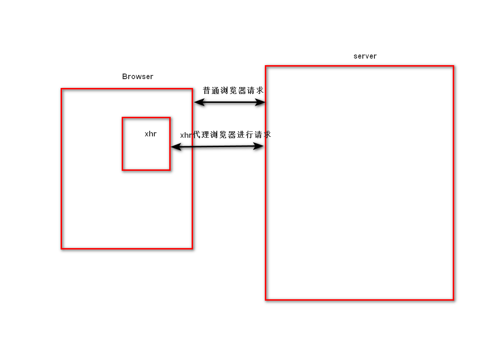

# Ajax

## 定义

即Asynchronous JavaScript And Xml，中文为异步的js和xml（EXtensible MarkUP Lanauage）。通过js异步的向服务器发送请求并接收响应数据

注：如今xml已被json取代，不过名字由于历史原因，并未修改

## Ajax特点

1. 异步访问
2. 局部刷新

## Ajax使用场景

1. 搜索建议
2. 表单验证
3. 前后端分离

## 原理图示



## 部分名词解析

### 同步访问

#### 特点

当客户端向服务器发送请求时，服务器在处理的过程中，浏览器只能等待，效率较低

#### 使用场景

1. url请求
2. form表单提交

### 异步访问

#### 特点

当客户端向服务器发送请求时，服务器在处理的过程中，客户端可以做其他的操作，不需要一直等待

#### 使用场景

1. 输入框输入后，直接返回验证结果
2. 搜索框输入内容后，直接返回相关内容

## 使用

### 核心对象-异步对象（XMLHttpRequest）

#### 定义

创建于JavaScript，代替浏览器向服务器发送异步的请求并接受响应

#### 创建

1. 注意事项：
   * IE7+，Chorme，Firefox，Safari，Opera浏览器调用XMLHttpRequest生成xhr对象
   * IE6及以下调用ActiceXObject生成xhr对象
2. 语法

   ```html
   <script>
   if (windows.XMLHttpRequest){
      // 支持XMLHttpRequest
      var xhr = new XMLHttpRequest();
   }else{
      // 不支持XMLHttpRequest，使用ActiceXObject创建异步对象
      var xhr = new ActiceXObject("Microsoft.XMLHTPP")
   }
   </script>
   ```  

#### 成员

1. 方法：open()
   * 作用：创建请求
   * 语法：```open(method, url, asyn)```
   * 参数：
     * method：请求方式，取值'get'或'post'
     * url：请求地址，字符串
     * asyn ：是否采用异步，true/false

   注：asyn使用true时，由于是异步且为网络通信，需要时间，如果后面的内容需要其返回的值，可能会出现返回的值还未从服务器返回导致验证失败的问题出现，在这种情况下可能会使用false选项
2. 方法：send()
   * 作用：通知xhr向服务器端发送请求
   * 语法：```send(body)```
   * 参数：
     * body：请求体，如果为get请求，值写null；如果为post请求，则要按照请求体的格式进行拼凑字符串
3. 属性：readyState
   * 作用：请求状态，通过不同的请求状态来表示xhr与服务器的交互情况
   * 值：见下表

     |状态|说明|
     |:----:|:----:|
     |0|代理被创建，但尚未调用open()方法|
     |1|open()方法已调用|
     |2|send()方法已被调用|
     |3|下载中；responseText属性已包含部分数据|
     |4|下载操作已完成|

4. 属性：responseText
   * 作用：携带响应数据
5. 属性：status
   * 作用：携带服务器端的响应码

#### get请求使用格式

```html
<script>
   if (windows.XMLHttpRequest){
      // 支持XMLHttpRequest
      var xhr = new XMLHttpRequest();
   }else{
      // 不支持XMLHttpRequest，使用ActiceXObject创建异步对象
      var xhr = new ActiceXObject("Microsoft.XMLHTPP")
   }
   // open异步对象
   xhr.open('get', url, true);
   // 设置回调函数
   xhr.onreadystatechange = function(){
      if(xhr.readyState == 4 && xhr.status == 200){
          xhr.responseText;
      }
   }
   // 放送请求
   xhr.send(null);
</script>
```

注：url这里可以使用get的查询字典；get请求无

#### post请求格式

1. 请求体结构解析
   * 与查询字符串结构一致，但不需要开头的问号  
  
  注：如果为django，并且启用csrf认证，那么需要从页面元素中django自动生成type类型为hidden的input中获取crsfmiddlewaretoken值

1. 语法

    ```html
    <script>
        if(windows.XMLHttpRequest){
            var xhr = new XMLHttpRequest();
        }else{
            var xhr = ActieXObject("Microsoft.XMLHTTP");
        }
        xhr.open('post', url, true);
        xhr.onreadystatechange = function(){
            if(xhr.readyState == 4 && xhr.status == 200){
                xhr.responseText;
            }
        }
        // 设置content-Type
        // Ajax的post的默认值为"text/plain;charset-utf8"
        xhr.setRequestHeader('Content-Type', 'application/x-www-form-urlencoded');
        // 拼接请求体内容
        var post_text = 'xxx' + ...
        xhr.send(post_text);
    </script>
    ```

### 跨域

#### 定义

非同源的网页，相互发送请求的过程

#### 同源的判定

一个网站如果具有相同的协议并且具有相同的域名/IP地址同时还具有相同的端口，那么它们是同源的

注：localhost与127.0.0.1不同源

#### 解决的方案

通过script标签的src向服务器资源发送请求，并由服务器资源指定前端页面的方法来执行响应的数据

#### 原理

其实只要具有src属性的元素都可以实现跨域的效果，由于浏览器对于静态资源不会拦截非同源请求

#### 原生语法实现演示

1. 前端

   ```html
   <html>
      <head>
         <style>
            .btn{
               width: 100px
               height: 100px
            }
         </style>   
      </head>
      <body>   
         <div class='btn'>跨域请求</div>
         <script>
            function print(data) {
                  console.log(data)
               }
            window.addEventLisener(
               'load',
               function () {
                  const but = document.querySelector('.btn')
                  but.addEventListener(
                     'click',
                     function() {
                        const body = document.querySelector('body')
                        const script = document.createElement('script')
                        script.type = 'text/javascript'
                        script.src = 'protocal://ip:port/xxx?callback=print&params1=value1&params2=value2'
                        body.appendChild(script)
                     }
                  )
               }
            )
         </script>
      </body>
   </html>
   ```

2. 后端

   ```python
   # urls.py
   urlpatterns = [
      re_path(r'protocal://ip:port/xxx', views.cross_view),
   ]
   # views.py
   def cross_view(request):
      func = request.GET['callback'][0]
      params1 = request.GET['params1'][0]
      params2 = request.GET['params2'][0]
      return func + f"('params1_from_server: {params1},params2_from_server: {params2}')"

   ```

注：后端传回来的数据可以是json字符串

### jQuery对ajax的支持

#### 方法

1. $obj.load(url, data, callback)
   * 作用：把指定url的html内容加载到你指定的元素中
   * 参数：
     * url：请求地址
       * url的后面空一格可以写元素选择器来指定url中获取的元素，如：```"index/server #btn"```
     * data：向url传入的参数，传参方式改变请求方式，默认get请求（可选）
       * 传参方式一：查询字符串（不用写问号），为get请求
       * 传参方式二：使用json对象/js对象，为post请求，且content-type为表单头```application/x-www-form-urlencoded```
     * callback：响应成功回调函数（可选）

   注：$obj为获取的元素（标签）对象；js对象与json对象类似但是key为一个变量而不是一个字符
2. $obj.get(url, data, callback, type)
   * 作用：通过get方式异步的向远程地址发送请求
   * 参数：
     * url：请求地址
     * data：向url传入的参数，都为get请求（可选）
       * 传参方式一：查询字符串（不用写问号）
       * 传参方式二：使用json对象/js对象
     * callback：响应成功回调函数（可选）
     * type：响应返回的数据格式
       * html
       * text
       * script
       * json
3. $obj.post(url, data, callback, type)
   * 作用：通过post方式异步的向远程地址发送请求
   * 参数：
     * url：请求地址
     * data：向url传入的参数，都为post请求（可选）
       * 传参方式一：请求体写法即键值对
       * 传参方式二：使用json对象/js对象
     * callback：响应成功回调函数（可选）
     * type：响应返回的数据格式
       * html
       * text
       * script
       * json
4. $obj.ajax(url, type, data, dataType, async, success, error, beforeSend)
   * 作用：通过ajax来异步的向远程地址发送请求
   * 参数：
     * url：请求地址
     * type：为请求的方式，```get```或```post```
     * data：向url传入的参数，都为post请求（可选）
       * 传参方式一：请求体写法即键值对
       * 传参方式二：使用json对象/js对象
     * dataType：响应返回的数据格式
       * html
       * text
       * script
       * json
       * jsonp：有关跨域的响应格式
     * async：是否异步，bool值
     * success：回调函数，请求和响应成功时回来执行的操作
     * error：回调函数，请求或响应失败时回来执行的操作
     * beforeSend：回调函数，发送ajax请求之前执行的操作，如果return false，则终止请求

   注：一般使用json/js对象进行传参

#### 跨域的支持——$obj.ajax()方法语法演示  

1. 一般版本

   ```html
   <script>
      function xxx(params1, params2, ...) {
         ...
      }
      $obj.ajax(
         url: 'xxx',
         type: 'get', // 只能为get请求
         dataType: 'jsonp',
         jsonp: 'callback', // 用来指定回调函数在查询字符串中的键（默认为callback）
         jsonpCallback: 'xxx', // 用来指定回调函数在查询字符串中键对应的值，为函数名
      )
   </script>
   ```

2. 极简版本

   ```html
   <script>
      $obj.ajax(
         url: 'xxx',
         type: 'get', // 只能为get请求
         dataType: 'jsonp',
         success: function(params1, params2, ...) {
            ...
         }
      )
   </script>
   ```

# json对象（JavaScript Object Notation）

## 作用

将信息按照一定格式组织起来，方便信息运输打包与解析

## 格式

### 要求

1. 使用```{}```表示单个对象
2. 在```{}```中以```key:value```这种键值对的形式来存储数据信息
3. key值必须用```""```双引号来包裹
4. value如果是字符串也必须用```""```双引号来包裹起来  

### 实例

```javascript
var obj = {
   "name": "xxx",
   "age": 18
}
```

## 后端对于json的处理

### 处理过程

1. 后端获取数据
2. 后端将数据转换为符合json格式的字符串
3. 在后端将json格式字符串进行响应

### json字符串（python and django）

#### 允许转换的数据类型

1. 元组
2. 字典
3. 列表

#### 后端处理方式（序列化）

1. python

   ```python
   import json
   json_str = json.dumps(元组|列表|字典, sort_keys=False, separators=xxx)
   # sort_keys可以防止python字典无序的问题；值为bool值，默认为False，要开始时选True
   # separators可以设置转化为json字符串是key与value之间的分割符和两个不同属性之间的间隔符；值为一个元组，元组中第一个值表示key与value之间的分割符，第二个值表示两个不同属性之间的间隔符；建议将其设置为(":", ",")，这样可以有效减少所传json字符串的长度，增加网络传输效率
   ```

2. django

   ```python
   # 方法一：使用django中提供的序列化类来完成QuerySet到json字符串的转化
   from django.core imort serializers
   from django.http import HttpResponse
   json_str = serializers.serializer('json', QuerySet)
   # 虽然这个方法可以方便的将QuerySet直接转化为json字符串，但会将大量不必要的字段也放入其中，减少网络传输效率，不建议使用
   return HttpResponse(json_str, content_type="application/json")
   # 设置content-type，由于默认为html

   # 方法二：直接使用json响应类，直接将字典变为json字符串并返回响应
   from django.http import JsonResponse
   d = {'key': value}
   return JsonResponse(d)
   ```

#### 前端处理方式（反序列化）

```javascript
jsonObj = JSON.parse(Json字符串)
```

# 结语

ajax学习至此告一段落，后续内容详见前后端互通项目