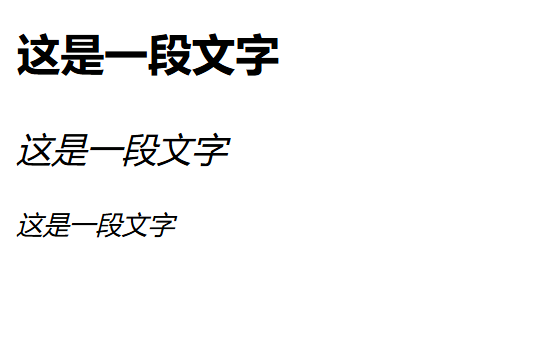
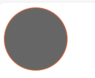

# html
## 定义
即超文本标记语言，通过标签的形式构建页面结构和填充内容
## 基本概念
### 网页
#### 定义
网页是基于浏览器的应用程序，是数据展示的载体
#### 组成
1. 浏览器
   * 向服务器发送用户请求指令
   * 接收并解析数据展示给用户
2. 服务器
   * 存储数据
   * 处理响应
3. 协议
   * 规范数据在传输过程中的打包方式
#### 优势
1. 即时响应
   * 更新服务端页面即完成更新
   * 客户端重新加载即兑现内容
2. 无需安装和更新
   * 无需安装任何应用软件
   * 只需要以一个浏览器执行即可
#### 开发需求
1. 运行环境：chorme/edge
2. 调试工具：浏览器中F12或右键检查
3. 开发工具：pycharm/vscode等
### 标签（标记元素）
#### 作用
用于标记网页中的内容
#### 分类
##### 单双标签
1. 单标签：只有开始标签，没有结束标签，可以手动添加```/```来表示闭合
    如：```<br/>```
2. 双标签：成对出现，包含开始标签和结束标签
    如：```<html></html>```
##### 内联/块元素
1. 块元素：独占一行，不与元素共行，可以手动设置长宽高，默认宽度与父类一致
    * 如：```<div></div>```
    * 包含标签：body，dic，h1~h6，p，ul，ol，li，form，table
2. 内联元素：可以与其他元素共行显示，不能手动设置宽高，尺寸由内容决定
    * 如：```<label></label>```
    * 包含标签：span，label，b，strong，i，s，u，sub，sup，a
3. 行内块元素：可以与其他元素共行显示，又能手动调整宽高
    * 如：``````
    * 包含标签：img，input，button
#### 标签嵌套原则
1. 块元素中可以嵌套任意元素（p元素除外，其只可嵌套行内元素）
2. 行内元素最好只嵌套行内块元素或行内元素
#### 标签之间的关系
1. 父子关系：即外部标签和嵌套在其内部一层的标签
2. 祖先后代关系：即外部标签和嵌套在其内部若干层的标签
3. 兄弟关系：即标签处于外部标签其内部的同一层的标签
## html使用
### 制作流程
1. 确定所需元素，按嵌套关系写出
2. 设置详细样式，达成整体以及初步的局部效果
3. 细节微调，使与要求完全吻合
### 语法
#### 基础语法规则
1. 使用<>为标签的标志，其中标签名不区分大小写
   如：```<br>```
2. 标签属性书写在开始标签中，使用空格与标签名间隔开，用于设置当前标签的显示内容或修饰显示效果。其中属性有属性和属性值构成，二者用等号连接，属性值外要加上双引号。如果有多个属性，使用空格间隔开每个属性
   如：``` height="200px" width="200px"```
3. 创建流程为先创建html或htm文件，再添加网页的基本结构，最后经过标签的嵌套完成网页效果
4. 注释语法：```<!--注释内容-->```
5. 所有属性标签全部小写
6. 当一个标签内有过多的属性，当换行
7. 当一个标签内有过多的嵌套标签时，当换行，使得每一个标签占一块区域
#### html基础结构
* 源码展示
  ```html
  <!--文档类型说明-->
  <!DOCTYPE html>
  <html lang="en">
  <!--头部设置，包含网页标题，引入外部的资源文件-->
  <head>
      <!--设置网页的文字编码-->
      <meta charset="UTF-8">
      <!--设置手机页面适配，其中name属性为表示显示端口；content属性中width的值device-width表示手机页面宽度；initial-scale表示比例变化，此处为1.0，即一比一变化-->
      <meta name="viewport" content="width=device-width, initial-scale=1.0">
      <!--网页标题设置，显示在选项卡上-->
      <title>Title</title>
  </head>
  <!--主体结构内容-->
  <body>

  </body>
  </html>
  ```
* 图解
  
### html常用标签
#### body中的常用标签
##### 文本标签
1. 标题标签：自带加粗效果，从h1到h6逐级递减
   * 源码展示：
        ```html
        <!DOCTYPE html>
        <html lang="en">
        <head>
            <meta charset="UTF-8">
            <title>标题标签演示</title>
        </head>
        <body>
            <h1>一级标题</h1>
            <h2>二级标题</h2>
            <h3>三级标题</h3>
            <h4>四级标题</h4>
            <h5>五级标题</h5>
            <h6>六级标题</h6>
        </body>
        </html>
        ```
   * 效果展示
        
2. 段落标签、换行标签与水平线标签
    * 源码展示：
        ```html
        <!DOCTYPE html>
        <html lang="en">
        <head>
            <meta charset="UTF-8">
            <title>段落标签与换行标签与水平线标签演示</title>
        </head>
            <!--p为块元素，可以承载一段文字-->
            <p>这是一段文字</p>
            <p>这是第二段文字</p>
            <p>
                <!--<br>是表示转行的,为内联元素-->
                这是第一行的文字<br>
                这是第二行的文字<br>
            </p>
            <!--写出一条水平线，为块元素-->
            <hr>
            <p>第二段文字</p>
        <body>

        </body>
        </html>
        ```
    * 效果展示
         
3. 普通文本标签
   * 源码展示：
        ```html
        <!DOCTYPE html>
        <html lang="en">
        <head>
            <meta charset="UTF-8">
            <title>普通文本标签演示</title>
        </head>
        <body>
            <b>加粗的字体</b>
            <strong>加粗的字体</strong>
            <i>斜体的字体</i>
            <u>带有删除线的字体</u>
            <!--span本身是没有什么特殊效果的，作为内联元素，可以将一段文字独立开来，单独设计样式-->
            <span>分区标签</span>
            <span>分区标签</span>
        </body>
        </html>
        ```
   * 效果展示
         
4. 字符实体标签
   * 源码展示：
        ```html
        <!DOCTYPE html>
        <html lang="en">
        <head>
            <meta charset="UTF-8">
            <title>字符实体演示</title>
        </head>
        <body>
            <p>
                <!--小于号-->
                &lt;
                <!--大于号-->
                &gt;
                <!--空格-->
                &nbsp;&nbsp;&nbsp;
                <!--产权标志-->
                &copy;
                <!--人民币符号-->
                &yen;
            </p>
        </body>
        </html>
        ```
   * 效果展示
         
##### 容器标签
* 源码展示：
    ```html
    <!DOCTYPE html>
    <html lang="en">
    <head>
        <meta charset="UTF-8">
        <title>容器标签演示</title>
    </head>
    <body>
        <!--div为块元素，多个div其实只是分成紧密相连的若干个部分，起到结构指示作用，同时可以对不同位置的块元素进行单独设置-->
        <div id="top">页面顶部划分</div>
        <div id="main">页面主体划分</div>
        <div id="bottom">页面底部划分</div>
    </body>
    </html>
    ```
* 效果展示
    
##### 图片与超链接标签
1. 图片标签
    * 源码展示：
        ```html
        <!DOCTYPE html>
        <html lang="en">
        <head>
            <meta charset="UTF-8">
            <title>Title</title>
        </head>
        <body>
            <!--img为行内块元素。其中src元素表示的是图片的地址，可以是本地地址，也可以是网络的url地址；width设置图片宽度，height设置图片高度，单位都为px；title为鼠标停留的效果；alt为图片获取不到显示的内容-->
            <!--从其他网址拿取图片并展示-->
            
            <!--本地图片展示-->
            
        </body>
        </html>
        ``` 
    * 效果展示
         
2. 超链接标签
   * 源码展示：
        ```html
        <!DOCTYPE html>
        <html lang="en">
        <head>
            <meta charset="UTF-8">
            <title>Title</title>
        </head>
        <body>
            <div id="top">顶部</div>
            <br><br><br><br><br><br><br><br><br><br><br><br><br><br><br><br><br><br><br><br><br><br><br><br><br><br><br><br><br>
            <br><br><br><br><br><br><br><br><br><br><br><br><br><br><br><br><br><br><br><br><br><br><br><br><br><br><br><br><br>
            <!--a为内联元素-->
            <!--跳转至其他网页并在新页面打开-->
            <a href="https://www.baidu.com" target="_blank">百度超链接</a>
            <!--跳转至其他网页并在原页面打开-->
            <a href="https://www.baidu.com" target="_self">百度超链接</a>
            <!--跳转至本网页顶部,其中#意为id-->
            <a href="#top" target="_self">百度超链接</a>
            <!--设置超链接不进行跳转，此处href值为javascript中的空-->
            <a href="javascript:void(0);">不跳转页面</a>
        </body>
        </html>
        ``` 
   * 效果展示
        <b>原html页面</b> 
        第一页
         
        第二页
         
        <b>点第一个</b>
        
        <b>点第二个</b>
        
        <b>点第三个</b>
        
3. 特殊超链接标签
   * 源码展示 
        ```html
        <!DOCTYPE html>
        <html lang="en">
        <head>
            <meta charset="UTF-8">
            <title>特殊超链接标签</title>
            <style>
                div{
                margin: 0 auto;
                padding: 0;
                width: 300px;
                height: 150px;
                }
            </style>
        </head>
        <body>
            <div>
                <!-- 通过iframe标签，可将其他网页展示在自己网页上 -->
                <!-- src参数为网页的地址，即url；scrolling参数即是否要滚动条 -->
                <iframe src="超链接标签.html"></iframe>
            </div>
            <div>
                <iframe src="超链接标签.html" scrolling="no"></iframe>
            </div>
        </body>
        </html>
        ```
   * 效果展示
        
##### 常用结构标签
1. 有序列表标签
   * 源码展示：
        ```html
        <!DOCTYPE html>
        <html lang="en">
        <head>
            <meta charset="UTF-8">
            <title>有序列表标签演示</title>
        </head>
        <body>
            <!--有序列表，ol为块元素，可以使用ol>li*3>ol>li*3来快捷创建-->
            <!--通过li中嵌套ol使得可以创建多层有序列表-->
            <ol>
                <li>01
                    <ol>
                        <li>11</li>
                        <li>12</li>
                        <li>13</li>
                    </ol>
                </li>
                <li>02
                    <ol>
                        <li>14</li>
                        <li>15</li>
                        <li>16</li>
                    </ol>
                </li>
                <li>03
                    <ol>
                        <li>17</li>
                        <li>18</li>
                        <li>19</li>
                    </ol>
                </li>
            </ol>
        </body>
        </html>
        ```
   * 效果展示
         
2. 无序列表标签
   * 源码展示：
        ```html
        <!DOCTYPE html>
        <html lang="en">
        <head>
            <meta charset="UTF-8">
            <title>无序列表标签演示</title>
        </head>
        <body>
            <!--无序列表，ul为块元素，可以使用ul>li*3>ul>li*3来快捷创建-->
            <!--通过li中嵌套ul使得可以创建多层无序列表-->
            <ul>
                <li>01
                    <ul>
                        <li>11</li>
                        <li>12</li>
                        <li>13</li>
                    </ul>
                </li>
                <li>02
                    <ul>
                        <li>14</li>
                        <li>15</li>
                        <li>16</li>
                    </ul>
                </li>
                <li>03
                    <ul>
                        <li>17</li>
                        <li>18</li>
                        <li>19</li>
                    </ul>
                </li>
            </ul>
        </body>
        </html>
        ```
   * 效果展示
         
3. 表格标签
   * 源码展示：
        ```html
        <!DOCTYPE html>
        <html lang="en">
        <head>
            <meta charset="UTF-8">
            <title>表格标签演示</title>
        </head>
        <body>
            <!--table为块元素-->
            <!--一般的表格，有边框，有标题，各个单元格没有间隙-->
            <!--border属性为设置表格边框宽度；cellspacing属性为设置各个单元格之间的空隙；width属性为设置表格宽度，单位为px-->
            <table border="1" cellspacing="0" width="240px">
                <!--caption标签为设置表格标题-->
                <caption>这是一个表格</caption>
                <!--style属性中的height属性可以设置单元格高度，单位px-->
                <tr style="height: 80px">
                    <!--th标签为表头-->
                    <th></th>
                    <th></th>
                    <th></th>
                </tr>
                <tr style="height: 80px">
                    <!--td标签为列-->
                    <td></td>
                    <td></td>
                    <td></td>
                </tr>
                <tr style="height: 80px">
                    <td></td>
                    <td></td>
                    <td></td>
                </tr>
                <tr style="height: 80px">
                    <td></td>
                    <td></td>
                    <td></td>
                </tr>
            </table>
            <br><br>
            <!--有边框但各个单元格之间有空隙的-->
            <table border="1" cellspacing="1" width="240px">
                <tr style="height: 80px">
                    <td></td>
                    <td></td>
                    <td></td>
                </tr>
                <tr style="height: 80px">
                    <td></td>
                    <td></td>
                    <td></td>
                </tr>
                <tr style="height: 80px">
                    <td></td>
                    <td></td>
                    <td></td>
                </tr>
            </table>
            <br><br>
            <!--只设置下边界的表格，同时表格的每一行的颜色不同-->
            <table border="0" cellspacing="0" width="240px">
                <!--style属性中的background-colour属性可以设置颜色，值为颜色英文或代码-->
                <tr style="height: 80px;background-color: aqua">
                    <!--style属性中的boder-bottom可以设置单元格的下方边界线，值为颜色、线的形态、线的宽度（px），此处solid表示实线，虚线为dotted。注意border-bottom只能在td中设置-->
                    <td style="border-bottom: black solid 1px"></td>
                    <td style="border-bottom: black solid 1px"></td>
                    <td style="border-bottom: black solid 1px"></td>
                </tr>
                <tr style="height: 80px;background-color: yellow">
                    <td style="border-bottom: black solid 1px"></td>
                    <td style="border-bottom: black solid 1px"></td>
                    <td style="border-bottom: black solid 1px"></td>
                </tr>
                <tr style="height: 80px;background-color: pink">
                    <td style="border-bottom: black solid 1px"></td>
                    <td style="border-bottom: black solid 1px"></td>
                    <td style="border-bottom: black solid 1px"></td>
                </tr>
            </table>
            <!--表格跨行与跨列合并，表格文字居中-->
            <table border="1" cellspacing="1" width="240px">
                <tr style="height: 80px">
                    <td colspan="2" style="text-align: center">10</td>
                    <td>10</td>
                </tr>
                <tr style="height: 80px">
                    <td rowspan="2"></td>
                    <td></td>
                    <td></td>
                </tr>
                <tr style="height: 80px">
                    <td></td>
                    <td></td>
                </tr>
            </table>
        </body>
        </html>
        ```
   * 效果展示
         
         
4. 表单标签
   * 源码展示：
        ```html
        <!DOCTYPE html>
        <html lang="en">
        <head>
            <meta charset="UTF-8">
            <title>表单标签演示</title>
        </head>
        <body>
            <div id="reg" style="width: 296px">
                <!--form为块元素,其中action中的#表示提交到当前页面,method表示提交方式,onsubmit表示提交时触发的执行函数-->
                <form action="#" method="get" onsubmit="">
                    <div>
                        <!--label为内联元素,for用来绑定后面元素的id-->
                        <label for="name">用户</label>
                        <!--text就是文本框,placeholder为提示语,maxlength为最长输入长度-->
                        <input type="text" id="name" name="username" placeholder="请输入用户名" maxlength="10">
                    </div>
                    <div>
                        <label for="password">密码</label>
                        <!--password即密码类型,输入看不见-->
                        <input type="password" id="password" name="pass" placeholder="请输入密码" maxlength="18">
                    </div>
                    <div>
                        <label for="xl">学历
                        <!--select为下拉选项,其中selected为默认勾选,value是提交后显示的值-->
                            <select name="certificate" id="xl">
                                <option value="-1" selected>请选择</option>
                                <option value="0">小学</option>
                                <option value="1">中学</option>
                                <option value="2">大学</option>
                            </select>
                        </label>
                        <!--radio圆圈选项类型,如果name名字一样,则会选项互斥,checked为默认勾选-->
                        <label>性别
                            <input type="radio" name="gender" value="1" checked>男
                            <input type="radio" name="gender" value="2">女
                        </label>
                    </div>
                    <div>
                        <label>爱好</label>
                        <!--checkbox为方块选项类型,checked为默认勾选-->
                        <label for="like01">唱</label>
                            <input type="checkbox" id="like01" name="like01">
                        <label for="like02">跳</label>
                            <input type="checkbox" id="like02" name="like02">
                        <label for="like03">rap</label>
                            <input type="checkbox" id="like03" name="like03">
                        <label for="like04">篮球</label>
                            <input type="checkbox" id="like04" name="like04" checked>
                    </div>
                    <div>
                        <label for="demo">简介</label>
                        <!--textarea为长文本输入,cols为列,rows为行-->
                        <textarea name="introduction" id="demo" cols="30" rows="10" placeholder="自我介绍300字"></textarea>
                    </div>
                    <div style="text-align: center">
                        <!--reset为重置按键类型,value为显示在按键上的文字-->
                        <input type="reset" value="重置">
                        <!--submit为提交按键类型,value为显示在按键上的文字-->
                        <input type="submit" value="注册">
                    </div>
                    <div>
                        <label for="roll-line">滚动条</label>
                        <!-- range为滚动条类型，max为滚动条的最大值；min为滚动条的最小值；step为步长的值；value为初始值 -->
                        <input type="range" id="roll-line" max="100" min="0" step="10" value="10">
                    </div>
                </form>
            </div>
        </body>
        </html>
        ```
   * 效果展示
        
5. 分组标签
   * 源码展示
        ```html
        <!DOCTYPE html>
        <html lang="en">
        <head>
            <meta charset="UTF-8">
            <title>分组标签演示</title>
        </head>
        <body>
            <!-- 设置分组元素 -->
            <fieldset>
                <!-- 设置分组元素标题 -->
                <legend>分组元素标题</legend>
                <!-- 要被放入组的元素 -->
                <button>1</button>
                <button>2</button>
                <button>3</button>
                <button>4</button>
                <button>5</button>
            </fieldset>
        </body>
        </html>
        ```
   * 效果展示
          
### CSS基本使用
#### 定义
即层叠样式表，与html相辅相成，实现对网页的排版布局与样式美化
#### 使用方式
* 样式结构：属性和值组成
  * 如：```属性: 值;属性: 值;```
* 分类
  1. 行内样式/内联样式：借助style属性，为当前元素添加样式申明
        * 如：```<标签名 style="样式申明">
  2. 内嵌样式：借助style标签，在html中嵌入css样式
        * 如：
            ```html
            <head>
                <style>
                    选择器{
                        属性: 值;
                        属性: 值;
                    }
                </style>
            </head>  
            ``` 
        注：选择器的解释在后文中，本处不做解释
  3. 外联样式表
        * 使用步骤
          1. 创建外部样式表文件，后缀为.css，内容与内嵌样式中style内部的内容一致
          2. 在html中使用<link>标签引入外部样式表
                * 如：
                    ```html
                    <head>
                        <link href="URL" type="text/css">
                    </head>  
                    ``` 
          3. 样式表文件通过选择器匹配元素应用样式   
* 特征
  1. 层叠性：多组css样式共同作用与同一个元素
  2. 继承性：后代元素可以继承祖先元素中的某些样式（大部分文本属性都可以继承）
  3. 样式表的优先级：
     1. 离元素越近就越优先
     2. 文档内嵌与外联样式表的优先级一致，后来者居上
     3. 默认样式和继承样式优先级最低 
#### CSS选择器
1. 作用：匹配文档中某些样式去应用匹配到的元素
2. 分类
   * 特殊选择：通过星号选择该页面中所有的元素
        ```html
        *{
            属性: 值;
        }
        ```
   * 标签选择器：根据标签名匹配文档中所有该元素
        ```html
        标签名{
            属性: 值;
        }
        ``` 
   * id选择器：根据元素id属性匹配唯一的元素
        ```html
        #id{
            属性: 值;
        }
        ``` 
        注：id属性值的命名规则与python变量名的命名规则相同，但可以与标签名一致
   * class选择器：根据元素的class属性匹配相应的元素，class属性可重复使用，一个元素可以使用多个class中间用空格隔开
        ```html
        .class{
            属性: 值;
        }
        ```
        另：当标签选择器与类选择器同时使用时标签在前，类选择器在后，即```a.class{}```，意为标签为a的情况下使用class才能生效
   * 群组选择器：为一组元素统一设置样式
        ```html
        selector1, selector2, selector3{
            属性: 值;
        }
        ``` 
   * 后代选择器：匹配满足选择器的元素的所有后代
        ```html
        selector1 selector2 selector3{
            属性: 值;
        } 
        ```
   * 子代选择器：匹配满足选择器的元素的所有子代
        ```html
        selector1>selector2{
            属性: 值;
        }
        ``` 
   * 伪类选择器：为元素的不同状态设置样式，必须与其他元素选择器共同使用
        * 伪类选项
          1. ```:link```：超链接访问前
          2. ```:visited```：超链接访问后
          3. ```:hover```：鼠标滑过时
          4. ```:active```：鼠标按住不动时
          5. ```:focus```：成为焦点时（文本框被编辑时）
          6. ```子元素:nth-child(n)```：当父元素内包裹多个相同的子元素时，可以通过该伪类使用数字来定位到父元素中自上而下数的第n个元素
       * 如：
            ```html
            a:link{
                属性: 值;
            }
            .c1:visited{
                属性: 值;
            }  
        另：超链接的设置要遵循如此顺序（link>visited>hover>active），由于当点开页面时，超链接就默认已经触发过了，故link大多数时候不起作用，除非清空浏览器缓存  
3. 选择器优先级（权重越大，优先度越高）
    |选择器类型|权重|
    |:----:|:----:|
    |标签选择器|1|
    |（伪）类选择器|10|
    |id选择器|100|
    |行内样式|1000|
    注：群组选择器权重各自独立，其余复杂选择器的权重为加和
#### CSS常用属性
1. ```color: 颜色```：设置字体颜色
2. ```background-color: 颜色```：设置背景颜色
3. ```font-size: xxpx```：设置字体大小
4. ```text-decoration: none```：可以在超链接标签中设置取消下划线
#### 部分通用属性值解析
##### 元素权重
1. 作用：使得低权重css样式可以生效
2. 语法：
    ```html
    <style>
        .red{
            background-color: red !important; // 变为高权重样式
        }
    </style>
    ```
##### 元素的尺寸
###### 单位
1. px：绝对单位，即写多少就是多少像素
2. ```%```：相对单位，相对父元素的大小比例
3. ```em```：相对单位，当没有任何设置，采用默认比例```1em=16px```；当通过父或祖先设置``font-size``并在子或后代设置```font-size```时，可以更改换算值常用于手机页面
    * 如：
        ```html
        <div style="font-size:10px">
            <!-- 即换算为1em=10px -->
            <p style="font-size:1em; width:10em"></p>
        </div>``` 
4. rpx：小程序页面单位
###### 内容超出尺寸处理
* 当页面元素超过元素范畴，使用overflow属性来解决超出部分表示方式，建议使用auto
    * 源码展示：
        ```html
        <!-- 未处理时 -->
        <div style="width: 10px;hight: 10px;background-color: green">
            aaaaaaaaaaaaaaaaaaaaaaaaaaaaaaaaaaaaaaaaaaaaaaaaaaaaaaaaaaaaaaaaaaaaaaaaaaaaaaaaaaaaaaaaaaaaaaaaaaaaaaaaaaaaaaaaaaaaaaaaaaaaaaaaaaaaaa
        </div>
        <br><br>
        <!-- auto值即当长或宽超过元素范畴时，自动生成对应滑块来显示超出内容 -->
        <div style="overflow: auto;width: 10px;hight: 10px;background-color: green">
            aaaaaaaaaaaaaaaaaaaaaaaaaaaaaaaaaaaaaaaaaaaaaaaaaaaaaaaaaaaaaaaaaaaaaaaaaaaaaaaaaaaaaaaaaaaaaaaaaaaaaaaaaaaaaaaaaaaaaaaaaaaaaaaaaaaaaa
        </div> 
        <br><br>
        <!-- hidden值即当长或宽超过元素范畴时，隐藏所有超出内容超出内容 -->
        <div style="overflow: hidden;width: 10px;hight: 10px;background-color: green">
            aaaaaaaaaaaaaaaaaaaaaaaaaaaaaaaaaaaaaaaaaaaaaaaaaaaaaaaaaaaaaaaaaaaaaaaaaaaaaaaaaaaaaaaaaaaaaaaaaaaaaaaaaaaaaaaaaaaaaaaaaaaaaaaaaaaaaa
        </div> 
        <br><br>
        <!-- scroll值即当长或宽超过元素范畴时，隐藏所有超出内容超出内容 -->
        <div style="overflow: scroll;width: 10px;hight: 10px;background-color: green">
            aaaaaaaaaaaaaaaaaaaaaaaaaaaaaaaaaaaaaaaaaaaaaaaaaaaaaaaaaaaaaaaaaaaaaaaaaaaaaaaaaaaaaaaaaaaaaaaaaaaaaaaaaaaaaaaaaaaaaaaaaaaaaaaaaaaaaa
        </div>
        ```   
    * 效果展示
         
##### 元素的颜色
###### 作用
设置字体，背景，边框在元素中的颜色
###### 使用方式
1. 使用英文单词表示，如：```color: red```
2. 使用rgb/rgba表示，其中rgb的范围为（0~255），透明度a的范围为（0~1），如：```rgb(2,3,5)```;```rgba(2,3,5,0.5)```
3. 使用16进制表示
   * 长16进制，如：```#ffffff```，```#000000```
   * 短16进制，如：```#fff```，```#000```
##### 元素的显示
###### 作用
设置元素的显示方式
###### 使用
1. 源码展示
   ```html
   <!doctype html>
    <html lang="en">
    <head>
        <meta charset="UTF-8">
        <meta name="viewport"
            content="width=device-width, user-scalable=no, initial-scale=1.0, maximum-scale=1.0, minimum-scale=1.0">
        <meta http-equiv="X-UA-Compatible" content="ie=edge">
        <title>元素显示演示</title>
        <style>
            div{
                width: 100px;
                height: 100px;
                background-color: #666;
                margin: 10px 0;
            }
            .Block{
                /*通过display设置元素显示，值为显示的类型名称*/
                /*block为正常显示*/
                display: block;
            }
            .None{
                /*none为不显示*/
                display: none;
            }
        </style>
    </head>
    <body>
    <!-- 默认为"",即空字符串，与block效果相同 -->
    <div></div>
    <div class="Block"></div>
    <div class="None"></div>
    </body>
    </html>
   ``` 
2. 效果展示
    
##### 鼠标的外形
###### 作用
设置鼠标的外形
###### 使用
1. 源码展示
   ```html
   <!DOCTYPE html>
    <html lang="en">
    <head>
        <meta charset="UTF-8">
        <title>鼠标外形演示</title>
        <style>
            div{
                width: 100px;
                height: 100px;
                border: #666 1px solid;
            }
            .fin-mark{
                /*cursor设置鼠标外形*/
                /*值为鼠标外形的类型，pointer为手指形*/
                cursor: pointer;
            }
            .pos-mark{
                /*move为移动形*/
                cursor: move;
            }
        </style>
    </head>
    <body>
    <div class="fin-mark"></div>
    <div class="pos-mark"></div>
    </body>
    </html>
   ``` 
2. 效果展示
   <strong>正常鼠标</strong> 
   
   <strong>手指形鼠标</strong>
    
   <strong>移动形鼠标</strong>
     
##### 背景属性
###### 背景颜色
1. 源码展示
   ```html
   <!DOCTYPE html>
    <html lang="en">
    <head>
        <meta charset="UTF-8">
        <title>背景颜色演示</title>
        <style>
            div{
                /*设置元素背景颜色，属性为background-color，值为颜色*/
                background-color: #666;
                width: 100px;
                height: 100px;
            }
        </style>
    </head>
    <body>
    <div></div>
    </body>
    </html>
    ``` 
2. 效果展示
   
###### 背景图片
1. 默认背景图片的展示规则
   背景图片从左上角开始显示。如果元素尺寸大于图片尺寸时，则自动重复平铺直到铺满整个元素，如果尺寸小于图片尺寸，图片超出部分不可见  
2. 源码展示
   ```html
   <!DOCTYPE html>
    <html lang="en">
    <head>
        <meta charset="UTF-8">
        <title>背景图片演示</title>
        <style>
            div{
                /*设置背景图片，属性为background-image，值为url("图片路径")*/
                background-image: url("resource1.jpg");
                width: 1071px;
                height: 801px;
                margin: 50px 0;
                padding: 0;
                float: left;
                border: solid 1px red;
            }
            #img-x-repeat{
                /*设置重复为仅沿着x轴，属性为background-repeat，值为repeat-x*/
                background-repeat: repeat-x;
            }
            #img-y-repeat{
                /*设置重复为仅沿着y轴，值为repeat-y*/
                background-repeat: repeat-y;
            }
            #img-no-repeat{
                /*设置不重复，值为no-repeat*/
                background-repeat: no-repeat;
            }
            #img-pos{
                background-repeat: no-repeat;
                /*设置背景图片显示位置，属性为background-position，值为水平方位（left，center，right）；水平偏移（不写为0）；竖直方位（top，
                center，bottom）；竖直偏移（不写为0）*/
                /*当竖直方位不写时,自动为center*/
                background-position: left 100px center;
            }
            #img-sim{
                /*简化写法，一次行设置完背景颜色，背景图片，重复方式，显示位置即属性为background，值为color；url；重复方式；position*/
                background: #666 url("resource1.jpg") no-repeat center center;
                /*设置背景图片大小，属性为background-size，值为宽度；高度*/
                /*当只写宽度时,高度会等比放大*/
                background-size: 200px;
            }
        </style>
    </head>
    <body>
    <div id="img-default"></div>
    <div id="img-x-repeat"></div>
    <div id="img-y-repeat"></div>
    <div id="img-no-repeat"></div>
    <div id="img-pos"></div>
    <div id="img-sim"></div>
    </body>
    </html>
    ``` 
3. 效果展示
   
4. 精灵图片
   * 作用：减少浏览器重复请求图片浪费时间，减少页面渲染时间
   * 原理：将多张图片按照一定规格缝合到一起
   * 源码展示
        ```html
        <!DOCTYPE html>
        <html lang="en">
        <head>
            <meta charset="UTF-8">
            <title>精灵图片演示</title>
            <style>
                .fairy-img-1{
                    width: 106px;
                    height: 106px;
                    margin: 50px 0;
                    background-image: url("2024-11-21_183153.png");
                }
                #b{
                    background-position: 0 -106px;
                }
                #c{
                    background-position: 0 -212px;
                }
                #d{
                    background-position: 0 -318px;
                }
                .fairy-img-2{
                    width: 116px;
                    height: 116px;
                    margin: 50px 0;
                    background-image: url("2024-11-21_183344.png");
                }
                #b-1{
                    background-position: -116px 0;
                }
                #c-1{
                    background-position: -232px 0;
                }
                #d-1{
                    background-position: -348px 0;
                }
            </style>
        </head>
        <body>
            <div id="a" class="fairy-img-1"></div>
            <div id="b" class="fairy-img-1"></div>
            <div id="c" class="fairy-img-1"></div>
            <div id="d" class="fairy-img-1"></div>
            <div id="a-1" class="fairy-img-2"></div>
            <div id="b-1" class="fairy-img-2"></div>
            <div id="c-1" class="fairy-img-2"></div>
            <div id="d-1" class="fairy-img-2"></div>
        </body>
        </html>
        ``` 
   * 效果展示
          
##### 文本属性
###### 字符
1. 源码展示
   ```html
   <!DOCTYPE html>
    <html lang="en">
    <head>
        <meta charset="UTF-8">
        <title>文本属性演示</title>
        <style>
            #font-size-weight-family{
                /*设置字体大小,属性为font-size;值为像素值*/
                font-size: 20px;
                /*设置字体粗细,属性为font-weight;值为无单位的数*/
                /*其中特殊的可直接填normal为400,bold为700即加粗*/
                font-weight: 700;
                /*设置字体名称,属性为font-family;值为字体名称,多个字体名称逗号分隔,如果有中文或空格要加引号,英文不需要*/
                /*注意要写sans-serif来兜底,必写*/
                font-family: "Microsoft Yahei", sans-serif;
            }
            #font-style{
                /*设置字体的风格,属性为font-style;值为italic(斜体)等*/
                font-style: italic;
            }
            #font-sim{
                /*简化设置,属性为font;值为style weight size family*/
                /*其中size,family必填,写时要按顺序*/
                font: italic normal 12px "Microsoft Yahei";
            }
        </style>
    </head>
    <body>
        <p id="font-size-weight-family">这是一段文字</p>
        <p id="font-style">这是一段文字</p>
        <p id="font-sim">这是一段文字</p>
    </body>
    </html>
    ``` 
2. 效果展示
   
###### 文本
1. 源码展示
   ```html
   <!DOCTYPE html>
    <html lang="en">
    <head>
        <meta charset="UTF-8">
        <title>文本属性演示</title>
        <style>
            #text-color-decoration-align-height{
                height: 40px;
                /*设置文本颜色,属性为color;值为颜色*/
                color: red;
                /*设置文本的装饰线,属性为text-decoration;值为装饰线类型和颜色*/
                /*装饰线类型包括,underline下划线,overline上划线,line-through删除线,none取消装饰线*/
                text-decoration: line-through blue;
                /*设置文本对齐方式,属性为text-align;值为对齐方式*/
                /*对齐方式的类型包括,left默认,center,right*/
                text-align: center;
                /*设置行高,属性为line-height;值为像素值*/
                /*可以利用文字永远相对行高垂直居中的特性,来调整文本在元素中的位置,当行高等于元素高时,文本垂直居中;当行高小于元素高时,文本偏上;当行高
                大于元素高时,文本偏下*/
                /*特殊的,当值不写单位时,则为字体大小的倍数*/
                line-height: 30px;
                border: solid 1px green;
            }
        </style>
    </head>
    <body>
        <div id="text-color-decoration-align-height">这是一段文字</div>
    </body>
    </html>
    ``` 
2. 效果展示
   
##### 图片属性
1. 源码展示
   ```html
    <!DOCTYPE html>
    <html lang="en">
    <head>
        <meta charset="UTF-8">
        <title>图片透明度</title>
        <style>
            img{
                /* 图片设置透明度设置为0.5 */
                opacity: 0.5;
            }
        </style>
    </head>
    <body>
    
    </body>
    </html>
    ``` 
2. 效果展示
    
#### 盒子模型
##### 概念
1. 在模型中它规定了元素处理内容、内边距、外边距、边框的方式
2. 最内是内容，包围内容的是内边距，内边距的边沿是边框，边框以外是外边距（默认颜色透明）
##### 使用
###### 边框
1. 普通边框实现
   * 源码展示
        ```html
        <!DOCTYPE html>
        <html lang="en">
        <head>
            <meta charset="UTF-8">
            <title>精灵图片演示</title>
            <style>
                .fairy-img-1{
                    width: 106px;
                    height: 106px;
                    margin: 50px 0;
                    background-image: url("2024-11-21_183153.png");
                }
                #b{
                    background-position: 0 -106px;
                }
                #c{
                    background-position: 0 -212px;
                }
                #d{
                    background-position: 0 -318px;
                }
                .fairy-img-2{
                    width: 116px;
                    height: 116px;
                    margin: 50px 0;
                    background-image: url("2024-11-21_183344.png");
                }
                #b-1{
                    background-position: -116px 0;
                }
                #c-1{
                    background-position: -232px 0;
                }
                #d-1{
                    background-position: -348px 0;
                }
            </style>
        </head>
        <body>
            <div id="a" class="fairy-img-1"></div>
            <div id="b" class="fairy-img-1"></div>
            <div id="c" class="fairy-img-1"></div>
            <div id="d" class="fairy-img-1"></div>
            <div id="a-1" class="fairy-img-2"></div>
            <div id="b-1" class="fairy-img-2"></div>
            <div id="c-1" class="fairy-img-2"></div>
            <div id="d-1" class="fairy-img-2"></div>
        </body>
        </html>
        ``` 
   * 效果展示
        
2. 单边框实现
    * 源码展示：
        ```html
        <!DOCTYPE html>
        <html lang="en">
        <head>
            <meta charset="UTF-8">
            <title>单边框演示</title>
            <style>
            div{
                margin: 0 auto;
                width: 100px;
                height: 100px;
                text-align: center;
            }
            /*设置上边框*/
            #top{
            border-top: red 1px solid;
            }
            /*设置下边框*/
            #bottom{
            border-bottom: red 1px solid;
            }
            /*设置左边框*/
            #left{
            border-left: red 1px solid;
            }
            /*设置右边框*/
            #right{
            border-right: red 1px solid;
            }
            </style>  
        </head>
        <body>
            <div id="top"><h1>top</h1></div>
            <div id="bottom"><h1>bottom</h1></div>
            <div id="left"><h1>left</h1></div>
            <div id="right"><h1>right</h1></div>
        </body>
        </html>
        ```
    * 效果展示：
         
3. 三角标
    * 源码展示：
        ```html
        <!DOCTYPE html>
        <html lang="en">
        <head>
            <meta charset="UTF-8">
            <title>三角标演示</title>
            <style>
                div{
                    width: 0;
                    height: 0;
                    /*设置边框透明*/
                    border: 10px transparent solid;
                    /*设置边框透明*/
                    border-top-color: red;
                }
            </style>
        </head>
        <body>
            <div></div>
        </body>
        </html>
        ``` 
    * 效果展示：
         
4. 圆角边框
    * 源码展示：
        ```html
        <!DOCTYPE html>
        <html lang="en">
        <head>
            <meta charset="UTF-8">
            <title>圆角边框演示</title>
            <style>
                div{
                margin: 10px auto;
                background-color: blue;
                width: 100px;
                height: 100px;
                text-align: center;
                border: red 1px solid;
                }
                #a{
                /*统一设置四个角的半径*/
                border-radius: 10px;
                }
                #b{
                /*分别设置左上、右上、右下、左下角的半径*/
                border-radius: 10px 20px 30px 40px;
                }
                #c{
                /*分别设置左上、右上左下、右下的半径*/
                border-radius: 10px 20px 30px;
                }
                #d{
                /*分别设置左上右下、右上左下的半径*/
                border-radius: 10px 20px;
                }
            </style>
        </head>
        <body>
            <div id="a"><h1>a</h1></div>
            <div id="b"><h1>b</h1></div>
            <div id="c"><h1>c</h1></div>
            <div id="d"><h1>d</h1></div>
        </body>
        </html>
        ``` 
    * 效果展示：
          
5. 圆形
   * 源码展示：
        ```html
        <!DOCTYPE html>
        <html lang="en">
        <head>
            <meta charset="UTF-8">
            <title>圆形演示</title>
            <style>
                div{
                width: 100px;
                height: 100px;
                background-color: #666;
                border: orangered 1px solid;
                /*将圆角半径设置为正方形的一半即为圆形*/
                border-radius: 50%;
                }
            </style>
        </head>
        <body>
            <div></div>
        </body>
        </html>
        ```
   * 效果展示：
        
###### 轮廓线
* 源码展示：
    ```html
    <!DOCTYPE html>
    <html lang="en">
    <head>
        <meta charset="UTF-8">
        <title>轮廓线演示</title>
        <style>
            div{
            /*设置轮廓线，第一个值为颜色;第二个值为边框宽度，单位px;第三个值为线的样式设置*/
            /*第三个值的部分选择：1.solid:实线;2.dotted:点线;3.虚线:dashed;4.double:双线边框*/
            outline: red 1px solid;
            width: 100px;
            height: 100px;
            }
            #button{
            /*取消轮廓线*/
            outline: none;
            }
        </style>
    </head>
    <body>
        <div></div>
        <!--选中时没有框-->
        <label for="button"></label>
        <input type="text" id="button">
        <!--选中时有框-->
        <label for="a"></label>
        <input type="text" id="a">
    </body>
    </html>
    ```
* 效果展示：
    <b>页面效果</b>
    
    <b>点中第一个文本框</b>
    
    <b>点中第二个文本框</b>
    
* 特点：与边框不同，不占位
###### 盒阴影
* 源码展示：
    ```html
    <!DOCTYPE html>
    <html lang="en">
    <head>
        <meta charset="UTF-8">
        <title>盒阴影演示</title>
        <style>
            div{
            margin: 100px auto;
            width: 100px;
            height: 100px;
            }
            /*阴影的偏移是建立在以元素左上角为坐标原点，向右向下为x、y的坐标轴正方向*/
            #a{
            /*设置阴影，第一个值为水平偏移；第二个值为垂直偏移；第三个为模糊程度，越大越模糊；第四个值选填为阴影尺寸；第五个为阴影尺寸*/
            box-shadow: 10px 10px 10px 10px #666;
            }
            #b{
            box-shadow: -10px -10px 10px #666;
            }
        </style>
    </head>
    <body>
        <div id="a"></div>
        <div id="b"></div>
    </body>
    </html>
    ```
* 效果展示：
    
###### 内边距
1. 普通内边距
   * 源码展示：
        ```html
        <!DOCTYPE html>
        <html lang="en">
        <head>
            <meta charset="UTF-8">
            <title>内边距演示</title>
            <style>
                div{
                    border: 1px red solid;
                }
                #a{
                    /*统一设置四个方向的内边距*/
                    padding: 10px;
                }
                #b{
                    /*从上右下左，分别设置四个方向的内边距*/
                    padding: 10px 20px 30px 40px;
                }
                #c{
                    /*分别设置上，左右，下的内边距*/
                    padding: 10px 20px 30px;
                }
                #d{
                    /*分别设置上下，左右的内边距*/
                    padding: 10px 20px;
                }
            </style>
        </head>
        <body>
            <div id="a"><label>a</label></div>
            <div id="b"><label>b</label></div>
            <div id="c"><label>c</label></div>
            <div id="d"><label>d</label></div>
        </body>
        </html>
        ``` 
   * 效果展示：
         
2. 单边内边距
   * 源码展示：
        ```html
        <!DOCTYPE html>
        <html lang="en">
        <head>
            <meta charset="UTF-8">
            <title>单边内边距</title>
            <style>
                div{
                    border: 1px red solid;
                    padding: 0;
                }
                #a{
                    /*设置上方的内边距*/
                    padding-top: 20px;
                }
                #b{
                    /*设置下方的内边距*/
                    padding-bottom: 20px;
                }
                #c{
                    /*设置左侧的内边距*/
                    padding-left: 20px;
                }
                #d{
                    /*设置右侧的内边距*/
                    padding-right: 20px;
                }
            </style>
        </head>
        <body>
            <div id="a"><label>a</label></div>
            <div id="b"><label>b</label></div>
            <div id="c"><label>c</label></div>
            <div id="d"><label>d</label></div>
        </body>
        </html>
        ``` 
   * 效果展示：
         
###### 外边距
1. 外边距语法
   1. 普通外边距
      * 源码展示：
        ```html
        <!DOCTYPE html>
        <html lang="en">
        <head>
            <meta charset="UTF-8">
            <!-- 外边距少左右补，少下上补 -->
            <title>外边距演示</title>
            <style>
                div{
                border: red 1px solid;
                width: 80px;
                height: 80px;
                margin: 0;
                }
                #a{
                /*统一设置上下左右的外边距*/
                margin: 10px;
                }
                #b{
                /*分别设置上，右，下，左的外边距*/
                margin: 10px 20px 30px 40px;
                }
                #c{
                /*分别设置上，左右，下的外边距*/
                margin: 10px 20px 30px;
                }
                #d{
                /*分别设置上下，左右的外边距*/
                margin: 10px 20px;
                }
                #e{
                /*居中的特殊写法*/
                margin: 0 auto;
                }
            </style>
        </head>
        <body>
            <div id="a"></div>
            <div id="b"></div>
            <div id="c"></div>
            <div id="d"></div>
            <div id="e"></div>
            <div></div>
        </body>
        </html>
        ``` 
      * 效果展示：
          
   2. 单边外边距
      * 源码展示：
        ```html
        <!DOCTYPE html>
        <html lang="en">
        <head>
            <meta charset="UTF-8">
            <title>单边外边距演示</title>
            <style>
                div{
                border: red 1px solid;
                width: 80px;
                height: 80px;
                margin: 0;
                }
                #a{
                /*设置上的外边距*/
                margin-top: 10px;
                }
                #b{
                /*设置下的外边距*/
                margin-bottom: 10px;
                }
                #c{
                /*设置左的外边距*/
                margin-left: 10px;
                }
                #d{
                /*设置右的外边距*/
                margin-right: 10px;
                }
            </style>
        </head>
        <body>
            <div id="a"></div>
            <div id="b"></div>
            <div id="c"></div>
            <div id="d"></div>
        </body>
        </html>
        ``` 
      * 效果展示：
          
2. 外边距合并现象
   1. 元素不包含的垂直合并
      * 文字说明：会取二者的最大值作为之间的边距而不是二者的加和 
      * 图解
          
   2. 元素包含的垂直合并
      * 文字说明：会取父元素的外边距值，而子元素贴在父元素的边缘（不能有边框，有边框则不会发生合并） 
      * 图解
         
##### 元素尺寸计算
1. 公式：width or height + padding + border +margin
##### 页面布局
###### 布局顺序
自上而下，自左而右
###### 定位布局
1. 作用：通过偏移属性调整元素的显示位置
2. 分类
   1. 浮动语法
      * 浮动特点：
         1. 元素设置浮动后从原始位置脱离，向左或向右停靠在其他元素的边沿，在页面中不再占位
         2. 元素设置浮动后具有块元素特征，可以调整宽高
         3. 浮动元素遮挡正常元素位置，无法遮住正常内容的显示，内容围绕在浮动元素周围展示
      * 浮动问题以及解决
         1. 问题：子元素设置浮动，父元素的高度发生变化
         2. 解决方法：
            * 计算并固定父元素宽高
            * 父元素末尾添加空的块元素，并使用属性```clear: both```
            * 父元素设置属性```overflow: hidden```  
      * 源码展示：
           ```html
           <!DOCTYPE html>
           <html lang="en">
           <head>
               <meta charset="UTF-8">
               <title>浮动元素演示</title>
               <style>
                   .top div{
                       /*必须明确父子关系，父元素才会因为子元素的内容而撑开*/
                       border: red 1px solid;
                       width: 100px;
                       height: 100px;
                       text-align: center;
                       margin: 0;
                       padding: 0;
                   }
                   .top{
                       width: 407px;
                       margin: 100px 50px;
                       border: black 3px solid;
                   }
                   .fl{
                       /*设置左浮动*/
                       float: left;
                   }
                   .fr{
                       /*设置右浮动*/
                       float: right;
                   }
               </style>
           </head>
           <body>
               <div class="top">
                   <div>a</div>
                   <div>b</div>
                   <div>c</div>
                   <div>d</div>
               </div>
               <div class="top">
                   <!-- 由于不占为，父元素高度变为0 -->
                   <div class="fl">a</div>
                   <div class="fr">b</div>
                   <div class="fl">c</div>
                   <div class="fr">d</div>
               </div>
           </body>
           </html>
           ``` 
      * 效果展示：
            
   2. 相对定位：relative
      * 相对位置：为该元素原本的位置
      * 特点：不脱离文档流，注意偏移后的空隙不可以填写内容
      * 源码展示
        ```html
        <!DOCTYPE html>
        <html lang="en">
        <head>
            <meta charset="UTF-8">
            <title>相对定位演示</title>
            <style>
                div{
                    border: solid 1px red;
                    margin: 0;
                    padding: 0;
                    width: 100px;
                    height: 80px;
                }
                #a{
                    /*定位属性为position，相对定位的值为relative*/
                    position: relative;
                    /*距离顶部向下3px*/
                    top: 3px;
                }
                #b{
                    position: relative;
                    /*距离左侧向右3px*/
                    left: 3px;
                }
                #c{
                    position: relative;
                    /*距离右侧向左3px*/
                    right: 3px;
                }
                #d{
                    position: relative;
                    /*距离底部向上3px*/
                    bottom: 3px;
                }
                #e{
                    position: relative;
                    /*距离顶部向上3px*/
                    top: -3px;
                }
            </style>
        </head>
        <body>
            <div></div>
            <div id="a"></div>
            <div id="b"></div>
            <div id="c"></div>
            <div id="d"></div>
            <div id="e"></div>
        </body>
        </html>
        ```     
      * 效果展示
          
   3. 绝对定位：absolute
      * 绝对位置：为包裹该元素且已定位（绝对定位、相对定位）且离该元素最近的元素，如若没有那么就会为页面(滚动顶部的区域)
      * 特点：脱离文档流，可手动设置宽高
      * 使用：一般父元素使用相对定位，子元素使用绝对定位
      * 源码展示
        ```html
        <!DOCTYPE html>
        <html lang="en">
        <head>
            <meta charset="UTF-8">
            <title>绝对定位演示</title>
            <style>
                div{
                    margin: 0;
                    padding: 0;
                    border: solid 1px red;
                }
                .a{
                    width: 200px;
                    height: 200px;
                    /*父元素先相对定位定位好*/
                    position: relative;
                    margin: 50px 0;
                }
                .b{
                    width: 40px;
                    height: 40px;
                    /*子元素使用绝对定位，属性为position，值为absolute*/
                    position: absolute;
                    /*距离最近已定位的祖先元素顶部向下10px*/
                    top: 10px;
                    /*距离最近已定位的祖先元素左部向右20px*/
                    left: 20px;
                }
                .c{
                    width: 40px;
                    height: 40px;
                    position: absolute;
                    /*距离最近已定位的祖先元素底部向上10px*/
                    bottom: 10px;
                    /*距离最近已定位的祖先元素右部向左20px*/
                    right: 20px;
                }
                .d{
                    width: 40px;
                    height: 40px;
                    position: absolute;
                    /*距离最近已定位的祖先元素底部向下10px*/
                    bottom: -10px;
                    /*距离最近已定位的祖先元素左部向右20px*/
                    left: 20px;
                }
            </style>
        </head>
        <body>
            <div class="a">
                <div class="b"></div>
                <div class="c"></div>
            </div>
            <div class="a">
                <div class="d"></div>
            </div>
            <!-- 如果没有已定位的元素包裹，则为处于顶部的页面区域 -->
            <div class="d"></div>
            <div style="height: 2000px"></div>
            <!-- 即使已经到了下一个页面，依旧相对于顶部的页面区域定位 -->
            <div class="c"></div>
        </body>
        </html>
        ```     
      * 效果展示
          
   4. 固定定位：fixed
      * 固定位置：为页面窗口的位置
      * 特点：脱离文档流，且页面滚动后不随之发生移动
      * 源码展示
        ```html
        <!DOCTYPE html>
        <html lang="en">
        <head>
            <meta charset="UTF-8">
            <title>固定定位演示</title>
            <style>
                div{
                    margin: 0;
                    padding: 0;
                    background-color: red;
                    width: 100px;
                    height: 80px;
                    text-align: center;
                }
                #a{
                    /*设置固定定位，属性为position，值为fixed*/
                    position: fixed;
                    /*距离页面窗口顶部向下20px*/
                    top: 20px;
                    /*距离页面窗口左部向右300px*/
                    left: 300px;
                }
                #b{
                    position: fixed;
                    /*距离页面窗口顶部向下300px*/
                    top: 300px;
                    /*距离页面窗口左部向右20px*/
                    left: 20px;
                }
                #c{
                    position: fixed;
                    /*距离页面窗口底部向上300px*/
                    bottom: 300px;
                    /*距离页面窗口右部向左20px*/
                    right: 20px;
                }
                #d{
                    position: fixed;
                    /*距离页面窗口右部向左300px*/
                    right: 300px;
                    /*距离页面窗口底部向上20px*/
                    bottom: 20px;
                }
            </style>
        </head>
        <body>
            <div id="a">a</div>
            <div id="b">b</div>
            <div id="c">c</div>
            <div id="d">d</div>
            <div style="height: 1000px;width: 100%;background-color: blue;font-size: 100px">a</div>
            <div style="height: 1000px;width: 100%;background-color: blue;font-size: 100px">b</div>
        </body>
        </html> 
        ```     
      * 效果展示
          
        
###### 堆叠次序
1. 堆叠规则
   * 定位元素永远在正常元素之上
   * 两个定位元素，如果z-index值相同，后写的定位元素在上
   * 两个定位元素，z-index值大的在上
2. 源码展示
   ```html
   <!DOCTYPE html>
    <html lang="en">
    <head>
        <meta charset="UTF-8">
        <title>堆叠次序演示</title>
        <style>
            div{
                width: 200px;
                height: 200px;
                margin: 0;
                padding: 0;
                position: relative;
            }
            img{
                width: 100%;
                height: 100%;
            }
            #a{
                top: 100px;
                left: 30px;
            }
            /*设置第一张图片鼠标划过时处于第二张图片上方*/
            #a:hover{
                z-index: 2;
            }
        </style>
    </head>
    <body>
        <div id="a">
            
        </div>
        <!-- 两个都为定位元素，第二张后写而居于第一张图片之上 -->
        <div>
            
        </div>
    </body>
    </html>
    ``` 
3. 效果展示
   <strong>鼠标滑过前</strong> 
   
   <strong>鼠标滑过后</strong> 
    
### JS基本使用
#### 定义
一种浏览器解释型语言，嵌套在HTML文件中，交给浏览器解释执行。主要实现网络动态效果以及用户交互和前后端数据交互
#### 基本概念
1. 核心语法：ECMAScript（ES6）
2. 浏览器对象模型：即BOM（Browser Object Model），提供浏览器相关方法
3. 文档对象模型：即DOM（Document Object Model），提供一系列文档方法
4. 事件：用户的行为（如：单击等）或者元素的状态（如：输入框的焦点状态等）
5. 事件处理：元素监听某种事件并在事件发生后自动执行对应的处理函数
6. 事件处理函数：即事件发生后的处理逻辑
#### 事件
##### 事件分类
1. 鼠标事件
   * 单击事件：onclick
   * 双击事件：ondblclick 
   * 鼠标移入：onmouseover
   * 鼠标移出：onmouseout
   * 鼠标移动：onmousemove
2. 文档或元素加载完毕事件：onload
3. 表单或元素控件状态监听事件
   * 文本框获得焦点：onfocus
   * 文本框失去焦点：onblur
   * 实时监听输入：oninput
   * 输入发生变化（输入框内容变化）或者元素状态发生变化（按钮选中状态变化）：onchange 
   * form元素监听器（提交内容后，审核内容，依据返回值即bool值来决定是否发送给服务器）：onsubmit表示提交时触发的执行函数
#### 使用方式
1. 内联方式
   * 语法：```<button 事件名称="事件处理函数;">点击</button>``` 
   * 事件绑定方法：固定绑定，即直接内嵌在元素之中
2. 文档内嵌方式
   * 语法:
        ```html
        <script type="text/javascript">
            alert("网页警告框")
        </script>```
   * 事件绑定方法：动态绑定，即使用id获取绑定对应元素
        ```html
        <div id="button"></div>
        <script type="text/javascript">
            a = document.getElementBYID('button')
            a.事件名称 = 事件处理函数
        </script>```
    * 注：
       * script标签可以写在文档的任意位置，并可以书写多次
       * 当加载到script时会执行对应代码，故不同位置会产生不同的效果 
3. 外部链接方式
   * 语法：
        ```html
        <script src="index.js"></script>
        ```
   * 事件绑定方法：同文档内嵌方式的绑定方法
   * 注：
       * 当script标签使用外部链接方式时，其内部不得书写js代码
       * 在js文件中直接书写代码即可 
#### 基础语法
##### 语法规范
1. 由语句组成，语句又由关键字，变量，常量，运算符，方法组成
2. 分号可以作为语句结束的标志，最好不要忽略
3. 严格区分大小写
4. 注释语法
   1. 单句注释语法：```//注释内容```
   2. 多句注释语法：```/*注释内容*/```
##### 变量与常量
1. 变量
   * 作用：存储运行过程中动态修改的数据
   * 语法使用：
        ```javascript
        // 定义单个变量但不立刻赋值
        var a;
        a = 100;
        // 定义单个变量并赋值
        var b = 200;
        // 定义多个变量但不赋值
        var m, n, k;
        m = 10;
        n = 20;
        k = 30;
        // 定义多个变量并赋值
        var j = 10, c = 20;
        ```
    * 命名规范：同python，建议驼峰体
    * 注意事项：
       * 可不使用var定义而是直接赋值，此时该变量为全局变量 
       * 未使用var且未赋值的变量访问报错
       * 使用var定义且未赋值，则值为undefined
       * 使用var定义的变量且不在函数中的为全局变量
2. 常量
    * 作用：储存定义后不可变的数据
    * 语法：```const PI = 3.14```
    * 注意事项：
      * 常量声明时，必须同时赋值
      * 常量定义后修改报错
      * 命名规范同变量，一般全部英文字母大写 
##### 数据类型
###### 分类
1. number类型
   1. 整数
      * 十进制
      * 八进制（0为前缀），如：```var b = 021; //b = 17 十进制```

    注：控制台输出一律转十进制
   2. 小数
      * 小数点表示
      * 科学计数法（同python）

       另：保留小数函数
         * 语法：```toFixed()```
         * 参数：为number型整数，表示要保留的小数位数
         * 返回值：保留小数位数后的小数
2. str类型：同python
3. bool类型
   * true/1：真
   * false/0：假 
4. undefined类型：当定义变量为赋值时即为该值
5. null类型（引用对象时）

另：数据类型检测函数：
* 语法：```typeof(parameter)/typeof parameter```
* 参数
  * parameter：变量或者表达式
* 返回值：变量或表达式的数据类型  
另：NaN检测函数：
* 语法：```isNaN()```
* 参数：需要判断的对象
* 返回值：bool值
###### 转换
1. 强制转换
   1. 转str
      * 语法：```toString()```
      * 参数：需要转换str的变量或表达式
      * 返回值：转为str的变量
   2. 转number
      1. 转number1
         * 语法：```Number()```
         * 参数：需要转化为number类型的变量或表达式
         * 返回值：如果成功则返回数字，如果遇到无法转换数字的字符则返回NaN（Not a Number）
         * 注意事项：小数是可以转化的
      2. 转number2
         * 语法：```parseInt()```
         * 参数：需要转化为number类型的变量或表达式
         * 返回值：参数会自动转为str，同时自左到右转数字直到第一个非数字，停止解析并返回
         * 注意事项：不可返回小数部分 
      3. 转number3
         * 语法：```pareseFloat()```
         * 参数：需要转化为number类型的变量或表达式
         * 返回值：自左到右转数字直到第一个非数字，停止解析并返回
         * 注意事项：可以返回小数部分      
2. 隐式转换
   1. 字符串与其他数据类型使用```+```时，自动转str，按顺序拼接前后两个字符串
   2. 使用```+```的其他情况一律转number进行数学运算
##### 运算符
1. 赋值运算符：同python
2. 算术运算符：同python
3. 复合运算符：同python
4. 自增/减运算符
   * 自增
       * 语法：```++```
       * 作用：变量本身加1并赋值
       * 注意事项：
           * 问题：当```++```在前方时，则先自增再进行赋值或其他运算，当```++```在后方时，先进行其他运算再自增
           * 实例：当定义a为1时，使用```log.console(a++)```时，会为1而非2，当第二次使用```log.console(a++)```时，显示的值为2
5. 关系运算符：基本同python
   * 特例1：```===```
      * 作用：完全相等，即值与数据类型都相等
   * 特例2：```!==```
      * 作用：不完全相等，即只比较值是否相等 

    注：如果无法比较，返回false 
6. 逻辑运算符
   * &&：与
   * ||：或
   * ！：非 
7. 三目运算符
   * 语法：```条件?值1:值2```
   * 作用：符合条件赋第一个值，不符合赋第二个值
##### 流程控制
###### 作用
控制代码的执行顺序
###### 分支/选择结构
1. if语句
   * 作用：通过条件或表达式的真假值来决定所走路径 
   * 分类：
     1. 简单if语句 
       * 语法：
         ```javascript
         if(条件或表达式){
             代码块；
         }
         ```     
     2. if-else语句
       * 语法：
         ```javascript
         if(条件或表达式){
             代码块;
         }else{
             代码块;
         }
         ```  
     3. if-else if-else语句
       * 语法：
         ```javascript
         if(条件或表达式){
             代码块;
         }else if(条件或表达式){
             代码块;
         }else if(条件或表达式){
             代码块;
         }...else{
             代码块;
         }
         ```
   * 条件中的假值：
     * 0值，如：（0，0.0）
     * 空字符串：""
     * undefined
     * null
2. switch语句
   * 作用： 通过值来决定所走的路径
   * 语法：
        ```javascript
        switch(value){
            case 值1:
                代码块;
            case 值2:
                代码块;
            ...
            // default类比else，如果没有符合的case值，则执行这个路径
            default:
                代码块;
        }
        ```
3. try-catch语法
   * 作用：捕获错误，使代码可以正常运行 
   * 语法：
      ```javascript
      try{
        语句块;
      // error 为形参，用来接收错误对象
      }catch(error){
        语句块;
      }
      ```  
###### 循环结构
1. 作用：根据条件，重复执行代码
2. 分类
   1. while循环
      * 语法： 
        ```javascript
        while(条件){
            代码块;
        }
        ``` 
   2. do-while循环
      * 区别：不管条件符不符合，都会运行一次
      * 语法：
        ```javascript
        do{
            代码块;
        }while(条件){
            代码块;
        }
        ```  
   3. for循环 
      * 语法：
        ```javascript
        for(定义循环变量;循环条件;更新循环变量){
            代码块;
        }
        ``` 
3. 循环控制
   * break：同python
   * continue：同python
##### 函数
###### 作用
封装代码块
###### 语法
1. 普通函数定义与使用
   * 语法：
        ```javascript
        function 函数名(参数列表){
            函数体;
        };
        ```
    注：当使用事件绑定函数时，可以使用this来表示函数绑定的元素
2. 匿名函数定义与直接调用
   * 语法：
        ```javascript
        // 直接执行
        (function (参数列表){
            函数体;
        })(实参);
        // 定义并赋值
        var fun = function (参数列表){
            函数体;
        }
        ```
###### 函数命名规范
1. 见明知意
2. 普通函数以小写字母开头，区分构造函数（大写字母开头）与定义类
###### 作用域
1. 全局变量和全局函数
   * 即在函数外部var或function定义的变量或函数
   * 全局变量和全局函数全局可用
   * 省略var的变量一律为全局变量
2. 局部变量和局部函数 
   * 即在函数内部var或function定义的变量或函数
   * 局部变量和局部函数仅在函数内部可以调用
3. 作用域链：为local>enclosed>global 
#### 对象（同python）
##### Array数组对象
###### 创建
1. ```var arr = []```
2. ```var arr = [1, "2", true]```
3. ```var new = Array(1, "2", true)```
###### 特点
1. 可以存储若干任意类型数据
2. 有索引，起始为0
3. 不定长
4. 通过```arr[index]```来获取其中的元素
5. 可嵌套数组
###### 属性和方法
1. 属性：
   * length：number类型，数组长度，可读写
2. 方法
   * ```arr.push(data)```
     * 作用：在数组末尾增加一个或多个元素
     * 参数
       * data：需要添加的元素，多个元素用逗号分隔
     * 返回值：number类型，添加之后的数组长度
   * ```arr.pop()```
     * 作用：在数组末尾移除一个元素
     * 返回值：移除的元素
   * ```arr.unshift(data)```
     * 作用：在数组头部增加一个或多个元素
     * 参数
       * data：需要添加的元素，多个元素用逗号分隔
     * 返回值：number类型，添加之后的数组长度 
   * ```arr.shift()```
     * 作用：在数组头部删除一个元素
     * 返回值：删除的元素
   * ```arr.toString()```
     * 作用：将数组转化为str
     * 返回值：str类型
   * ```arr.join(param)```
     * 作用：将数组按连接符连成字符串
     * 参数
       * param：str类型，连接符
     * 返回值：str类型，拼接后的字符串
   * ```arr.reverse()```
     * 作用：反转列表
     * 返回值：反转后的数组（在原数组上操作）
   * ```arr.sort(func)```
     * 作用：按照排序算法升序排列，默认根据Unicode编码升序排列
     * 参数
       * function：排序算法函数，由于sort在比较两个元素大小时会将其传入排序算法函数中，并根据函数返回值的正负0来决定大小，即如果大于0则交换位置，否则不交换
     * 返回值：排序后的数组（在原数组上操作） 
##### String对象
###### 创建
1. ```var str = ""```
2. ```var str = "100"```
3. ```var str = new String("")```
###### 特点
* 字符串采用数组结构存储每位字符，故具有索引值，从0开始
###### 属性和方法
1. 属性
   * lenth：number类型，字符串长度，可读写 
2. 方法
   * ```str.toUpperCase()```
     * 作用：将字符串改为全大写
     * 返回值：转换后的字符串（新字符串，非原始字符串）
   * ```str.toLowerCase()```
     * 作用：将字符串改为全小写
     * 返回值：转换后的字符串（新字符串，非原始字符串）
   * ```str.charAT(index)```
     * 作用：获取对应索引值的字符
     * 参数
       * index：number类型，所需取字符的索引值
     * 返回值： str类型，字符
   * ```str.charCodeAT(index)```
     * 作用：获取对应索引值的字符的字符编码
     * 参数
       * index：number类型，所需取字符的索引值
     * 返回值：number类型，字符编码
   * ```indexOf(str, fromIndex)```
     * 作用：从前向后获取指定字符的索引值
     * 参数
       * str：str类型，需要查找的str对象，默认为0
       * fromIndex：number类型，开始查找的位置
     * 返回值： number类型，成功返回对应索引，失败返回-1
   * ```lastIndexOf(str, fromIndex)```
     * 作用：从后向前获取指定字符的索引值
     * 参数
       * str：str类型，需要查找的str对象
       * fromIndex：number类型，开始查找的位置，默认为```str.length - 1```
     * 返回值： number类型，成功返回对应索引，失败返回-1
   * ```substring(startindex, endIndex)```
     * 作用：截取对应索引值区间的字符
     * 参数
       * startIndex：number类型，开始截取的索引值
       * endIndex：number类型，结束截取的索引值的后一个
     * 返回值：str类型，截取的字符串
   * ```substr(startIndex, len)```
     * 作用：截取对应索引值区间的字符
     * 参数
       * startIndex：number类型，开始截取的索引值
       * len：number类型，要截取的长度
     * 返回值：str类型，截取的字符串 
   * ```str.split(param)``` 
     * 作用：根据指定字符切割字符串
     * 参数
       * param：str类型，用于切割字符串的字符（会丢失）
     * 返回值：切割字符串后形成的数组
##### 正则表达式对象
###### 创建
1. ```var reg = /正则表达式/ig```
2. ```var reg = new RegExp("正则表达式", 修饰符)```
###### 修饰符
1. i：忽略大小写
2. g：全局
###### 属性和方法
1. 属性
   * lastIndex：表示下一次匹配的起始索引位置，可读可写；初始为0，当使用过一次后变更为该次匹配到的字符串末端索引值加一
    注：要设置正则表达式的修饰符为g才可使用
2. 方法
   * ```reg.test(str)```
     * 作用：验证字符串中是否有符合正则表达式的
     * 参数
       * str：str类型，需要查找的str对象
     * 返回值：bool值
   * ```str.match(reg)```
     * 作用：匹配所有符合正则表达式的字符并存储到数组中
     * 参数
       * reg：正则表达式
     * 返回值：数组
   * ```str.replace(reg, newStr)```
     * 作用：将匹配到的所有符合正则表达式的字符替换为新字符
     * 参数
       * reg：正则表达式
       * newStr：str类型，新字符
     * 返回值：替换后的字符串
   注：结合innerHTML属性，可以在newStr中书写标签，以更改页面显示内容  
##### Math对象
###### 特点
提供一系列的数学方法
###### 属性和方法
1. 属性
   * ```Math.PI```：圆周率
   * ```Math.E``` ：自然对数
2. 方法
   * ```Math.random()```
     * 作用：生成0-1的随机数
     * 返回值：number类型，数字
   * ```Math.ceil(x)```
     * 作用：对x向上取整
     * 参数
       * x：number类型，需要取整的数字
     * 返回值：number类型，取整后的数字
   * ```Math.floor(x)```
     * 作用：对x向下取整
     * 参数
       * x：number类型，需要取整的数字
     * 返回值：number类型，取整后的数字 
   * ```Math.round(x)``` 
     * 作用：对x向四舍五入取整
     * 参数
       * x：number类型，需要取整的数字
     * 返回值：number类型，取整后的数字 
##### 日期对象
###### 创建
1. ```var date = new Date("2011/11/11")```
2. ```var date = new Date("2011/11/11 11:11:11")```
3. ```var date = new Date() \\参数为空则默认系统时间```
###### 方法
1. ```date.getTime()```
   * 作用：获取时间戳（与python不同为毫秒数）
   * 返回值：毫秒数 
2. ```date.getFullYear()```
   * 作用：获取年份
   * 返回值：年份 
3. ```date.getMonth()```
   * 作用：获取月份
   * 返回值：月份  
4. ```date.getDate()```
   * 作用：获取日
   * 返回值：日  
5. ```date.getHours()```
   * 作用：获取时
   * 返回值：小时 
6. ```date.getMinutes()```
   * 作用：获取分钟
   * 返回值：分钟
7. ```date.getSeconds()```
   * 作用：获取秒
   * 返回值：秒 
##### BOM对象
###### 定义
浏览器对象模型，核心为window对象，与网页运行共同产生，直接使用，在使用时可省略
###### window对象常用方法
* 网页弹框
  1. 普通的网页弹窗
     * 语法：```alert()```
     * 参数：str，括号中写入弹窗提示的内容
  2. 获取用户输入内容并返回相关内容（不常用）
     * 语法：```prompt()``` 
     * 参数：str，输入的提示语
     * 返回值：用户输入的内容
  3. 控制台输出（调试用）
     * 语法：```console.log()```
     * 参数：str，控制台输出的内容
* 窗口的打开与关闭
  1. ```window.open(URL)```
     * 作用：新建窗口访问对应URL
     * 参数
       * URL：str类型，URL地址 
  2. ```window.close()```  
     * 作用：关闭当前窗口
  3. 定时器方法
     1. 间歇调用（周期性定时器）
        * 使用
          ```javascript
          // 开启定时器
          var timeID = setInterval(function, interval);
          /*
          参数
            1. function：需要执行代码的函数
            2. interval：时间间隔，以毫秒为单位
          返回值：定时器id  
          */

          // 关闭定时器
          clearInterval(timeID);  
          ``` 
        * 作用：每隔一段时间就执行一次代码 
     2. 超时调用（一次性计时器）
        * 使用
          ```javascript
          // 开启定时器
          var timeID = setTimeout(function, interval);
          /*
          参数
            1. function：需要执行代码的函数
            2. interval：时间间隔，以毫秒为单位
          返回值：定时器id  
          */
          
          // 关闭定时器
          clearTimeout(timeID);  
          ``` 
        * 作用：等待一段时间执行一次代码
###### windows对象常用属性
1. history
   * 作用：保存当前窗口访问过的URL
   * 属性
     * length：表示当前窗口访问过的URL数量
   * 方法
     1. ```back()```
        * 作用：访问前一个记录 
     2. ```forward()```
        * 作用：访问下一个记录 
     3. ```go(n)```
        * 作用：翻阅n条记录
        * 参数
          * n：number类型，正数向后，负数向前    
2. location
   * 作用：保存当前窗口的地址栏信息
   * 属性
     * href：设置或获取当前窗口的地址栏信息
     * 方法
       1. ```reload(param)```
          * 作用：重载页面
          * 参数
            param：默认为false，即从缓存中重载，true则为强制从服务器根目录重载     
3. document
   * 作用：提供HTML文档操作的方法    
##### DOM对象（DOM对象为BOM对象中的一部分）
###### 定义
文档对象模型，每个html文件都被视为一个文档，故操作文档即操作页面元素
###### 方法
1. 动态在网页中写入内容
   * 语法：```document.wirte()```
   * 参数：str，括号中写要写入的内容，可识别html标签
   * 注意事项：
     * 当网页渲染完毕再调用会覆盖网页原本内容
     * 不涉及事件时，区分代码的书写位置 
###### DOM对象中的节点对象
1. 元素节点（操作标签）
   *  获取元素id对应的元素节点
      * 语法：```a = document.getElementByID(param)``` 
      * 参数
        * param：str，要获取元素的id名称
      * 返回值：获取到的元素
   * 获取类名对应的元素节点数组
      * 语法：```a = document.getElementsByClassName(param)```
      * 参数
        * param：str，要获取元素的类名
      * 返回值：数组
   * 获取标签名对应的元素节点数组
      * 语法：```a = document.getElementsByTagName(param)```
      * 参数：
        * param：str，要获取元素的类名
      * 返回值：数组
    * 获取name属性对应的元素节点数组
      * 语法：```a = document.getElementsByName(param)```
      * 参数
        * param：str类型，元素节点的name属性值
      * 返回值：数组
2. 属性节点（操作标签属性）
   * 通过元素节点对象的方法操作标签属性
      1. ```a = elem.getAttribute(attrName)```
         * 作用：获取元素对应属性名称的属性值
         * 参数
           * attrName：str类型，要获取元素属性的名称
         * 返回值：str类型，元素属性的值 
      2. ```elem.setAttribute(attrName, value)```
         * 作用：设置元素对应属性名称的属性值
         * 参数
           * attrName：str类型，要设置元素属性的名称
           * value：str类型，要设置元素属性的值
      3. ```elem.removeAttribute(attrName)```
         * 作用：移除元素对应属性
         * 参数
           * attrName：str类型，要移除元素属性的名称 
   * 通过点语法访问
      1. ```elem.attrName```：同get
      2. ```elem.attrName = value```：同set
      3. ```elem.attrName = null``` ：同remove

    另：操作元素样式
    1. 为元素添加id，class属性，且值对应选择器样式
    2. 操作元素行内样式（通过访问元素节点的style属性节点进而获取css属性）
        注：
            1. ```-```的属性写法改为驼峰体写法
            2. 值为str类型，需要单位
            3. 由于获取和操作的为行内样式，无法获取内嵌或外联样式，故当使用内嵌或外联样式的元素通过该方法取到的值为```""```，需通过```getComputerStyle(elem, null)```获取css样式
            4. 当值为颜色时，要在逗号与数之间加上空格，如：```rgba(255, 255, 255, 0.5)```  
3. 文本节点（操作标签的文本内容） 
   * 获取或修改元素的文字内容（不可识别html标签）
      * 语法：```元素.innerText/元素.innerText = 新内容```
      * 返回值：元素的文字内容/无返回值 
   * 获取或修改元素的html标签内容（可识别html标签）
      * 语法：```元素.innerHTML/元素.innerHTML = 新内容```
      * 返回值：元素的标签内容/无返回值 
#### jQuery
##### 介绍
js的工具库，对其相关功能进一步封装
##### 使用
1. 引入（本地文件或者CDN，此处只介绍本地文件）
    ```javascript
    <script src="文件地址"></script>
    ```
2. 工厂函数 —— $()
   * 作用：获取元素节点，将原生js对象转换为jQuery对象
   * 转换 
     * 原生转换为jQuery格式：```$(原生标签) // 返回jQuery对象```
     * jQuery转换为原生对象
       1. 根据下标获取：```var div = $obj[0];```
       2. 使用方法：```var div = $obj.get(0);```
   * 通过选择器获取元素：```$("选择器")```
     * 基础选择器
       * 标签选择器
            ```javascript
            $("div")
            ``` 
       * id选择器
            ```javascript
            $("#id")
            ```  
       * 类选择器
            ```javascript
            $(".className")
            ``` 
       * 群组选择器
            ```javascript
            $("p, h1, body")
            ``` 
     * 层级选择器
       * 后代选择器
            ```javascript
            $("p h1")
            ``` 
       * 子代选择器
            ```javascript
            $("p>h1")
            ``` 
       * 相邻兄弟选择器：匹配选择器1后第一个符合选择器2的兄弟元素
            ```javascript
            $("h1+p")
            ``` 
       * 通用兄弟选择器：匹配选择器1后所有符合选择器2的兄弟元素
            ```javascript
            $("h1~h2")
            ```   
     * 过滤选择器：需结合其他选择器，类似伪类
       * 只获取首个元素
            ```javascript
            :first
            ``` 
       * 只获取最后一个元素
            ```javascript
            :last
            ``` 
       * 获取奇数下标的元素（下标从0开始）
            ```javascript
            :odd
            ``` 
       * 获取偶数下标的元素（下标从0开始）
            ```javascript
            :even
            ``` 
       * 获取指定下标的元素（下标从0开始）
            ```javascript
            :eq(index)
            ``` 
       * 获取小于指定下标的元素（下标从0开始）
            ```javascript
            :lt(index)
            ``` 
       * 获取大于指定下标的元素（下标从0开始）
            ```javascript
            :gt(index)
            ``` 
       * 获取非指定选择器的元素
            ```javascript
            :not("selector")
            ``` 
     * 属性选择器：当多个属性选择器或其他选择器与属性选择器无间隔相连，表示要同时满足所有选择器，即与关系
       * 获取包含指定css属性的元素
            ```javascript
            [attrName]
            ``` 
       * 获取包含指定css属性与相应css属性值的元素
            ```javascript
            [attrName = value]
            ``` 
       * 获取css属性值以指定字符开始的元素
            ```javascript
            [attrName ^= value]
            ``` 
       * 获取css属性值以指定字符结束的元素
            ```javascript
            [attrName $= value]
            ``` 
       * 获取css属性值包含指定字符的元素
            ```javascript
            [attrName *= value]
            ``` 
     * 子元素过滤器   
       * 获取第一个子元素
            ```javascript
            :first-child
            ``` 
       * 获取最后一个子元素
            ```javascript
            :last-child
            ``` 
       * 获取第n个子元素（n从1开始）
            ```javascript
            :nth-child(n)
            ``` 
3. 操作元素内容
   * ```html() // 等价于innerHTML```
   * ```text() // 等价于innerText``` 
   * ```val() // 等价于表单元素的value```  
4. 操作属性标签
   * ```attr("attrName", "value") // 设置或读取属性的值，当读取值的时候不写value，当读取表单元素的选中状态时，只能判断是否书写checked``` 
   * ```prop("attrName", "value") // 设置或读取属性的值，当读取值的时候不写value，当读取表单元素的选中状态时，可以读取其选中状态```
   * ```remove("attrName") // 移除属性样式```
5. 操作标签样式
   1. 添加id或class属性，对应选择器
   2. 针对class设置方法
      * ```addClass("className") // 元素类属性中仅添加该类名```
      * ```removeClass("className") // 元素类属性中仅移除该类名```
      * ```toggleClass("className") // 元素类属性中有该类名则添加，否则删除``` 
   3. 操作行内样式
      * ```css("attrName", "value") // 设置对应行内样式```
      * ```css({"attrName":"value", "attrName":"value"}) // 使用json格式对象添加多个行内样式```  
6. 根据层级结构获取元素
   1. ```parent() // 返回父元素```
   2. ```parents("selector") // 返回符合选择器的祖先元素```
   3. ```children() / children("selector") // 返回所有直接子元素/返回满足选择器的直接子元素```
   4. ```find("selector") // 返回所有的后代元素（包括直接与间接）```
   5. ```next() / next("selector") // 返回下一个兄弟元素/返回下一个符合选择器的兄弟元素```
   6. ```prev() / prev("selector") // 返回前一个兄弟元素/返回前一个符合选择器的兄弟元素```
   7. ```siblings() / siblings("selector") // 返回所有的兄弟元素/返回所有满足选择器的所有兄弟元素```

    注：元素的直接子元素表示该元素的下一层，元素的间接子元素表示该元素的孙元素也可
7. 创建、添加或删除元素
   1. 创建
      ```jQuery
      $("标签")
      ``` 
   2. 添加
      ```jQuery
      $obj.append(newObj) // 添加至最后一个子元素
      $obj.prepend(newObj) // 添加至第一个子元素
      $obj.html(newObj) // 直接改写元素内部html
      $obj.after(newObj) // 在元素后面作为兄弟元素添加
      $obj.before(newObj) // 在元素前面作为兄弟元素添加
      ```   
   3. 移除 
      ```jQuery
      $obj.remove() // 移除元素内容
      ```  
8. 动画
   1. 显示/隐藏：```show(time)/hide(time) // 单位为毫秒``` 
   2. 下拉/上推：```slideDown(time)/slideUp(time) // 单位为毫秒``` 
   3. 淡隐/淡现：```fadeOut(time)/fadeIn(time) // 单位为毫秒``` 
   4. 动画函数（配合timeout或者interval使用）：```animate(Json格式对象) // json格式对象为css样式，即属性与属性值``` 
9.  jQuery事件处理
    1. 文档加载完毕（window.onload）
       ```$(document).ready(function) / $().ready(function) / $(function)```

       注：原生只可调用一次，即新覆盖旧，而jQuery可以多次调用 
    2. 事件绑定（事件名要去除on） 
       ```
       $obj.on("click", function) // 新版本
       $obj.bind("click", function) // 1.6-1.8
       $obj.click(function)    
       ``` 
    3. this：即事件触发对象本身，为原生对象，可以通过```$(this)```来转jQuery对象
10. jQuery遍历
    ```jQuery
    $("selector").each(function(index, element){函数体;}) // index为索引，element为原生对象
    ```  
### json格式对象
1. json格式对象实例方法的定义与使用
   ```javascript
   // 定义
   var 对象名 = {
    函数名a:function (参数列表){
        函数体;
    },
    函数名b:function (){
        函数体;
    }
   };
   // 调用
   对象名.函数名a()
   对象名.函数名b()
   ``` 
2. json格式对象属性的定义与使用
   ```javascript
   var 对象名={key1: value1, key2: value2}
   对象名.key1 // value1
   对象名.key2 // value2
   ```
## html，css与js相关注意事项
1. 三者都是可以被压缩的，注意js中语句分号不要漏掉
2. 当多个页面公用css与js文件时，可以通过json对象为每个页面创建类，派生业务逻辑与业务对象
3. css的书写顺序依据从外到内，从左到右，从上到下的顺序
# 结语
html，css，js的学习暂时告一段落，剩余进阶笔记，见下一篇章MySQL核心
