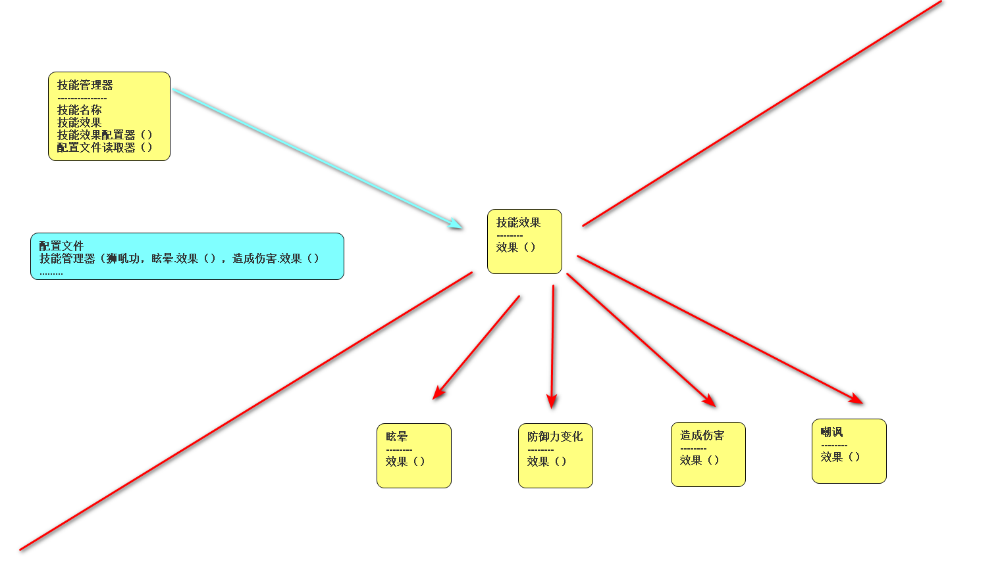

# 换行

## 不换行

我是一段很普通的文本信息，把我打印出来就可以了。我是第二段文本信息

## 直接换行

我是一段很普通的文本信息，把我打印出来就可以了。
我是第二段文本信息

区别在于直接换行句子间多了一个空格

## 先敲两个空格再换行

我是一段很普通的文本信息，把我打印出来就可以了。  
我是第二段文本信息

区别在于完成换行

## 换行两次

我是一段很普通的文本信息，把我打印出来就可以了。

我是第二段文本信息

区别在于换行后的间隔更大，类似段落与段落之间的关系

# 加粗与斜体

## 斜体

_我是一段很普通的文本信息，把我打印出来就可以了。_
_我是一段很普通的文本信息，把我打印出来就可以了。_

## 加粗

**我是一段很普通的文本信息，把我打印出来就可以了。**
**我是一段很普通的文本信息，把我打印出来就可以了。**

## 斜体且加粗

**_我是一段很普通的文本信息，把我打印出来就可以了。_**
**_我是一段很普通的文本信息，把我打印出来就可以了。_**

## 部分斜体与加粗

我是*一段*很普通的文本信息，把我打印出来就可以了。
我是**一段**很普通的文本信息，把我打印出来就可以了。
我是**_一段_**很普通的文本信息，把我打印出来就可以了。

# 画横杠

## 横杠

~~我是一段很普通的文本信息，把我打印出来就可以了。~~

## 横杠且斜体

_~~我是一段很普通的文本信息，把我打印出来就可以了。~~_

## 横杠且加粗

**~~我是一段很普通的文本信息，把我打印出来就可以了。~~**

## 横杠且加粗且斜体

**_~~我是一段很普通的文本信息，把我打印出来就可以了。~~_**

# 分割线

```
___
***
---

三种方式都能划一个横线
```

# 列表

## 无序列表

我是一段很普通的文本信息，把我打印出来就可以了。

- 我是第一项任务
- 我是第二项任务

或者

我是一段很普通的文本信息，把我打印出来就可以了。

- 我是第一项任务
- 我是第二项任务

## 有序列表

### 无嵌套

我是一段很普通的文本信息，把我打印出来就可以了。

1. 我是第一项任务
2. 我是第二项任务

或者

我是一段很普通的文本信息，把我打印出来就可以了。 3. 我是第一项任务 4. 我是第二项任务

所以只能按顺序写出，但是首项可自定义

### 有嵌套

我是一段很普通的文本信息，把我打印出来就可以了。

1. 我是第一项任务
   - 我是二级列表
2. 我是第二项任务
   - 我是二级列表

或者

1. 我是第一项任务
   1. 我是二级列表
2. 我是第二项任务
   1. 我是二级列表

### 列表内换行

#### 直接换行

1. 我是第一项任务 1. 我是二级列表
   我是一段很普通的文本信息，把我打印出来就可以了。

多一个空格并直接跟在后面

#### 空两格换行

1. 我是第一项任务
   1. 我是二级列表  
      我是一段很普通的文本信息，把我打印出来就可以了。

直接在列表内换行

#### 连换两行

1. 我是第一项任务
   1. 我是二级列表

我是一段很普通的文本信息，把我打印出来就可以了。

可以直接换行，类似前面换段

## to do list

我是一段很普通的文本信息，把我打印出来就可以了。

- [ ] 我是第一项任务
- [x] 我是第二项任务

# 代码块

## 代码前都加一个 tab

    print('hello world')

## 用上下三个反引号包裹代码块

```python
print('hello world')
```

## 行内代码块

调用`__init__()`方法

# 多级标题

```
# 一级标题
## 二级标题
### 三级标题
#### 四级标题
##### 五级标题
###### 六级标题

或者
一级标题
=
二级标题
-
```

# 引用

## 普通引用

> 引用内容

换行遵循前面，但是直接空两行会断开引用，建议每个引用内容前加尖括号

## 引用嵌套引用

> > 引用内容容

## 引用嵌套代码块

> 引用内容
>
> ```python
> print('hello world')
> ```

## 引用嵌套列表

> 引用内容
>
> - 第一个事项

# 超链接

## 直接插入链接

请前往[官网](https://baidu.com)

## 链接通过之后变量赋予

请前往[官网][a]
请前往[官网][a]
[a]:https://baidu.com

### 脚注

请前往官网[^1]
[^1]: 我是脚注

# 插入图片

## 直接写图片地址



## 之后变量赋予图片地址

![图片][def]

[def]: 技能设计图（局部）（正确，较好的方式）.png

# 表格

| 表头 | 表头 | 表头 |
| :--- | :--: | ---: |
| 表体 | 表体 | 表体 |
| 表   |  表  |   表 |

# 自定义 HTML 内容

学完前端再回来补

# 其他扩展语法

## 高亮文本

==我是高亮文本==

## 上标与下标

### 上标

x^2^

### 下标

x~2~

# 数学公式

## 单行

$x = 1$

## 多行

$$
x = 1
$$

## 各种数学符号

$$
\frac{1}{2}\\
x^2\\
x_2 \\
x_2^{2x}\\
\sqrt[3]{4}\\
()[]\{\}\\
\not=\\
\approx\\
\leq \\
\geq \\
\times \\
\div \\
\pm \\
\sum^{10}_{k=2}100k \\
\prod 累乘 \\
\coprod 累除 \\
\overline{1+2+3=4} \\
90^\circ \\
\sin\pi \\
\infty \\
\int_2^2x^2 \\
\iint \\
y\prime \\
\lim \\
\emptyset \\
\in \\
\notin \\
\supset \\
\supseteq \\
\subset \\
\subseteq \\
\bigcap \\
\bigcup \\
\log_21 \\
\alpha \\
\beta \\
\gamma \\
\delta \\
\eta \\
\omega \\
\theta \\
\sigma \\
\mu \\
\epsilon \\
$$
