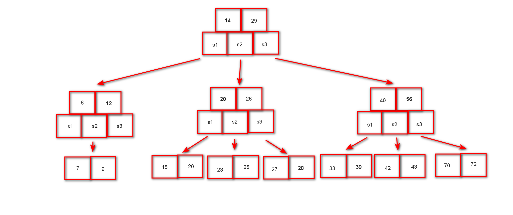
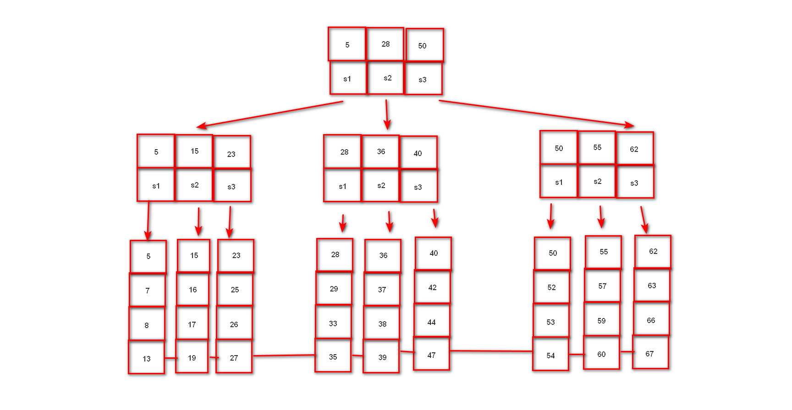
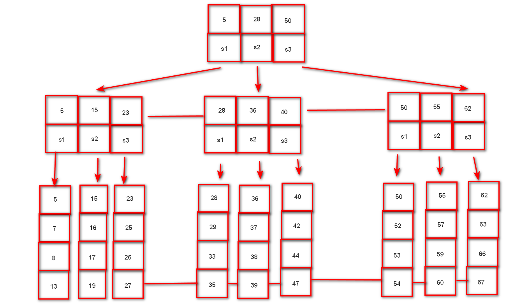
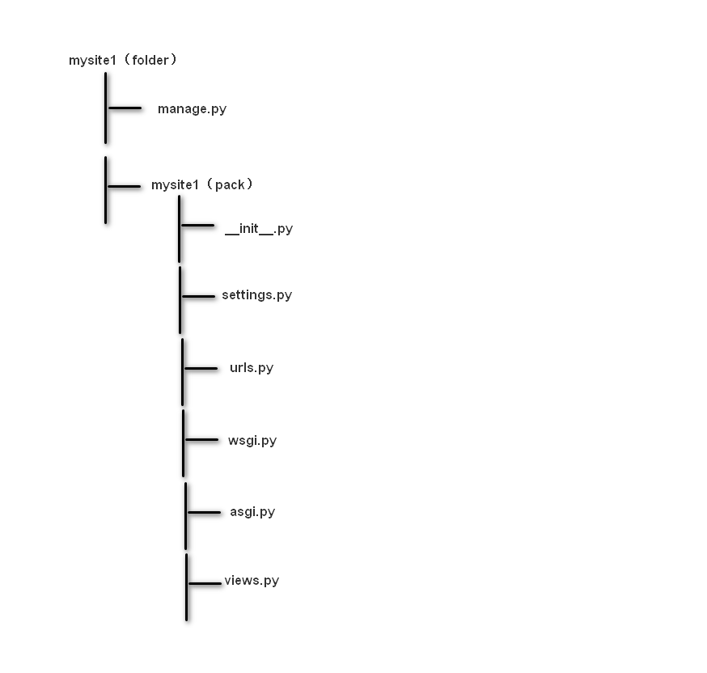

# mysql核心
## 索引
### 定义
对数据中的一列或多列的值进行排序的一种结构，即btree
#### 涉及的相关数据结构
1. b树
   * 图示
      
   * 查询过程说明
     寻找单个数据时，按照索引所在的区间，走对应的指针，直到找到索引；寻找一个区间时，则重复寻找单个数据的过程，直到覆盖整个区间
   * 特点：指针比索引多一个，每个节点包含对应索引的所有内容
   * 优点
     单个查询速度极快，且包含数据，找到索引即找到所需内容 
   * 缺点 
     区间查询时速度极慢，且由于每个节点都包含数据，整个树的宽度极大，相同搜索的存储空间获得的索引较少，同样影响搜索速率 
2. b+树
   * 图示
       
   * 查询过程说明
     查找单个数据时，按照索引走对应的指针，直到找到最小的索引区间，走叶子对应的链表依次寻找直到找到对应索引；查找区间时，先同查找单个数据，找到区间起始点，然后直接通过列表向前或者向后找到区间终止点
   * 特点
     索引与指针个数一致，数据仅在叶子节点所对应的链表上，各个叶子节点对应的链表之间按顺序相连，为双向链表    
   * 优点
     查找区间速度极快，同时由于数据全在叶子节点的链表中，故树的宽度较窄，相同搜索空间包含更多索引搜索效率更高 
   * 缺点
     由于数据只在叶子节点上，故必须走到叶子节点所对应的链表才可找到对应数据，查找单个数据时相对较慢   
3. b*树
   * 图示 
     
   * 特点
     索引与指针个数一致，数据仅在叶子节点所对应的链表上，各个叶子节点对应的链表之间按顺序相连，为双向链表，同时每个中间节点之间也是按顺序相连的     
### 优点
极大的加快数据检索
### 缺点
极大的占用物理空间
### 创建索引
#### 语法
1. 新表：```create table 表 (字段名 数据类型,..., index(字段名);```
2. 已有表：```create index 索引名 on 表名(字段名);```
### 查看索引
#### 语法
```show index from 表名```
### 删除索引
```drop index 索引名 from 表名```
## key
### key分类
#### 普通key
1. 字符标识：MUL（default）
2. 含义：无约束
#### 唯一key
1. 字符标识：UNI
2. 含义：不重复
3. 语法
   1. 创建
      * 建表时：```create table 表名 (..., unique(字段名));```
#### 主键（primary key）
1. 字符标识：primary key
2. 含义：不重复且不可为空，一个表中仅含有一个
3. 语法：详见python_re_and_mysql_and_git_learning.md的mysql部分
#### 外键（foreign key）
1. 含义：让当前字段在其他表的范围内选取
2. 语法
   1. 创建
      * 建表：```create table 表名 (..., 外键名 foreign key (参考字段名) references 表名 (被参考字段名) on delete 级联动作 on update 级联动作); -- 其中外键名可省略，有mysql自动分配```
      * 已有表：```alter table 表名 add 外键名 foreign key (参考字段名) references 表名 (被参考字段名) on delete 级联动作 on update 级联动作); -- 其中外键名可省略，有mysql自动分配```
   2. 查看
      * ```show create table 表名;``` 
   3. 删除 
      * ```alter table 表名 drop foreign key 外键索引名;```
3. 使用规则：
   * 主从表数据类型必须一致
   * 主表被参考字段为key的一种，一般为主键
4. 级联动作
   * cascade：主表中与从表外键相关的记录更新或删除，从表中对应的记录同时更新或删除（更新只更新外键的值，删除则删除整条记录）
   * restrict：从表有外键相关的记录，则主表对应的记录不得删除或更新
   * set null：主表中与从表外键相关的记录更新或删除，从表中对应的记录的外键的值变为null
## 表的复制
### 作用
在表上线前，可以复制进行离线测试以防出现问题，同时当要扩充表来记录时，也可快速扩表
### 语法
1. 复制指定表中的指定字段
  ```create table 表名 select ...;```
2. 复制表结构（扩表）
   ```create table 表名 select * where false;```
### 注意事项
表复制时，key不会复制过来，需手动添加 
## 数据导入与导出
### 作用
将数据库中的记录与系统文件进行交互
### mysql安全文件路径
1. 作用：为使得数据库安全所有文件的导入与导出必须通过安全文件路径
2. 查看路径方法
   * ```show variable like "%secure%"```

   注：在windows中注意将路径中的反斜杠转为斜杠 
### 语法
#### 导入
1. 导入非sql文件 
  ```load data infile "路径/文件名" into table 表名 fields terminated by "分隔符" lines terminated by "分隔符";```
2. 导入sql文件
   1. 详见python_re_and_mysql_and_git_learning.md的mysql部分
   2. 直接使用```source 文件名.sql;```
#### 导出
1. 导出非sql文件 
  ```select ... from 表名 into outfile "路径/文件名" fields terminated by "分隔符" lines terminated by "分隔符";```
1. 导出sql文件： 详见python_re_and_mysql_and_git_learning.md的mysql部分
#### csv分割符
1. 字段分割符：```,```
2. 行分隔符：```\n```
## 锁  
### 目的
解决客户端并发访问的冲突问题
### 锁类型分类
1. 读锁（共享锁）：当拥有读锁时，其他客户端可以读取但不可以修改记录
2. 写锁（排他锁，互斥锁）：当拥有写锁时，其他客户端不可读取且不可修改记录
### 锁粒度分类（mysql使用的引擎）
1. 表级锁：mvisam
2. 行级锁：innodb
## 存储引擎
### 定义
处理表的处理器
### 基本操作
1. 查看所有存储引擎
   ```show engines;``` 
2. 查看已有表的存储引擎
   ```show create table 表名``` 
3. 创建表指定引擎
   ```create table 表名 (...) engine=引擎名;``` 
4. 已有表指定引擎
   ```alter table 表名 engine=引擎名;``` 
### mysql中的三个重要引擎
#### InnoDB
1. 支持行级锁
2. 支持外键、事务、事务回滚
3. 表字段和索引字段存储在一个文件中
   1. 表名.frm：表结构
   2. 表名.ibd：表记录及索引文件
4. 特点
   1. 由于表字段和索引字段存储在一个文件中，故InnoDB的b+树上的叶子节点是拥有数据的
   2. 由于是行级锁，故在写操作中不会由于一个记录的修改导致整个表上锁
   3. 支持功能丰富，如外键、事务
   4. 索引有序，范围查询效率优秀
   5. 由于第一个特点，故在缓存中，相同存储空间下存储的索引更少，可能导致搜索记录时要进行磁盘io降低效率
   6. 由于第四个特点，故其通过记录获取记录的频繁程度，更改存储在内存中的索引，可以减少第四个特点效率降低的影响 
#### MyISAM
1. 支持表级锁
2. 表字段和索引分开存储
   1. 表名.frm：表结构
   2. 表名.MYI：索引文件（my index）
   3. 表名.MYD：记录文件（my data）
3. 特点
   1. 由于表字段和索引分开存储，故MyISAM的b+树的叶子节点不含有数据而是指向对应存储内容位置的指针，需要进行磁盘io获取数据；另一方面，由于缓存中只储存索引，故相同存储空间存储索引更多，可以减少磁盘io增加效率
   2. 由于索引为无序存储，范围查询效率堪忧
   3. 由于为表级锁，当表中有一个记录更改时，整个表上锁
   4. 支持功能少
#### MEMORY
1. 表记录存储在内存中效率高
2. 服务或主机重启表记录清楚，但表结构依旧存在
### 存储引擎的选择
#### 原则
1. 当不确认也不想进行测试时，一律使用InnoDB
2. 进行测试以及衡量后，选择存储引擎
3. 临时表使用MEMORY（一般被redis替代）
4. 不要随意更改已有表的存储引擎
#### 原因
从前面对每个存储引擎的特点介绍可以看出，InnoDB与MyISAM在不同场景各有利弊，但是如前面所谈索引在缓存中的存储问题，虽然InnoDB存储的索引较少，但是一旦命中，效率将比MyISAM高；另一方面，InnoDB支持功能更多更关键，为了效率舍弃功能也值得衡量；最后，一者为表级锁一者为行级锁，应该就存储内容是否需要更高的锁颗粒度进行选择
## 权限
### 添加权限用户
1. 添加新用户，设置可以连接的ip
   ```create user "用户名"@"连接地址" identified by "密码";```
   注：连接地址写```%```表示所有当前主机的ip地址，写```localhost```表示只能本地连接
2. 授权
   ```grant 权限列表 on 库名.表名 to "用户名"@"连接地址"```
   注：权限列表可以写```all privileges、select、insert、...```等，不同权限通过逗号连接；```库名.表名```中可以写```*```表示所有库或者所有表 
3. 刷新权限 
   ```flush privileges;``` 
## 远程连接
1. ```sudo su``` 
2. ```cd /etc/mysql/mysqld.conf.d```
3. ```cp mysqld.conf mysqld.conf.bak```
4. ```vim mysqld.conf```并将```bind-address```前加```#```注释
5. 保存退出
6. ```service mysql restart```
7. 设置用户连接方式为```%```
## 设置优先使用字符编码
1. ```sudo su``` 
2. ```cd /etc/mysql/mysqld.conf.d```
3. ```cp mysqld.conf mysqld.conf.bak```
4. ```vim mysqld.conf```并增加```character_set_server = unf8/其他字符编码```
5. 保存退出
6. ```service mysql restart```
7. 通过```show variables like "%character%"```来查看设置结果
## 查看mysql的错误日志
### 第一种方式
1. ```cd /var/log/mysql```
2. ```vim error.log```
### 第二种方式
1. ```cd /var/log```
2. ```vim syslog```并通过关键词mysql检索
## 事务
### 定义
一件事从开始发生到结束的过程
### 作用
确保数据的一致性，准确性，时效性
### 事务操作
1. 开启事务
   * 使用```begin;```或```start transastion;```来开启 
2. 执行sql语句
3. 结束事务
   * 使用```commit;```来提交或使用```rollback;```来回滚
### 事务四大特点
#### 原子性（atomicity）
事务被视为最小的工作单位，要么全部提交，要么全部回滚，不存在中间状态
#### 一致性（consistency）
数据库总是从一个一致状态转换到另一个一致状态
#### 隔离性（isolation）
一个事务在结束前，其他事务不可见该事务所作的修改
#### 持久性（durability） 
一旦事务提交，其所做的修改会永远保存到数据库，此时即使系统崩溃，修改的数据也不会丢失
## E-R模型（Entry-Relationship）
### 定义
E-R模型即实体-关系数据模型，用于数据库设计
### 作用
用简单的图反映事实或数据之间的关系
### 实体与属性
1. 实体：即一个事物，矩形框表示，在数据库中体现为表的记录
2. 属性：即事物特性，椭圆形框表示，在数据库中体现为表的字段
3. 关系
   * 一对一（1:1）：A，B间的实体一一对应
   * 一对多（1:m/1:n）：A中的一个实体对应B中的多个实体
   * 多对多（m:n）： A中的一个实体对应B中的多个实体，B中的一个实体也对应A中的多个实体
### 关系映射实现
1. 一对一：在A，B表中的任意一个表添加一个外键字段关联另一个表的key前要加上unique，一般为主键
2. 一对多：在多对一的表中添加一个外键字段关联一对多的表中的key，一般为主键
3. 多对多：创建第三个表分别用两个外键字段关联两个表的key，一般为主键
## 普通查询
### 查询消耗时间记录（精准）的步骤
1. ```show variables like "%pro%"```：找到profiling
2. ```set profiling=1```：开启profiling功能
3. ```show profiles```：展示近几次查询所耗时间
### 查询语句书写顺序
|mysql执行顺序|语句书写顺序|
|:----:|:----:|
|3|select ...,聚合函数 from 表明|
|1|where...|
|2|group by ...|
|4|having ...|
|5|order by ...|
|6|limit ...|
### 查询相关关键字
#### 聚合函数
##### 作用
可以获取整个字段的特征
##### 分类
1. avg(字段名)：该字段的平均值
2. max(字段名)：该字段的最大值
3. min(字段名)：该字段的最小值
4. sum(字段名)：该字段的记录之和
5. count(字段名)：统计该字段记录的个数，空值null不会统计

注：使用```聚合对象 as 新字段名```可以为聚合对象命名，方便后面调取使用
#### group by
##### 作用
依据group by后的字段名，对该字段名中不同的值分别进行一次聚合

注：使用group by时，如果select后面有普通字段，则普通字段必须与group by后面的字段保持一致
#### having
##### 作用
与where作用类似，不过是用条件来筛选聚合对象的
#### distinct
##### 作用
除去字段中的重复值
##### 使用
写在要查询的字段前或者聚合对象括号中的字段前即可

注：可使用多个字段，字段之间的关系为与关系，即只用当某一条数据的这几个字段都相同才被视为相同数据
## 嵌套查询
### 定义
把内层查询结果作为外层查询的条件
### 语法格式
```select ... from 表名 where 条件(select ... );```

注：嵌套的查询语句可以不写from，则默认是从外层select的表
## 多表查询
### 普通查询（笛卡尔积）
#### 特点
如果没有使用where条件限制，那么会组合出大量的结果，即笛卡尔积，故需通过限定where条件使得不同表的记录可以一一对应，减少冗余的结果
#### 语法
```select ... from 表1,表2,... (where 条件)```
### 连接查询
#### 内连接
##### 作用
与普通查询加上where一致，仅仅是更改了写法
##### 语法
```select ... from 表1 inner join 表2 on 条件 inner join ...```
#### 左（右）连接
##### 作用
主要查询左（右）的字段，当右（左）字段没有匹配条件时，显示null
##### 语法
```select ... from 表1 left/right join 表2 on 条件 left/right join ...```
## sql语句优化
1. 存储引擎优化：合理选择引擎
2. 索引优化：在select，where，order by经常涉及的字段建立索引
3. sql语句优化（本质上是尽量使用索引扫描而非全表扫描，或者减少返回内容）
   1. 单条查询加```limit 1```
   2. where自居不使用```!=```
   3. 不使用空值判断（设置字段默认值，防止空字段）
   4. 避免```or```连接（使用union all来连接两个查询语句）
   5. 避免使用前置```%```模糊查询
   6. 避免```in/not in```（使用between）
   7. 避免```select *```（使用指定字段）
# sql注入
## 定义
一种在前端网页中的表单写入sql语句的行为
## 原理
由于客户端搜索内容本质是在前端提交关键词后传输给后端，再通过格式化字符串变为sql语句在数据库中检索内容，那么在前端输入如```--```，```;```等符号或者写入sql语句来改变后端sql语句的含义，使得得到非正常的结果
## 危害
可能导致数据库的信息泄露，数据库的信息遭到破坏以及绕开网页验证等恶劣问题
## 防护
通过更加严谨的检测，防止非正常输入的进入，同时使用较为复杂的库名，以防被撞到库名，导致整个数据库被删除或修改
# 网络传输过程中部分环节的部分原理
## 重要数据的加密与解码
部分重要的数据如密码等在存储进数据库前会加密，如哈希算法，以防数据库泄露后，直接将用户相关信息直接暴露在外。一般来说经过加密的过程是单向的，不可逆的，但国内的CMD5通过对大量字符串进行各种算法加密并形成映射表，得到了解码方法
## 哈希算法部分特点及应用
### 哈希算法特点
1. 无论输入内容为何，最终加密输出的内容都为长度相同的字符串且一一对应，当输入内容不同（即使只有一点不同）都会导致结果发生极大的变化，被称为雪崩效应
### 应用
1. 大文件传输的验证方式
   1. 首先由于大文件不可能一次进行传输，故每次客户端请求下载内容时都要向服务端提供下载进度，以保证大文件传输的正确性
   2. 但由于多次传输过程中可能导致文件被替换丢失等问题，所以要进行验证，一般使用将文件转化为哈希值，并与官方下载提供的哈希值进行比对的方式保证文件的完整性。
   3. 大文件由于无法全部转化为哈希值，故一般采用抽样调查的方式，将文件按指定大小划分并抽取数据内容转化为哈希值
# URL（Uniform Resource Locator）介绍
## 定义
同一资源定位符
## 作用
用来表示互联网上某个资源的地址

注：互联网上的每一各文件都有一个唯一的url，它包含的信息指出文件的位置及浏览器处理方式
## 语法格式
```
protocol://hostname[:port]/path[?query][#fragment] # []表示可省略

# 如下实例
https://baidu.com/video/showVideo?menuid=65781&version=AID201908#subject
```
### 格式解析
#### protocol（协议）——常用三种
* http：通过HTTP访问该资源
  * 格式：```http://```
* https：通过安全的HTTPS访问该资源
  * 格式：```https://```
* file：通过本地计算机上的文件访问
  * 格式：```file://```
#### hostname（主机名）
是指存放资源的服务器的域名系统（DNS）主机名、域名或IP地址
#### port（端口号）
* 整数可选，忽略时使用方案的默认接口

注：各种传输协议都有默认的端口号，如http默认80，https默认443
#### path（路由地址）
* 由零个或多个```/```符号隔开的字符串，一般用来表示主机上的一个目录或文件地址。路由地址决定了服务器如何处理这个请求
#### query（查询列表）
* 可选，用于给动态网页传递参数，可有多个参数，用```&```隔开，每个参数名与参数值用```=```隔开
#### fragment（信息片段）
* 字符串，用于指定网络资源中的片段，即指向页面中的某个元素的标识。可以起到如通过该标识快速跳转至该页面中其指向的元素而无需刷新页面等作用
# Django框架
## 介绍
### 基本情况
2005年发布，采用python语言编写的开源web框架。早期的时候django主做新闻和内容管理。如今是一个重量级的python web框架，django配备了web开发常用的大部分组件。
### 支持组件
1. 基本配置
2. 路由系统
3. 原生html模板系统
4. 视图view
5. Model模型，数据库连接和ORM类数据库管理
6. 中间件
7. Cookie&Session
8. 分页
9. 数据库后台管理系统admin
### 使用场景
1. 网络后端开发
2. 微信公众号、微信小程序等后台开发
3. 基于HTTP/HTTPS协议的后台服务器开发，，如：在线语音/在线图像识别，在线第三方身份验证服务器等
## 使用
### 安装
#### 安装命令
1. 使用普通库的安装：```pip3 install django[==版本]```
2. 使用whl安装（需现在官网上下载whl文件）：```pip3 install xxx.whl```
3. 使用tar.gz安装（仅限Linux）：
   ```shell
   tar -xvf xxx.tar.gz
   cd Django-1.11.8
   python3 setup.py install
   ``` 
#### 版本选择
1. 要支持对应的python版本
2. 选择长期支持版
##### 查看安装版本
在python中使用如下命令
```python
import django
print(django.VERSION)
```
### 卸载
在命令行中使用如下命令
```shell
pip3 uninstall django
```
### 开发
#### 创建项目
在命令行中使用如下命令
```shell
django-admin startproject "项目名称"
```

注：项目名称不得使用中文
#### 项目目录解析
##### 项目目录结构图

##### 主模块（```manage.py```）
1. 作用：项目管理主程序，在开发阶段用于管理整个项目的开发运行的调试
2. 部分子命令（使用```python3 manage.py```查看）:
   * ```runserver```：启动服务 
   * ```startapp```：创建应用
   * ```migrate```：数据库迁移    
##### 项目包文件夹（mysite1包）
1. ```__init__.py```：包初始化文件，管理包内可被导出的模块
2. ```wsgi.py```
3. ```urls.py```：```settings.py```中的```ROOT_URLCONF```指定主路由配置文件
   * ```urlpatterns```：一个列表，在其中配置url
     * 使用```path("路径", views中的处理函数, name=none)```配置url
     * 使用```re_path(r"regex", views中的处理函数, name=none)```配置url
       * 不带捕获组但带有分组的regex的：按照位置传参给views中处理函数
       * 带捕获组的：按照关键字传参给views中处理函数
   
     注：name可为地址起名，在模板中可以反向解析地址 
4. ```asgi.py```
5. ```views.py```：包含若干个用于接收一个浏览器的请求并通过HttpResponse对象返回数据的函数。此函数可以通过接收浏览器请求并根据业务逻辑返回相应的内容给浏览器
   * 语法
     ```python
     def xxx_view(request, [其他参数]):
         语句块
         return HttpResponse对象

     # 参数
     # request：用于绑定HttpRequest对象，通过此对象可以获取浏览器的参数和数据
     # 需通过django.http导入HttpResponse类或其子类    
     ``` 
6. ```settings.py```：django项目的配置文件，此配置文件中的一些全局变量将为django框架的运行提供一系列参数；此配置文件在启动服务时自动调用；可以定义一些变量作为全局作用域的数据传递
   * 内部全局变量解析
     * BASE_DIR：用于绑定当前项目的绝对路径（动态计算得到）
     * DEBUG：用于配置django项目的启动模式
       * 取值：
         * True：表示开发环境中使用调试模式
         * False：表示当前项目运行在生产环境中
     * ALLOWED_HOSTS：设置允许访问到本项目的网络地址列表
       * 取值
         * ```[]```空列表：表示只有```127.0.0.1```或```localhost```或```[::1]```可以访问
         * ```['*']```：表示任何网络地址都可以访问该项目
         * ```['192.168.0.*', '172.130.0.1']```：表示指定ip的客户端可以访问，其中```*```表示数字任取
         * ```['*.baidu.com']```：表示可以通过百度访问
     * INSTALLED_APPS：指定当前项目中安装的应用列表
     * MIDDLEWARE：用于注册中间件
     * TEMPCATES：用于指定模板的配置信息
     * DATABASES：用于指定数据库的配置信息
     * LANAUAGE_CODE：用于指定语言配置
       * 取值
         * ```en-us```：英文
         * ```zh-hans```：中文
     * TIME_ZONE：用于指定当前服务器端的时区
       * 取值
         * ```UTC```：世界标准时间
         * ```Asia/Shanghai```：中国时间
     * ROOT_URLCONF：用于配置根级URL，一般为配置```mysite1.urls```文件名
   
   注：此模块可以通过```from django.conf import settings```来导入和使用
#### pycharm调试配置步骤
1. pycharm中edit其中的configuration
2. 增加python下```manage.py```的debug
3. 增加parameters：```runserver```
4. 保存并重启项目，之后同普通debug
#### Django各模块中部分类与方法解析
##### HttpResponse与HttpRequest对象
1. HttpRequest对象
    * 产生：服务器收到htt协议的请求，会根据数据报文创建HttpRequest对象
    * 属性
      * path：字符串，表示请求的路由信息
      * path_info：URL字符串
      * method：字符串，常用为GET与POST
      * encoding：字符串，用于提交数据的编码形式
        * 如果为none，则为浏览器默认字符编码，一般为```utf-8```
        * 这个属性可写，在修改后之后访问都将使用修改后的编码
      * GET：QueryDict查询字典对象，包含get请求方式的所有数据
      * POST：QueryDict查询字典对象，包含post请求方式的所有数据
      * FILES：类似于字典的对象，包含所有的上传文件的信息
      * COOKIES：python字典，包含所有的cookie，键和值都为字符串
      * session：类似于字典的对象，表示当前会话
      * body：字符串，请求体的内容（POST或PUT）
      * environ：字符串，客户端运行的环境变量信息
      * scheme：请求协议，即```http/https```
      * request.get_full_path()：请求的完整路径
      * request.get_host()：请求的主机
      * request.META：请求中的元数据（信息头）
        * request.META['REMOTE_ADDR']：客户端IP地址

   注：属性可通过调试断点查看 
2. HttpResponse对象
   * 构造函数格式
     ```HttpResponse(content=响应体, content_type=响应体数据类型, status=响应码)``` 
   * 作用：向客户端浏览器返回响应，同时携带响应体内容
   * 参数 
     * content：表示返回的内容
     * status：返回HTTP响应的状态（默认为200）
     * content_type：值返回数据的MIME类型，默认为```text/html```。浏览器会根据这个属性来显示数据。
       * 常用的content_type
         * ```text/html```：默认，html文件
         * ```text/plain```：纯文本
         * ```text/css```：css文件
         * ```text/javascript```：js文件
         * ```multipact/form-data```：文件提交
         * ```application/json```：json传输
         * ```application/xml```：xml文件
   * HttpResponse子类
     |子类名|作用|响应码|额外内容|
     |:----:|:----:|:----:|:----:|
     |HttpResponseRedirect|重定向|301|在括号内加上网址，可以直接跳转|
     |HttpResponseNotModified|未修改|304||
     |HttpResponseBadRequest|错误请求|400||
     |HttpResponseNotFound|没有对应的资源|404||
     |HttpResponseForbidden|请求被禁止|403||
     |HttpResponseServerError|服务器错误|500||

   注：可通过网页检查中的network来查看状态码与请求  
#### GET方式传参
##### 原理
GET请求方式可通过查询字符串（Query String）将数据传递给服务器
##### 格式
即url中的查询字符串部分
##### 语法
```python
if request.method == "GET":
   info1 = request.GET['参数名'] # 第一种获取方式
   info2 = request.GET.get("参数名", 默认值) # 第二种获取方式，仅限于键值对是一对一的
   info3 = request.GET.getlist("参数名") # 第三种获取方式，键值对为一对多时可以用这个
elif ...:
```

注：通过```{"键":["值1", "值2", "值3"]}```来实现单键对多值
##### 能产生get请求的场合
1. 地址主动输入
2. html的超链接标签
3. html中的form表单提交

注：查询字符串建议不超过2048字节
