# mysql核心

## 索引

### 定义

对数据中的一列或多列的值进行排序的一种结构，即btree

#### 涉及的相关数据结构

1. b树
   * 图示
     
   * 查询过程说明
     寻找单个数据时，按照索引所在的区间，走对应的指针，直到找到索引；寻找一个区间时，则重复寻找单个数据的过程，直到覆盖整个区间
   * 特点：指针比索引多一个，每个节点包含对应索引的所有内容
   * 优点
     单个查询速度极快，且包含数据，找到索引即找到所需内容
   * 缺点
     区间查询时速度极慢，且由于每个节点都包含数据，整个树的宽度极大，相同搜索的存储空间获得的索引较少，同样影响搜索速率
2. b+树
   * 图示
       
   * 查询过程说明
     查找单个数据时，按照索引走对应的指针，直到找到最小的索引区间，走叶子对应的链表依次寻找直到找到对应索引；查找区间时，先同查找单个数据，找到区间起始点，然后直接通过列表向前或者向后找到区间终止点
   * 特点
     索引与指针个数一致，数据仅在叶子节点所对应的链表上，各个叶子节点对应的链表之间按顺序相连，为双向链表
   * 优点
     查找区间速度极快，同时由于数据全在叶子节点的链表中，故树的宽度较窄，相同搜索空间包含更多索引搜索效率更高
   * 缺点
     由于数据只在叶子节点上，故必须走到叶子节点所对应的链表才可找到对应数据，查找单个数据时相对较慢
3. b*树
   * 图示
     
   * 特点
     索引与指针个数一致，数据仅在叶子节点所对应的链表上，各个叶子节点对应的链表之间按顺序相连，为双向链表，同时每个中间节点之间也是按顺序相连的

### 优点

极大的加快数据检索

### 缺点

极大的占用物理空间

### 创建索引

#### 语法

1. 新表：```create table 表 (字段名 数据类型,..., index(字段名);```
2. 已有表：```create index 索引名 on 表名(字段名);```

### 查看索引

#### 语法

```show index from 表名```

### 删除索引

```drop index 索引名 from 表名```

## key

### key分类

#### 普通key

1. 字符标识：MUL（default）
2. 含义：无约束

#### 唯一key

1. 字符标识：UNI
2. 含义：不重复
3. 语法
   1. 创建
      * 建表时：```create table 表名 (..., unique(字段名));```

#### 主键（primary key）

1. 字符标识：primary key
2. 含义：不重复且不可为空，一个表中仅含有一个
3. 语法：详见python_re_and_mysql_and_git_learning.md的mysql部分

#### 外键（foreign key）

1. 含义：让当前字段在其他表的范围内选取
2. 语法
   1. 创建
      * 建表：```create table 表名 (..., 外键名 foreign key (参考字段名) references 表名 (被参考字段名) on delete 级联动作 on update 级联动作); -- 其中外键名可省略，有mysql自动分配```
      * 已有表：```alter table 表名 add 外键名 foreign key (参考字段名) references 表名 (被参考字段名) on delete 级联动作 on update 级联动作); -- 其中外键名可省略，有mysql自动分配```
   2. 查看
      * ```show create table 表名;```
   3. 删除
      * ```alter table 表名 drop foreign key 外键索引名;```
3. 使用规则：
   * 主从表数据类型必须一致
   * 主表被参考字段为key的一种，一般为主键
4. 级联动作
   * cascade：主表中与从表外键相关的记录更新或删除，从表中对应的记录同时更新或删除（更新只更新外键的值，删除则删除整条记录）
   * restrict：从表有外键相关的记录，则主表对应的记录不得删除或更新
   * set null：主表中与从表外键相关的记录更新或删除，从表中对应的记录的外键的值变为null

## 表的复制

### 作用

在表上线前，可以复制进行离线测试以防出现问题，同时当要扩充表来记录时，也可快速扩表

### 语法

1. 复制指定表中的指定字段
  ```create table 表名 select ...;```
2. 复制表结构（扩表）
   ```create table 表名 select * where false;```

### 注意事项

表复制时，key不会复制过来，需手动添加

## 数据导入与导出

### 作用

将数据库中的记录与系统文件进行交互

### mysql安全文件路径

1. 作用：为使得数据库安全所有文件的导入与导出必须通过安全文件路径
2. 查看路径方法
   * ```show variable like "%secure%"```

   注：在windows中注意将路径中的反斜杠转为斜杠

### 语法

#### 导入

1. 导入非sql文件
  ```load data infile "路径/文件名" into table 表名 fields terminated by "分隔符" lines terminated by "分隔符";```
2. 导入sql文件
   1. 详见python_re_and_mysql_and_git_learning.md的mysql部分
   2. 直接使用```source 文件名.sql;```

#### 导出

1. 导出非sql文件
  ```select ... from 表名 into outfile "路径/文件名" fields terminated by "分隔符" lines terminated by "分隔符";```
1. 导出sql文件： 详见python_re_and_mysql_and_git_learning.md的mysql部分

#### csv分割符

1. 字段分割符：```,```
2. 行分隔符：```\n```

## 锁  

### 目的

解决客户端并发访问的冲突问题

### 锁类型分类

1. 读锁（共享锁）：当拥有读锁时，其他客户端可以读取但不可以修改记录
2. 写锁（排他锁，互斥锁）：当拥有写锁时，其他客户端不可读取且不可修改记录

### 锁粒度分类（mysql使用的引擎）

1. 表级锁：mvisam
2. 行级锁：innodb

## 存储引擎

### 定义

处理表的处理器

### 基本操作

1. 查看所有存储引擎
   ```show engines;```
2. 查看已有表的存储引擎
   ```show create table 表名```
3. 创建表指定引擎
   ```create table 表名 (...) engine=引擎名;```
4. 已有表指定引擎
   ```alter table 表名 engine=引擎名;```

### mysql中的三个重要引擎

#### InnoDB

1. 支持行级锁
2. 支持外键、事务、事务回滚
3. 表字段和索引字段存储在一个文件中
   1. 表名.frm：表结构
   2. 表名.ibd：表记录及索引文件
4. 特点
   1. 由于表字段和索引字段存储在一个文件中，故InnoDB的b+树上的叶子节点是拥有数据的
   2. 由于是行级锁，故在写操作中不会由于一个记录的修改导致整个表上锁
   3. 支持功能丰富，如外键、事务
   4. 索引有序，范围查询效率优秀
   5. 由于第一个特点，故在缓存中，相同存储空间下存储的索引更少，可能导致搜索记录时要进行磁盘io降低效率
   6. 由于第四个特点，故其通过记录获取记录的频繁程度，更改存储在内存中的索引，可以减少第四个特点效率降低的影响

#### MyISAM

1. 支持表级锁
2. 表字段和索引分开存储
   1. 表名.frm：表结构
   2. 表名.MYI：索引文件（my index）
   3. 表名.MYD：记录文件（my data）
3. 特点
   1. 由于表字段和索引分开存储，故MyISAM的b+树的叶子节点不含有数据而是指向对应存储内容位置的指针，需要进行磁盘io获取数据；另一方面，由于缓存中只储存索引，故相同存储空间存储索引更多，可以减少磁盘io增加效率
   2. 由于索引为无序存储，范围查询效率堪忧
   3. 由于为表级锁，当表中有一个记录更改时，整个表上锁
   4. 支持功能少

#### MEMORY

1. 表记录存储在内存中效率高
2. 服务或主机重启表记录清楚，但表结构依旧存在

### 存储引擎的选择

#### 原则

1. 当不确认也不想进行测试时，一律使用InnoDB
2. 进行测试以及衡量后，选择存储引擎
3. 临时表使用MEMORY（一般被redis替代）
4. 不要随意更改已有表的存储引擎

#### 原因

从前面对每个存储引擎的特点介绍可以看出，InnoDB与MyISAM在不同场景各有利弊，但是如前面所谈索引在缓存中的存储问题，虽然InnoDB存储的索引较少，但是一旦命中，效率将比MyISAM高；另一方面，InnoDB支持功能更多更关键，为了效率舍弃功能也值得衡量；最后，一者为表级锁一者为行级锁，应该就存储内容是否需要更高的锁颗粒度进行选择

## 权限

### 添加权限用户

1. 添加新用户，设置可以连接的ip
   ```create user "用户名"@"连接地址" identified by "密码";```
   注：连接地址写```%```表示所有当前主机的ip地址，写```localhost```表示只能本地连接
2. 授权
   ```grant 权限列表 on 库名.表名 to "用户名"@"连接地址"```
   注：权限列表可以写```all privileges、select、insert、...```等，不同权限通过逗号连接；```库名.表名```中可以写```*```表示所有库或者所有表
3. 刷新权限
   ```flush privileges;```

## 远程连接

1. ```sudo su```
2. ```cd /etc/mysql/mysqld.conf.d```
3. ```cp mysqld.conf mysqld.conf.bak```
4. ```vim mysqld.conf```并将```bind-address```前加```#```注释
5. 保存退出
6. ```service mysql restart```
7. 设置用户连接方式为```%```

## 设置优先使用字符编码

1. ```sudo su```
2. ```cd /etc/mysql/mysqld.conf.d```
3. ```cp mysqld.conf mysqld.conf.bak```
4. ```vim mysqld.conf```并增加```character_set_server = unf8/其他字符编码```
5. 保存退出
6. ```service mysql restart```
7. 通过```show variables like "%character%"```来查看设置结果

## 查看mysql的错误日志

### 第一种方式

1. ```cd /var/log/mysql```
2. ```vim error.log```

### 第二种方式

1. ```cd /var/log```
2. ```vim syslog```并通过关键词mysql检索

## 事务

### 定义

一件事从开始发生到结束的过程

### 作用

确保数据的一致性，准确性，时效性

### 事务操作

1. 开启事务
   * 使用```begin;```或```start transastion;```来开启
2. 执行sql语句
3. 结束事务
   * 使用```commit;```来提交或使用```rollback;```来回滚

### 事务四大特点

#### 原子性（atomicity）

事务被视为最小的工作单位，要么全部提交，要么全部回滚，不存在中间状态

#### 一致性（consistency）

数据库总是从一个一致状态转换到另一个一致状态

#### 隔离性（isolation）

一个事务在结束前，其他事务不可见该事务所作的修改

#### 持久性（durability）

一旦事务提交，其所做的修改会永远保存到数据库，此时即使系统崩溃，修改的数据也不会丢失

## E-R模型（Entry-Relationship）

### 定义

E-R模型即实体-关系数据模型，用于数据库设计

### 作用

用简单的图反映事实或数据之间的关系

### 实体与属性

1. 实体：即一个事物，矩形框表示，在数据库中体现为表的记录
2. 属性：即事物特性，椭圆形框表示，在数据库中体现为表的字段
3. 关系
   * 一对一（1:1）：A，B间的实体一一对应
   * 一对多（1:m/1:n）：A中的一个实体对应B中的多个实体
   * 多对多（m:n）： A中的一个实体对应B中的多个实体，B中的一个实体也对应A中的多个实体

### 关系映射实现

1. 一对一：在A，B表中的任意一个表添加一个外键字段关联另一个表的key前要加上unique，一般为主键
2. 一对多：在多对一的表中添加一个外键字段关联一对多的表中的key，一般为主键
3. 多对多：创建第三个表分别用两个外键字段关联两个表的key，一般为主键

## 普通查询

### 查询消耗时间记录（精准）的步骤

1. ```show variables like "%pro%"```：找到profiling
2. ```set profiling=1```：开启profiling功能
3. ```show profiles```：展示近几次查询所耗时间

### 查询语句书写顺序

|mysql执行顺序|语句书写顺序|
|:----:|:----:|
|3|select ...,聚合函数 from 表明|
|1|where...|
|2|group by ...|
|4|having ...|
|5|order by ...|
|6|limit ...|

### 查询相关关键字

#### 聚合函数

##### 作用

可以获取整个字段的特征

##### 分类

1. avg(字段名)：该字段的平均值
2. max(字段名)：该字段的最大值
3. min(字段名)：该字段的最小值
4. sum(字段名)：该字段的记录之和
5. count(字段名)：统计该字段记录的个数，空值null不会统计

注：使用```聚合对象 as 新字段名```可以为聚合对象命名，方便后面调取使用

#### group by

##### 作用

依据group by后的字段名，对该字段名中不同的值分别进行一次聚合

注：使用group by时，如果select后面有普通字段，则普通字段必须与group by后面的字段保持一致

#### having

##### 作用

与where作用类似，不过是用条件来筛选聚合对象的

#### distinct

##### 作用

除去字段中的重复值

##### 使用

写在要查询的字段前或者聚合对象括号中的字段前即可

注：可使用多个字段，字段之间的关系为与关系，即只用当某一条数据的这几个字段都相同才被视为相同数据

## 嵌套查询

### 定义

把内层查询结果作为外层查询的条件

### 语法格式

```select ... from 表名 where 条件(select ... );```

注：嵌套的查询语句可以不写from，则默认是从外层select的表

## 多表查询

### 普通查询（笛卡尔积）

#### 特点

如果没有使用where条件限制，那么会组合出大量的结果，即笛卡尔积，故需通过限定where条件使得不同表的记录可以一一对应，减少冗余的结果

#### 语法

```select ... from 表1,表2,... (where 条件)```

### 连接查询

#### 内连接

##### 作用

与普通查询加上where一致，仅仅是更改了写法

##### 语法

```select ... from 表1 inner join 表2 on 条件 inner join ...```

#### 左（右）连接

##### 作用

主要查询左（右）的字段，当右（左）字段没有匹配条件时，显示null

##### 语法

```select ... from 表1 left/right join 表2 on 条件 left/right join ...```

## sql语句优化

1. 存储引擎优化：合理选择引擎
2. 索引优化：在select，where，order by经常涉及的字段建立索引
3. sql语句优化（本质上是尽量使用索引扫描而非全表扫描，或者减少返回内容）
   1. 单条查询加```limit 1```
   2. where自居不使用```!=```
   3. 不使用空值判断（设置字段默认值，防止空字段）
   4. 避免```or```连接（使用union all来连接两个查询语句）
   5. 避免使用前置```%```模糊查询
   6. 避免```in/not in```（使用between）
   7. 避免```select *```（使用指定字段）

# sql注入

## 定义

一种在前端网页中的表单写入sql语句的行为

## 原理

由于客户端搜索内容本质是在前端提交关键词后传输给后端，再通过格式化字符串变为sql语句在数据库中检索内容，那么在前端输入如```--```，```;```等符号或者写入sql语句来改变后端sql语句的含义，使得得到非正常的结果

## 危害

可能导致数据库的信息泄露，数据库的信息遭到破坏以及绕开网页验证等恶劣问题

## 防护

通过更加严谨的检测，防止非正常输入的进入，同时使用较为复杂的库名，以防被撞到库名，导致整个数据库被删除或修改

# 网络传输过程中部分环节的部分原理

## 重要数据的加密与解码

部分重要的数据如密码等在存储进数据库前会加密，如哈希算法，以防数据库泄露后，直接将用户相关信息直接暴露在外。一般来说经过加密的过程是单向的，不可逆的，但国内的CMD5通过对大量字符串进行各种算法加密并形成映射表，得到了解码方法

## 哈希算法部分特点及应用

### 哈希算法特点

1. 无论输入内容为何，最终加密输出的内容都为长度相同的字符串且一一对应，当输入内容不同（即使只有一点不同）都会导致结果发生极大的变化，被称为雪崩效应

### 应用

1. 大文件传输的验证方式
   1. 首先由于大文件不可能一次进行传输，故每次客户端请求下载内容时都要向服务端提供下载进度，以保证大文件传输的正确性
   2. 但由于多次传输过程中可能导致文件被替换丢失等问题，所以要进行验证，一般使用将文件转化为哈希值，并与官方下载提供的哈希值进行比对的方式保证文件的完整性。
   3. 大文件由于无法全部转化为哈希值，故一般采用抽样调查的方式，将文件按指定大小划分并抽取数据内容转化为哈希值

# URL（Uniform Resource Locator）介绍

## 定义

同一资源定位符

## 作用

用来表示互联网上某个资源的地址

注：互联网上的每一各文件都有一个唯一的url，它包含的信息指出文件的位置及浏览器处理方式

## 语法格式

```
protocol://hostname[:port]/path[?query][#fragment] # []表示可省略

# 如下实例
https://baidu.com/video/showVideo?menuid=65781&version=AID201908#subject
```

### 格式解析

#### protocol（协议）——常用三种

* http：通过HTTP访问该资源
  * 格式：```http://```
* https：通过安全的HTTPS访问该资源
  * 格式：```https://```
* file：通过本地计算机上的文件访问
  * 格式：```file://```

#### hostname（主机名）

是指存放资源的服务器的域名系统（DNS）主机名、域名或IP地址

#### port（端口号）

* 整数可选，忽略时使用方案的默认接口

注：各种传输协议都有默认的端口号，如http默认80，https默认443

#### path（路由地址）

* 由零个或多个```/```符号隔开的字符串，一般用来表示主机上的一个目录或文件地址。路由地址决定了服务器如何处理这个请求

#### query（查询列表）

* 可选，用于给动态网页传递参数，可有多个参数，用```&```隔开，每个参数名与参数值用```=```隔开

#### fragment（信息片段）

* 字符串，用于指定网络资源中的片段，即指向页面中的某个元素的标识。可以起到如通过该标识快速跳转至该页面中其指向的元素而无需刷新页面等作用

# Django框架

## 介绍

### 基本情况

2005年发布，采用python语言编写的开源web框架。早期的时候django主做新闻和内容管理。如今是一个重量级的python web框架，django配备了web开发常用的大部分组件。

### 支持组件

1. 基本配置
2. 路由系统
3. 原生html模板系统
4. 视图view
5. Model模型，数据库连接和ORM类数据库管理
6. 中间件
7. Cookie&Session
8. 分页
9. 数据库后台管理系统admin

### 使用场景

1. 网络后端开发
2. 微信公众号、微信小程序等后台开发
3. 基于HTTP/HTTPS协议的后台服务器开发，，如：在线语音/在线图像识别，在线第三方身份验证服务器等

## web框架设计模式

### django框架设计模式（MODEL-TEMPLATE-VIEW MTV）

1. 图解
   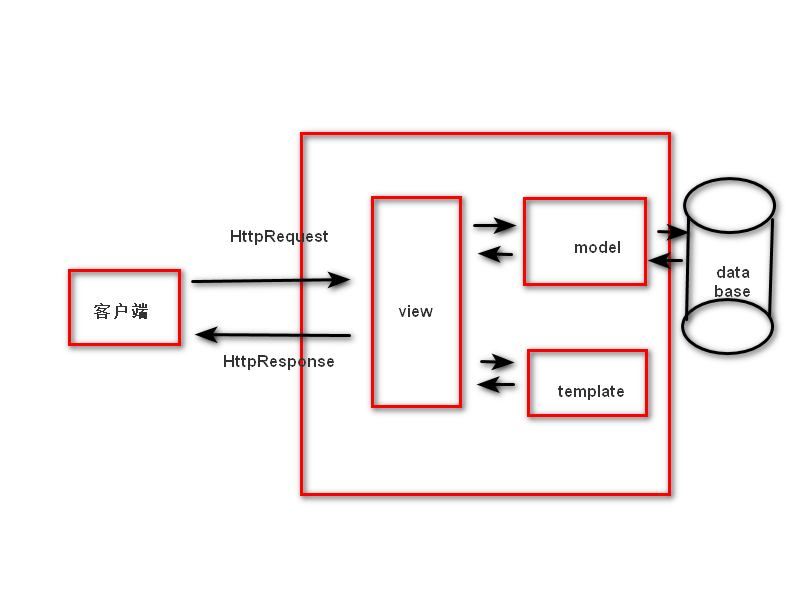
2. 各层次解析
    * M：主要用于数据库层次的封装
    * T：负责呈现内容到浏览器
    * V：负责接收请求、获取数据、返回结果，为核心

### 其他web框架的设计模式（MODEL-VIEW-CONTROLLER）

1. 图解
   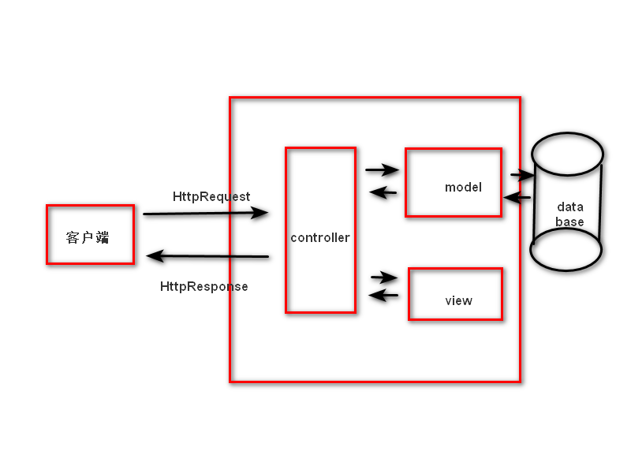
2. 各层次解析
   * M：主要用于数据库层次的封装
   * V：用于向客户端展示结果
   * C：用于处理请求、获取数据、返回结果，为核心

## 使用

### 安装

#### 安装命令

1. 使用普通库的安装：```pip3 install django[==版本]```
2. 使用whl安装（需现在官网上下载whl文件）：```pip3 install xxx.whl```
3. 使用tar.gz安装（仅限Linux）：

   ```shell
   tar -xvf xxx.tar.gz
   cd Django-1.11.8
   python3 setup.py install
   ```

#### 版本选择

1. 要支持对应的python版本
2. 选择长期支持版

##### 查看安装版本

在python中使用如下命令

```python
import django
print(django.VERSION)
```

### 卸载

在命令行中使用如下命令

```shell
pip3 uninstall django
```

### 开发

#### 创建项目

在命令行中使用如下命令

```shell
django-admin startproject "项目名称"
```

注：项目名称不得使用中文

#### 项目目录解析

##### 项目目录结构图


##### 主模块（```manage.py```）

1. 作用：项目管理主程序，在开发阶段用于管理整个项目的开发运行的调试
2. 部分子命令（使用```python3 manage.py```查看）:
   * ```runserver```：启动服务
   * ```startapp```：创建应用
   * ```migrate```：数据库迁移

##### 项目包文件夹（mysite1包）

1. ```__init__.py```：包初始化文件，管理包内可被导出的模块
2. ```wsgi.py```
3. ```urls.py```：```settings.py```中的```ROOT_URLCONF```指定主路由配置文件
   * ```urlpatterns```：一个列表，在其中配置url
     * 使用```path("路径", views中的处理函数, name=none)```配置url
     * 使用```re_path(r"regex", views中的处理函数, name=none)```配置url
       * 不带捕获组但带有分组的regex的：按照位置传参给views中处理函数
       * 带捕获组的：按照关键字传参给views中处理函数

     注：name可为地址起名，在模板中可以反向解析地址
4. ```asgi.py```
5. ```views.py```：包含若干个用于接收一个浏览器的请求并通过HttpResponse对象返回数据的函数。此函数可以通过接收浏览器请求并根据业务逻辑返回相应的内容给浏览器
   * 语法

     ```python
     def xxx_view(request, [其他参数]):
         语句块
         return HttpResponse对象

     # 参数
     # request：用于绑定HttpRequest对象，通过此对象可以获取浏览器的参数和数据
     # 需通过django.http导入HttpResponse类或其子类    
     ```

6. ```settings.py```：django项目的配置文件，此配置文件中的一些全局变量将为django框架的运行提供一系列参数；此配置文件在启动服务时自动调用；可以定义一些变量作为全局作用域的数据传递
   * 内部全局变量解析
     * BASE_DIR：用于绑定当前项目的绝对路径（动态计算得到）
     * DEBUG：用于配置django项目的启动模式
       * 取值：
         * True：表示开发环境中使用调试模式
         * False：表示当前项目运行在生产环境中
     * ALLOWED_HOSTS：设置允许访问到本项目的网络地址列表
       * 取值
         * ```[]```空列表：表示只有```127.0.0.1```或```localhost```或```[::1]```可以访问
         * ```['*']```：表示任何网络地址都可以访问该项目
         * ```['192.168.0.*', '172.130.0.1']```：表示指定ip的客户端可以访问，其中```*```表示数字任取
         * ```['*.baidu.com']```：表示可以通过百度访问
     * INSTALLED_APPS：指定当前项目中安装的应用列表
     * MIDDLEWARE：用于注册中间件
     * TEMPCATES：用于指定模板的配置信息
     * DATABASES：用于指定数据库的配置信息
     * LANAUAGE_CODE：用于指定语言配置
       * 取值
         * ```en-us```：英文
         * ```zh-hans```：中文
     * TIME_ZONE：用于指定当前服务器端的时区
       * 取值
         * ```UTC```：世界标准时间
         * ```Asia/Shanghai```：中国时间
     * ROOT_URLCONF：用于配置根级URL，一般为配置```mysite1.urls```文件名

   注：此模块可以通过```from django.conf import settings```来导入和使用

#### pycharm调试配置步骤

1. pycharm中edit其中的configuration
2. 增加python下```manage.py```的debug
3. 增加parameters：```runserver```
4. 保存并重启项目，之后同普通debug

#### Django各模块中部分类与方法解析

##### HttpResponse与HttpRequest对象

1. HttpRequest对象
    * 产生：服务器收到htt协议的请求，会根据数据报文创建HttpRequest对象
    * 属性
      * path：字符串，表示请求的路由信息
      * path_info：URL字符串
      * method：字符串，常用为GET与POST
      * encoding：字符串，用于提交数据的编码形式
        * 如果为none，则为浏览器默认字符编码，一般为```utf-8```
        * 这个属性可写，在修改后之后访问都将使用修改后的编码
      * GET：QueryDict查询字典对象，包含get请求方式的所有数据
      * POST：QueryDict查询字典对象，包含post请求方式的所有数据
      * FILES：类似于字典的对象，包含所有的上传文件的信息
      * COOKIES：python字典，包含所有的cookie，键和值都为字符串
      * session：类似于字典的对象，表示当前会话
      * body：字符串，请求体的内容（POST或PUT）
      * environ：字符串，客户端运行的环境变量信息
      * scheme：请求协议，即```http/https```
      * request.get_full_path()：请求的完整路径
      * request.get_host()：请求的主机
      * request.META：请求中的元数据（信息头）
        * request.META['REMOTE_ADDR']：客户端IP地址

   注：属性可通过调试断点查看
2. HttpResponse对象
   * 构造函数格式
     ```HttpResponse(content=响应体, content_type=响应体数据类型, status=响应码)```
   * 作用：向客户端浏览器返回响应，同时携带响应体内容
   * 参数
     * content：表示返回的内容
     * status：返回HTTP响应的状态（默认为200）
     * content_type：值返回数据的MIME类型，默认为```text/html```。浏览器会根据这个属性来显示数据。
       * 常用的content_type
         * ```text/html```：默认，html文件
         * ```text/plain```：纯文本
         * ```text/css```：css文件
         * ```text/javascript```：js文件
         * ```multipact/form-data```：文件提交
         * ```application/json```：json传输
         * ```application/xml```：xml文件
   * HttpResponse子类

     |子类名|作用|响应码|额外内容|
     |:----:|:----:|:----:|:----:|
     |HttpResponseRedirect|重定向|301|在括号内加上网址，可以直接跳转|
     |HttpResponseNotModified|未修改|304||
     |HttpResponseBadRequest|错误请求|400||
     |HttpResponseNotFound|没有对应的资源|404||
     |HttpResponseForbidden|请求被禁止|403||
     |HttpResponseServerError|服务器错误|500||

   注：可通过网页检查中的network来查看状态码与请求  

#### GET方式传参

##### 原理

GET请求方式可通过查询字符串（Query String）将数据传递给服务器

##### 格式

即url中的查询字符串部分

##### 语法

```python
if request.method == "GET":
   info1 = request.GET['参数名'] # 第一种获取方式
   info2 = request.GET.get("参数名", 默认值) # 第二种获取方式，仅限于键值对是一对一的
   info3 = request.GET.getlist("参数名") # 第三种获取方式，键值对为一对多时可以用这个
elif ...:
```

注：通过```{"键":["值1", "值2", "值3"]}```来实现单键对多值

##### 能产生get请求的场合

1. 地址主动输入
2. html的超链接标签
3. html中的form表单提交

注：查询字符串建议不超过2048字节

#### POST方式传参

##### 传递方式

通过html网页中的form表单标签进行提交

##### 接收方式

1. 判断request.method是否为POST
2. 使用get/getlist/[]来拿取POST中的值

##### 注意事项

1. 需先关闭csrf认证，否则django将会拒绝客户端POST请求
   * 在settings.py中找到MIDDLEWARE，并将CsrfViewsMiddleWare所在行注释
2. 表单中POST提交的内容必须在标签中加入name属性，且只有input，select，textarea标签才能写入name属性

#### template模板层

##### 定义

根据字典值动态变化的HTML网页，即HTML网页中缺省部分内容

##### 配置

1. 创建与```manage.py```同级别的templates文件夹
2. 修改```settings.py```中的TEMPLATES变量
   * BACKEND：指定模板引擎
   * DIRS：模板的搜索目录
     注：其中填入的目录要使用动态计算，即```os.path.join(BASE_DIR, "templates")```
   * APP_DIRS：是否要在应用中的templates文件夹中搜索模板文件
      注：在app包中的下级目录创建templates目录，再下级创建与app应用名相同的文件夹之后，可以在其中存储模板html，当此选项值为true时，则可以render或load通过```/应用app名/模板名```来获取模板
   * OPTIONS：有关模板的选项

##### 使用

1. 模板加载
   1. 通过loader获取模板，通过HttpResponse进行响应

      ```python
      from django.template import loader
      t = loader.get_template("模板文件名")
      html = t.render(字典)
      return HttpResponse(html)
      ```

   2. 使用render

      ```python
      from django.shortcuts import render
      return render(request, "模板名称", [字典数据]) # 此处方括号表示可省略
      ```

2. 模板变量
   * ```{{ 变量名 }}```：普通变量占位
   * ```{{ 变量名.index }}```：变量占位并获取其对应索引的值
   * ```{{ 变量名.方法 }}```：变量占位并获取对应方法结果的值
   * ```{{ 变量名.key }}```：变量占位并获取对应key值的value值
   * ```{{ 函数名 }}```：变量占位并获取函数方法的值
  
   注：由于render传递字典时通过key定位模板变量，并将value值传入其中，故可以使用```locals()```将函数局部作用域内所有的局部变量形成键值对的字典，方便创建用于render传递数据的字典
3. 模板标签
   1. 作用：将一些服务端的功能传递进模板中
   2. 通用标签语法

      ```
      
      html内容
      
      ```

   3. 各常用标签介绍
      * if标签
        * 语法：

          ```
          
          ...
          
          ...
          
          ...
          
          ```

        * 注意事项
          * 可使用的bool运算：```==```，```!=```，```<```，```>```，```<=```，```>=```，```in```，```not in```，```is```，```is not```，```and```，```or```，```not```
          * 不可使用数学运算
          * 不可使用括号  
      * for标签
        * 语法：

          ```
          
          ...
          
          ...
          
          ```

        * 内置变量（forloop）
          * forloop.counter：循环的当前迭代（1开始）
          * forloop.counter0：循环的当前迭代（0开始）
          * forloop.revcounter：循环的反向迭代（1结束）
          * forloop.revcounter0：循环的反向迭代（0结束）
          * forloop.first：第一次循环时为True否则为False
          * froloop.last：最后一次循环时为True否则为False
          * froloop.parentloop：外层循环的当前迭代
      * extends标签
        * 作用：使子模版复用父模板的内容，同时也可覆盖重写父模板中对应的块
        * 语法：

          ```
          # 1. 继承语句
          
          # 2. 重写语句
          
          

          # 如果要在子模版中重写父模板中的内容，必须在父模板中用block标签包裹，语法与重写一致，然后在子模版中使用对应的块名来重写
          ```

   4. 部分过滤器
      1. 作用：对输出结果进行处理
      2. 语法

         ```
         {{ 变量名 | 过滤器1 | 过滤器2 | ... }}
         ```

      3. 常用
         * lower：全小写
         * upper：全大写
         * safe：识别html
         * add:'n'：增加n的数值
         * truncatechars:'n'：保留n-3位字符内容并加上三个点
      注：更多过滤器见官方文档

##### URL反向解析

1. 作用：在配置路由时，可取name来命名对应路由，使得当路由改变时，其他网页可以不通过修改地址，而直接通过name反向解析出url来获取改变后的路由地址
2. 语法：

   ```
    # 写在html中写有路由地址的位置处，其中如果原先的url没有分组，可以不写分组的值
   ```

#### 静态文件

##### 定义

不与服务器做动态交互的文件，如：图片，js，css，音频，部分html等

##### 配置

1. 在```settings.py```中配置STATIC_URL
   * 作用：设置访问静态文件的url地址
   * 默认值：为```/static/```，一般不改
   * 注意事项：如果想自己配置url地址，注意地址的首尾都要有```/```
2. 在```settings.py```中配置STATICFILES_DIRS
   * 作用：设置静态文件的物理存储地址
   * 值：字符串，使用```os.path.join()```动态计算的```settings.py```中的BASE_DIR与静态文件夹的相对路径

##### 访问方法

1. 直接使用url地址来访问
   如：```/static/imgs/xxx```
2. 先使用load标签加载static，再在模板中使用模板变量来替代静态文件url地址填写的位置
   如：

      ```
      
      
      ```  

#### 应用app

##### 定义

即一个独立的业务模块，包含自己的路由，视图，模板，模型

##### 创建

1. 首先使用如下命令创建app文件夹

   ```shell
   python3 manage.py startapp '应用名称'
   ```

2. 再在```settings.py```中的INSTALLED_APPS注册该创建的应用app

   ```python
   INSTALLED_APPS = [
      xxxx,
      xxxx,
      '要注册的应用名称',
   ]
   ```

##### app目录结构解析

1. migration文件夹：保存数据迁移的中间文件（用来与数据库同步模型）
2. ```__init__.py```文件：应用子包的初始化文件
3. ```admin.py```文件：应用后台管理文件
4. ```apps.py```文件：应用的属性配置文件
5. ```models.py```文件：与数据库相关的映射文件
6. ```test.py```文件：应用的单元测试文件
7. ```views.py```文件：视图函数处理文件

##### 应用的分布式路由

1. 意义：化整为零，减少耦合度，优化路由路径搜索
2. 实现：通过主路由分发至各个app的子路由，并交由给app自己的views进行处理
3. 图示
   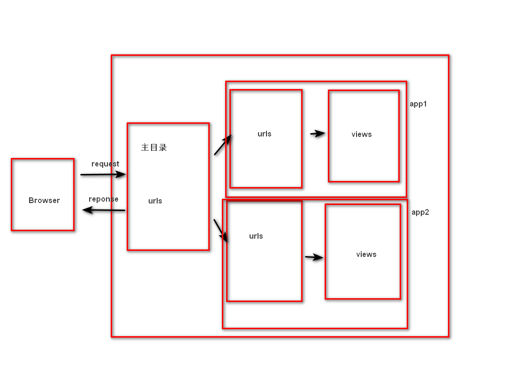
4. 语法
   1. 在子路由中增加urlpattrens列表用来存放子路由

      ```python
      urlpatterns = [
         url1,
         url2,
         ...
      ]
      # 子路由中的路由要减去主路由中用于向各app子路由分发的路由路径
      ```

   2. 在主路由中添加分发路由的路由路径

      ```python
      from django.conf.urls import include
      urlpatterns = {
         ...,
         path('/music/', include('music.urls'))
      }
      # music为一个app的名称，同时注意这里的路径一定要首尾有/
      ```  

#### 数据库与模型

##### ORM（Object Relationship Mapping）框架

1. 定义：对象映射关系
2. 作用：建立模型类和对象与数据库表字段记录的映射关系，允许以面向对象的方式操作数据库
3. 优缺点：简化数据库操作的同时，由于不直接使用sql语句，故效率低于sql语句
4. 配置mysql数据库
   1. 安装pymysql包
   2. 创建数据库
      ```create database 数据库名 charset=utf8 collate utf8_general_ci /*collate 后的内容表示优化utf8编码排序，同时取消大小写敏感*/```
   3. 在```settings.py```中的DATABASES

      ```python
      # 默认使用sqlite
      DATABASES = {
         'default': {
            'ENGINE': 'django.db.backends.sqlite',
            'NAME': os.path.join(BASE_DIR, 'db.sqlite3')
         }
      }
      # 修改为使用mysql
      DATABASE = {
         'default': {
            'ENGINE': 'django.db.backends.mysql',
            'NAME': '数据库名称',
            'USER': 'XXX',
            'PASSWORD': 'XXX',
            'HOST': '127.0.0.1',
            'PORT': 3306
         }
      }
      ```

   4. 在主目录的```__init__.py```中写入如下语句

      ```python
      import pymysql
      pymysql.install_as_MySQLdb()
      ```

5. 模型
   1. 定义：是一个类，继承自父类```django.db.models.Models```
   2. 作用：成为数据交互的接口，是表示和操作数据库的方法和方式
   3. 与数据库的映射关系
      * 表 -> 类
      * 字段 -> 属性
      * 记录 -> 实例化后的对象
   4. 创建模型类
      * 语法

        ```python
        from django.db import models
        class 类名(models.Model):
            字段名 = models.字段类型(字段选项)
        ```

      * 字段类型
        1. BooleanField()
           * 数据库对应类型：tinyint(1)
        2. CharField()
           * 数据库对应类型：varchar
           * 注意事项：需指定max_lenth参数
        3. DateField()
           * 数据库对应类型：date
           * 字段选项
             * auto_now：每次保存都修改为当次保存的时间，值为True/False
             * auto_now_add：仅在第一次添加时记录保存时间，值为True/False
             * default：自行设置的默认时间，值为字符串格式的时间
           * 注意事项：三个中至多选择一个
        4. DateTimeField()
           * 数据库对应类型：datetime(6)
        5. DecimalField()
           * 数据库对应类型：decimal(x,y)
           * 字段选项
             * max_digits：总位数
             * deciaml_places：小数位数
        6. FloatField()
           * 数据库对应类型：double
        7. EmailField()
           * 数据库对应类型：varchar
           * 注意事项：只能存邮箱格式的内容
        8. IntegerField()
           * 数据库对应类型：int
        9. URLField()
           * 数据库对应类型：varchar(200)
        10. ImageField()
           * 数据库对应类型：varchar(100)
           * 注意事项：该类型仅存图片的存储路径
        11. TextField()
           * 数据库对应类型：longtext

         注：更多见官方文档
      * 部分通用字段选项（参数）
        1. primary_key
           * 值：True/默认为False
           * 注意事项：如果不给类中的字段设置主键，则会自动生成id作为主键
        2. blank
           * 值：True/默认为False
           * 含义：True时表示字段可以为空，但仅针对字符类型；False表示不能为空
        3. null
           * 值：True/默认为False
           * 注意事项：如果数字或日期类型要允许为空的，需要将blank与null都设置为True
        4. default
           * 值：该字段默认的值，由该字段的类型决定
           * 注意事项：对于不许为空的字段，一般设置default
        5. db_index
           * 值：True/默认False
           * 作用：创建索引
        6. unique
           * 值：True/默认False
           * 作用：创建唯一索引
        7. verbose_name
           * 值：字符串
           * 作用：在后台管理admin界面显示的名字

         注：更多见官方文档  
6. 数据库迁移  
   * 作用：同步模型与数据库中的内容，包括建立删除表以及字段的增删改
   * 生成迁移文件
     * 命令

         ```shell
         python3 manage.py makemigrations [指定app名]
         ```

     * 作用：每一个models都生成迁移的中间文件并保存在各自的migrations文件夹中
   * 执行迁移
     * 命令

         ```shell
         python3 manage.py migrate [指定app名]
         ```

     * 作用：完成模型与数据库的同步
   * 注意事项：每一次修改模型都要在服务启动前执行以上两个命令来同步数据库与模型
7. 数据库基本操作
   1. 定义：即CRUD(CREATE/READ/UPDATE/DELETE)
   2. 管理器对象（MyModel.Objects）
      1. 来源：继承自父类models.model
      2. 作用：通过其进行数据库相关操作
   3. 增加记录（对象）
      * 方法一

         ```python
         obj = MyModel.objects.create(属性1=值1, 属性2=值2, ...) # 成功返回记录的实体，失败则抛出异常
         ```

      * 方法二

         ```python
         # 实例化对象后依次赋值
         obj = MyModel()
         obj.属性1 = 值1
         ...
         # 保存记录
         obj.save()
         # 实例化对象同时赋值
         obj = MyModel(属性1=值1, 属性2=值2, ...)
         # 保存记录
         obj.save()
         ```

   4. 查询数据（select语句）
      * 查询谓词
        1. 作用：实现where语句后的条件
        2. 书写方式：书写在filter/exclude/get方法的参数中，并使用```列名__查询谓词```来作为关键字参数。其中列名实现获取列，其中查询谓词部分实现对应的筛选条件
           如：```MyModel.objects.filter(column_lt = 50)```
        3. 部分查询谓词
           * ```__exact```：等值匹配（可省略，即只写列名）
           * ```__contains```：包含指定值（相当于 like "%xxx%"）
           * ```__startwith```：以该值开始
           * ```__endwith```：以该值结尾
           * ```__gt```：大于
           * ```__gte```：大于等于
           * ```__lt```：小于
           * ```__lte```：小于等于
           * ```__in```：在集合中
           * ```__range```：值在闭区间中

            注：更多见官方文档
      * QuerySet对象
        * 作用：将查询结果形成一个聚合对象，支持迭代协议，拥有一些方法
      * F与Q对象
        1. F对象
           * 作用：可以取出当前记录中各个字段的值
           * 导入：```from django.db.models import F```
           * 使用：```F("列名")```
           * 实例：```QuerySet.update(列1=F("列1") + 10)```
        2. Q对象
           * 作用：实现各个逻辑运算
           * 导入：```from django.db.models import Q```
           * 可以使用的运算符
             * 与：&
             * 或：|
             * 非：~
           * 使用：```Q(条件1) & Q(条件2) | ~ Q(条件3)```
           * 实例：```MyModel.objects.filter(Q(price_lt=20) | Q(price_gt=40))```
      * 普通查询方法详解
         1. ```MyModel.objects.all()```
            * 作用：查询全部记录，相当于```select * from xxx```
            * 返回值：QuerySet对象，内部的每一条查询到的记录都以MyModel对象的形式存在
         2. ```MyModel.objects.values()```
            * 作用：查询所有记录的指定列，相当于```select 列名1, 列名2, ... from xxx```
            * 参数：str类型，要获取的类名
            * 返回值：QuerySet对象，内部的每一条查询到的记录都以字典的形式存在，格式为```{"列名1": "值1", "列名2": "值2", ...}```
         3. ```MyModel.objects.values_list()```
            * 作用：查询所有记录的指定列，相当于```select 列名1, 列名2, ... from xxx```
            * 参数：str类型，要获取的类名
            * 返回值：QuerySet对象，内部的每一条查询到的记录都以元组的形式存在，格式为```("值1", "值2", ...)```
         4. ```MyModel.objects.order_by()```
            * 作用：查询全部记录并按照指定列进行排序，相当于```select * from xxx order by 列名1, 列名2```
            * 参数：str，列名，在列名前加负号可以降序排列，当有多个列名会按照书写顺序作为优先级进行比较
            * 返回值：QuerySet对象，内部的每一条查询到的记录都以以元组的形式存在
         5. ```MyModel.objects.filter()```
            * 作用：根据输入的条件进行筛选，返回对应的符合条件的记录
            * 参数：查询条件即列名加查询谓词与要达成条件的值
            * 返回值：QuerySet对象，内部的每一条查询到的记录都以MyModel对象的形式存在
            * 注意事项：逗号连接的各个以关键字传参形式呈现的条件之间为与关系
         6. ```MyModel.objects.exclude()```
            * 作用：根据输入的条件进行筛选，返回对应的不符合条件的记录
            * 参数：查询条件即列名加查询谓词与要达成条件的值
            * 返回值：QuerySet对象，内部的每一条查询到的记录都以MyModel对象的形式存在
            * 注意事项：逗号连接的各个以关键字传参形式呈现的条件之间为与关系  
         7. ```MyModel.objects.get()```
            * 作用：根据输入的条件进行筛选，返回符合条件的唯一一条记录
            * 参数：查询条件即列名加查询谓词与要达成条件的值
            * 返回值：MyModel对象
            * 注意事项：能且只能返回一条记录。如果多于一条，则抛出Model.MultipleObjectsReturned异常；如果没有记录，则抛出Model.DoesNotExist异常

            注：更多见官方文档
      * 聚合查询详解
         * 聚合查询相关类与对象导入：```from django.db import *```
         * 聚合函数分类：
           1. Sum
           2. Avg
           3. Count
           4. Max
           5. Min
         * 聚合查询语法
            1. 不具有分组
               * 语法：```MyModel.objects.aggregate(结果变量名1=聚合函数("列"), 结果变量名2=聚合函数("列"), ...)```
               * 参数：结果变量名自定义即可
               * 返回值：由结果变量名于值形成的字典，即```{"结果变量名1": 值1, "结果变量名2": 值2, ...}```
            2. 具有分组
               * 语法：```QuerySet对象.annotate(结果变量名1=聚合函数("列"), 结果变量名2=聚合函数("列"), ...)```
               * 参数：结果变量名自定义即可
               * 返回值：QuerySet对象，内部的结果以字典形式呈现
               * 注意事项：QuerySet对象是使用values获取的指定列的记录，这些列将作为后面聚合的分组

      注：可与F对象联用，使得查询条件可以通过获取之前自己列的值进行自加，自减，自乘，自除后于自己列或其他列进行比较等操作
   5. 修改数据
      1. 修改单一数据
         * 使用get获取单一对象
         * 使用对象.属性直接修改
         * 通过对象.save()保存修改
      2. 修改多个数据
         * 使用能返回QuerySet对象的查询语句
         * 使用对象.update(列1=值1)来进行集体修改

      注：常与F对象联用，使得多个修改数据可以通过获取之前自己列的值进行自加，自减，自乘，自除等操作  
   6. 删除数据
      1. 删除单个数据
         * 通过查询语句得到单一对象
         * 使用对象.delete()方法进行删除
      2. 删除多个数据
         * 通过查询语句得到单一对象
         * 使用对象.delete()方法进行删除
   7. 数据表映射关系实现
      1. 一对一
         * 创建表中关联语法：

           ```python
            class MyModelA(models.Model):
               paraA = xxx

            class MyModelB(models.Model):
               mymodela = models.OneToOneField(MyModelA)
           ```  

         * 创建关联记录语法：

           ```python
           objA = MyModelA.objects.create(xxx)
           objB = MyModelB.objects.create(xxx, my_model_a = objA)
           ```  

         * 查询关联记录语法：

           ```python
           objA.mymodelb # 获得b中关联记录
           objB.mymodela # 获取a中关联记录
           ```

      2. 一对多
         * 创建表中关联语法：

           ```python
            class MyModelA(models.Model):
               paraA = xxx
            class MyModelB(models.Model):
               mymodela = ForeignKey(MyModelA, ...)
               """
               参数：
                  to：即一对多表中一表的类名
                  on_delete：
                     值：
                        models.CASCADE：与sql中cascade一致
                        models.PROTECT：与sql中restrict一致
                        models.SET_NULL：与sql中set null一致
                        models.SET_DEFAULT：当主表删除时从表自动变为默认值 
                           注：需要设置ForeignKey的default关键字参数值
                        更多见官方文档
                  其余Field的通用参数

               """
           ```  

         * 创建关联记录语法：

           ```python
           objA = MyModelA.objects.create(xxx)
           objB = MyModelB.objects.create(xxx, mymodela=objA)
           objC = MyModelB.objects.create(xxx, mymodela=objA)
           ```  

         * 查询关联记录语法：

           ```python
           # 正向，获取QuerySet或者所需对象
           objA.mymodelb_set.filter(xxx)
           objA.mymodelb_set.exclude(xxx)
           objA.mymodelb_set.all(xxx)
           objA.mymodelb_set.get(xxx)
           # 逆向
           objB.mymodela
           objC.mymodela
           ```

      3. 多对多
         * 创建表中关联语法：

           ```python
            class MyModelA(models.Model):
               paraA = xxx
            class MyModelB(models.Model):
               mymodela = ManyToManyField(MyModelA)
           ```  

         * 创建关联记录语法：

           ```python
           # 先创建a表对象，再创建b表对象
           objA = MyModelA.objects.create(xxx)
           objB = objA.mymodelb_set.create(xxx)
           objC = objA.mymodelb_set.create(xxx)
           # 创建a表对象，并增加已有b表对象
           objD = MyModelA.objects.create(xxx)
           objD.mymodelb_set.add(objB)
           objD.mymoelb_set.add(objC)

           # 简单理解则是，每一个A表对象都有一个交集，通过彼此间可能有交集实现多对多
           ```  

         * 查询关联记录语法：

           ```python
           # 正向，返回QuerySet对象或所需对象
           objA.mymodelb_set.filter(xxx)
           objA.mymodelb_set.exclude(xxx)
           objA.mymodelb_set.all(xxx)
           objA.mymodelb_set.get(xxx)
           # 逆向，返回QuerySet对象或所需对象
           objB.mymodela_set.filter(xxx)
           objB.mymodela_set.exclude(xxx)
           objB.mymodela_set.all(xxx)
           objB.mymodela_set.get(xxx)
           ```

   8. 原生数据库查询语句
      1. 查询语句（select）
         * 语法：```MyModel.objects.raw(sql语句)```
         * 返回值：为QuerySet对象
      2. 其他语句
         * 导入connection：```from django.db import connection```
         * 使用如下的语句

            ```python
            with connection.cursor() as cur:
               cur.execute(sql语句)
            ```

8. ORM中错误解决方法
   * 问题1
     * 描述：在已有类中新增属性时报错
     * 可能原因：新增属性为非空字段，而已有的数据在新增字段都没有值，故报错
     * 解决方法：在新增属性中增加default参数
   * 问题2
     * 描述：已有数据库结构紊乱
     * 解决方法：删除已有库，并重建库，并删除migrations中除```__init__.py``文件以外的所有文件，之后重新执行两步迁移命令即可

#### django中的shell

1. 定义：django自己基于ipython的交互环境
2. 作用：方便直接在交互模式进行测试，其中可以使用django包以及自己项目包中的内容
3. 注意事项：进入交互环境时，处于主目录所在的位置，故导入内容时，要写从主目录开始的相对路径
4. 语法：

   ```shell
   python3 manage.py shell
   ```

#### django数据库后台管理  

##### 作用

通过图形化界面，简单的操作数据库，可供测试或调试时使用

##### 呈现内容

将所有注册的模型类按照django自带应用admin中所写的呈现在网页

##### 使用

1. 创建后台管理用户
   * 语法：```python3 manage.py createsuperuser```

     注：之后按照提示操作即可，注意密码不可过于简单  
2. 访问url：```http://127.0.0.1:8000/admin```
3. 自定义后台管理的数据表
   * 步骤
     1. 对应应用的admin.py中导入应用的models模块
     2. 使用```admin.site.register(MyModel, [MyModelManager])```进行注册即可
        注：MyModel_Manger非必填项，详情见下方的模型管理类
4. 自定义后台管理的数据表中数据显示方式
   1. 自建model类中的```__str__```内置方法
      * 描述：通过重写该内置方法，返回字符串，作为该表记录在admin界面中显示的内容
      * 图示：
        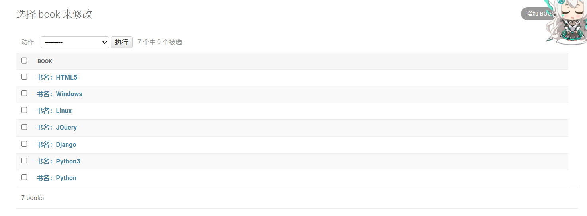
   2. 自建model类中field的verbose属性
      * 描述：在自建model类写字段时，可以通过指定关键字参数verbose的值，来作为该字段在admin显示的内容
      * 图示：
        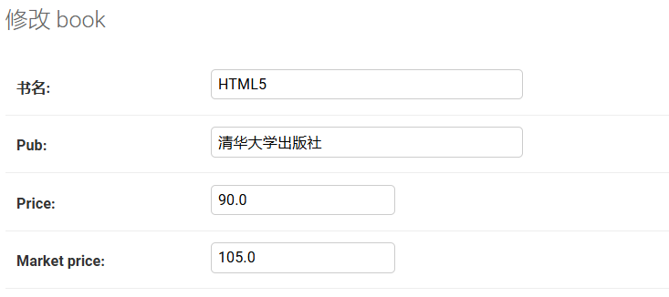  
   3. 模型管理类
      * 作用：用于管理关联模型在admin界面显示的方式
      * 创建：

        ```python
         # 在应用下的admin.py文件中
         # 创建自定义的模型管理类
         class MyModelManager(admin.ModelAdmin):
            pass
         # 注册并关联已有模型类
         admin.register(models.MyModel, MyModelManager)
         
        ```  

      * 部分类属性：
        * list_display：
          * 值：值为列表，其中填写字段
          * 作用：控制表在admin界面可以显示的字段
          * 图示：
            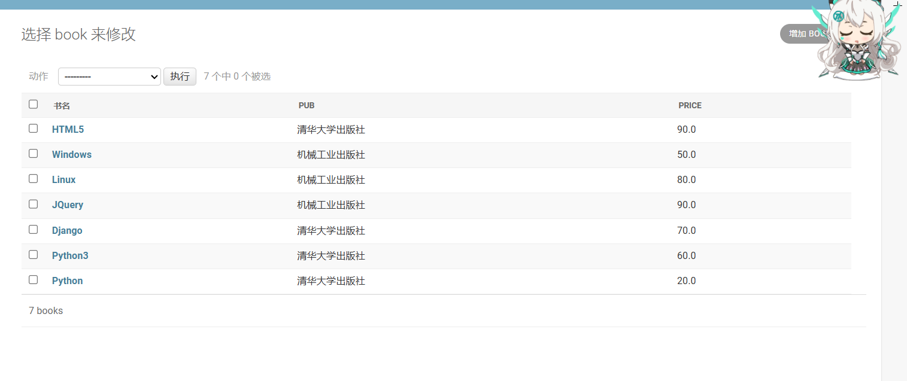
        * list_display_links：
          * 值：值为列表，其中填写字段
          * 作用：控制表在admin界面显示的字段是否可以直接跳转至修改页面
          * 图示：
            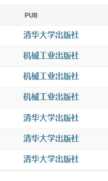
        * list_filter：
          * 值：值为列表，其中填写字段
          * 作用：开启admin界面右侧依据字段的过滤器
          * 图示：
            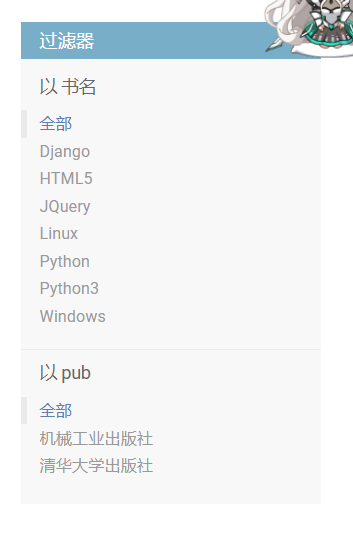
        * search_fields：
          * 值：值为列表，其中填写字段
          * 作用：开启admin上方的依据字段的搜索框
          * 图示：
            
        * list_edible：
          * 值：值为列表，其中填写字段
          * 作用：使得表在admin界面上显示的字段可以直接被编辑（即变为input元素）
          * 图示：
            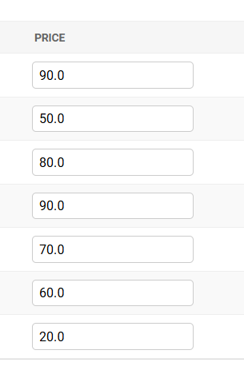

         注：其他详见官方文档
   4. meta类
      * 作用：可以重新定义当前模型类和数据表的一些基本信息
      * 书写位置：在对应的模型类之内，即内嵌类
      * 部分属性：
        * db_table
          * 作用：用于数据表名的修改
          * 值：str
          * 注：由于涉及到数据库中表名的修改，故要进行数据库迁移
        * verbose_name
          * 作用：用于对admin界面中表的单数名进行修改
          * 值：str
          * 图示：
            
        * verbose_name_plural
          * 作用：用于对admin界面中表的复数名进行修改
          * 值：str
          * 图示：
            
5. 界面使用指南
   1. 创建超级用户（操作user表）
      * 图示：
        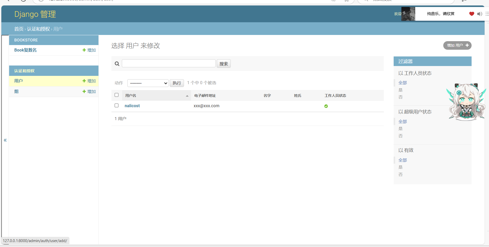
        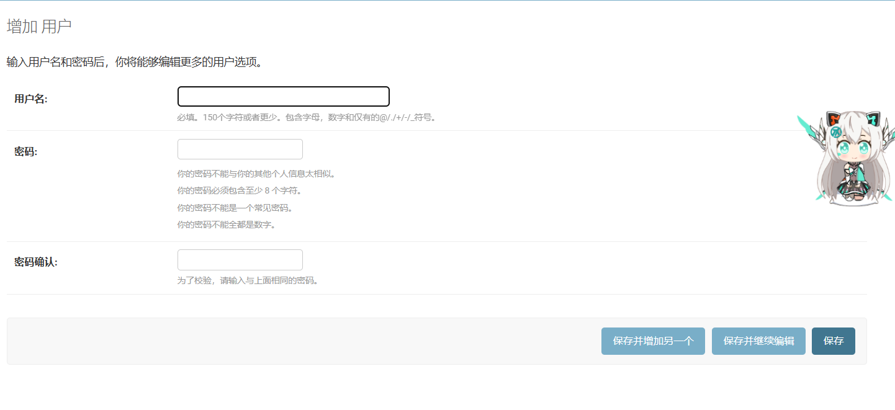
   2. admin中点击表的字段实现排序，点击箭头选择正序或逆序，再次点击字段取消排序
      * 图示：
        
        
        
   3. 增删改查注册的数据表
      * 图示：
        
        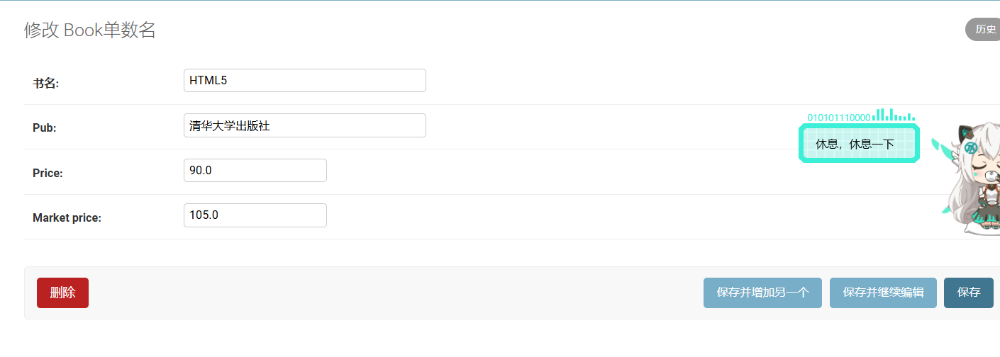
        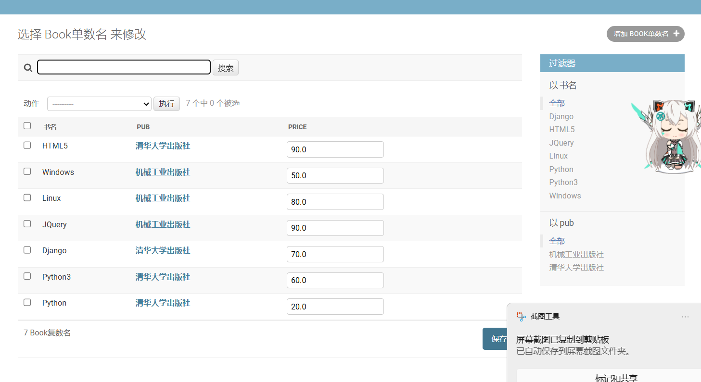  

#### Cookies

##### 作用

临时存储信息，且可以独立于服务器保存于客户端浏览器。通常用于记录客户端自己的信息或者记录客户端与服务端连接的确认信息等。

##### 存储方式

以键值对形式存储

注：键和值只能是ASCII编码

##### 注意事项

* Cookies每次客户端访问都会传输至服务端，故大量的Cookies会极大影响响应速度
* 需通过HttpResponse对象完成Cookies服务端到客户端的传送
* 需通过HttpResquest对象完成Cookies客户端到服务端的传送
* Cookies在不同的网站是相互隔离的

##### django中的使用方式

1. 添加、修改Cookies
   * 语法：```HttpResponse.set_cookie(key, value=, max_age=None, expires=None)```
   * 参数：
     * key：键的值
     * value：值的值
     * max_age：存活时间，单位为秒
     * expires：具体过期时间（即年月日时分秒）

   注：当不指定max_age和expires时，关闭浏览器时此Cookies失效
2. 删除Cookies
   * 语法：```HttpResponse.delete_cookie(key)```
   * 参数：
     * key：即要删除Cookie的键的值

   注：key不存在即什么都不做
3. 获取Cookies
   * 语法：```request.COOKIES.get(key, default)```
   * 参数：  
     * key：要获取Cookie的键的值
     * default：如果没有对应Cookie返回的默认值

#### Session

##### 定义

在服务器上开辟一段空间，用于保留浏览器和服务器交互时的重要数据

##### 作用

1. 由于http是无状态的，每一次请求都是新连接，故要保证服务器与客户端持续连接，需借助session来存储与会话有关的记录、
2. 保存在服务器，相较Cookies更安全

##### 原理

在客户端启动Cookie的前提下，当启用session时，会自动在服务端的Cookie中存储sessionid，用于在向服务端提交请求时获取对应的会话资源，以保持交互状态

注：sessionid每个客户端独立，即不同请求者之间不共享，与请求者一一对应

##### django中的session

1. 启用session
   * 在```settings.py```文件中启用```INSTALLED_APPS```中的session应用

     ```python
     INSTALLED_APPS = [
         'django.contrib.sessions',
     ]
     ```

   * 在```settings.py```文件中启用```MIDDLEWARE_CLASSES```中的session中间件  

     ```python
     MIDDLEWARE = [
         'django.contrib.sessions.middleware.SessionMiddleware',
     ] 
     ```

2. session的相关数据类型：是类似与字典的SessionStore类型，可以用类似于字典的方式进行操作
3. session基本操作
   1. 保存session的值到服务器

      ```python
      request.session['KEY'] = value
      # 若没有sessionid会自动在对应请求者的Cookies中生成
      ```

   2. 获取session的值

      ```python
      # 第一种方式
      value = request.session['KEY'] 
      # 第二种方式
      value = request.session.get('KEY', 缺省值)
      ```  

   3. 删除session的值

      ```python
      del request.session['KEY']
      ```  

4. setting中session的部分缺省设置
   1. SESSION_COOKIE_AGE
      * 作用：指定sessionid在Cookies中保存时间（默认是两周）
      * 值：int类型，秒数
   2. SESSION_EXPIRE_AT_BROWSER_CLOSE
      * 作用：是否在关闭浏览器的同时使sessionid失效（默认为False）
      * 值：bool值
   3. 更多详见```django.conf.global_settings.py```文件中的session相关内容
注：启用session需做数据库迁移，否则出错

#### MIDDLEWARE中间件

##### 定义

是django处理请求/响应的钩子框架，为轻量级的插件，用于全局改变输入输出

##### 原理图示

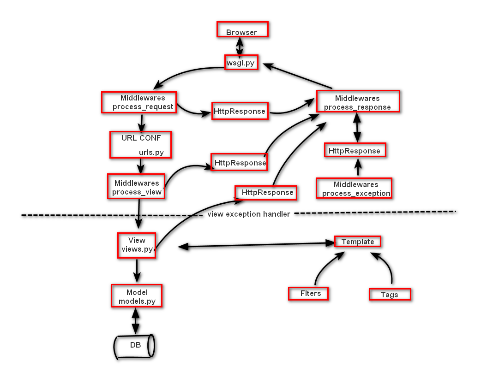

##### 使用（部分）

1. 创建py文件
   * 在主目录创建```middleware.py```
2. 创建中间件类

   ```python
   from django.utiles.deprecation import MiddlewareMixin
   class MyMiddleWare(MiddlewareMixin):
      pass
   ```

3. 可重写的方法（至少实现一个）

   ```python
   """
   作用：在进入路由前调用
   返回值：None（进入路由），HttpResponse（先返回process_response再返回Browser）
   """
   def process_request(self, request):
      pass
   
   
   """
   作用：在进入视图前调用
   参数：
      callback：将要进入的视图
   返回值：None（进入视图），HttpResponse（先返回process_response再返回Browser）
   """
   def process_view(self, request, callback, callback_args, callback_kwargs):
      pass
   
   
   """
   作用：所有返回HttpResponse时调用
   返回值：HttpResponse
   """
   def process_response(self, request, response):
      pass
   
   
   """
   作用：抛出异常时调用
   返回值：HttpResponse
   """
   def process_exception(self, request, exception):
      pass
   
   
   """
   作用：在视图执行完毕时/每个请求调用，返回实现render方法的响应对象
   """
   def process_template_response(self, request):
      pass
   ```

##### 补充说明

1. 详细内容可在```built-in middleware reference```中查看
2. 可以实现限制ip访问网站的需求等
3. 当有多个process相关的方法，会依次调用

##### CSRF（Cross-site Request Forgey）保护

1. 概念：使用非本站点的网页中form表单向服务器提交数据，并视图在本站点服务器完成用户的默写操作
2. 作用：不让其他表单提交到本站服务器
3. 使用
   * 打开中间件中的csrf验证
   * 在form表单中增加如下内容

     ```html
     <form action='' method='post'>
         
     </form>     
     ```  

#### 文件上传

##### 使用

1. html中的上传方式

  ```html
  <form action="" method="post" enctype="multiple/form-data"> 
   /* 提交方式必须为post 
      必须有enctype="multiple/form-data"
   */
  <input type="file" name="myfile"> 
  </form> 
  ```

2. django服务器的接收方式
   * 创建文件上传接收文件夹：一般在static下创建file文件
   * 书写文件上传配置（在settings.py中）

     ```python
     MEDIR_ROOT = 绝对路径
     ```  

   * 视图中接收与读写

     ```python
     from django.conf import settings # 获取文件上传地址，即MEDIR_ROOT
     def myfile_view(request):
        file_obj = request.FILES["xxx"]
        file_title = file_obj.name # 获取文件标题
        file_data = file_obj.file # 获取文件流对象
        file_content = file_data.read() # 同文件操作，read中可写入数字限制一次最大读取字节
     ```

注：详见官方文档

#### form模块

##### 作用

可以通过面向对象的方式生成html中的表单控件标签或者完成表单的验证

##### 使用

1. 创建py文件
   * 在对应应用中创建```form.py```
2. 创建表单类
   1. 表单类

      ```python
      import django.forms
      class Form表单类名(forms.Form):
         pass
      ```

   2. 表单生成
      * 书写控件

        ```python
        form1 = forms.xxxField(label=xxx, widget=forms.xxxInput, initial=xxx, required=xxx)
        """
        参数：
         label：str，控件前的文本内容
         initial：默认值，相当于html中的value
         required：bool，是否必填，即是否不能为空
         widget：小部件，用于指定控件的类型
        """
        ```

      * 另：widget表

        |小部件类名|对应的html中类型|
        |:----:|:----:|
        |TextInput|type='text'|
        |PasswordInput|type='password'|
        |NumberInput|type='number'|
        |EmailInput|type='email'|
        |URLInput|type='url'|
        |HiddenInput|type='hidden'|
        |CheckboxInput|type='checkbox'|
        |CheckboxSelectMultiple|type='checkbox'|
        |RadioSelect|type='radio'|
        |Textarea|textarea标签|
        |Select|select标签|
        |SelectMultiple|select multiple标签|

   3. 表单验证
      * 重写自建form类中的验证方法
        * 单个属性验证方法

          ```python
          """
          作用：用于验证单一属性的合法性
          返回值：
            1. 返回对应的属性值表示验证成功
            2. 抛出forms.ValidationError表示验证失败
          """
          def clean_属性名(self):
            pass
          ```

        * 整体属性验证方法  

          ```python
          """
          作用：用于验证多个属性间关系的合法性
          返回值：
            1. 返回对应的self.cleaned_data表示验证成功
            2. 抛出forms.ValidationError表示验证失败
          """
          def clean(self):
            pass
          ```

      * 验证并接收form表单数据字典

          ```python
          form1 = xxxForm(request.POST) # 实例化对象
          form1.isvalid() # 判断数据是否合法
          form_data = form1.cleaned_data # 获取表单提交数据字典
          ```

3. html解析（可忽略）
   1. 自动解析

      ```html
      {{ form1.as_p }} # p标签包裹
      {{ form1.as_ul }} # li标签包裹，手动提供ul/ol标签作为外层包裹
      {{ form1.as_table }} # tr，th，td标签分别包裹整体，label，input，手动提供table标签作为外层包裹
      ```

      注：只有label和input部分没有外层的form
   2. 手动解析

      ```html
      
         {{ field.lable }} /* 生成label */
         {{ field }} /* 生成控件 */
      
      ```

注：详见官方文档

#### 分页模块

##### 作用

当有大量数据显示，可以将数据分发至多个页面进行展示，每个页面仅展示一部分，便于阅读

##### 使用

1. Paginator对象
   * 构造

     ```python
     from django.core.paginator import Paginator
     paginator1 = Paginator(object_list, per_page)
     """
     参数：
      object_list：展示列表
      per_page：每一页展示的数据量
     """
     ```

   * 属性
     * count：数据总数
     * num_page：分页总数
     * page_range：从一到分页总数+1的range对象
     * per_page：每页数据的个数
   * 方法
     1. paginator1.page(number)
        * 作用：返回对应number的page对象，以供html展示
        * 参数
          * number：int类型
        * 返回值：page对象
        * 异常
          * InvalidPage：当输入一个不存在的页面时，被抛出
          * PageNotAnInteger：当输入一个非整型的数字时，被抛出
          * EmptyPage：当页面没有对象时抛出
2. Page对象
   * 构造

     ```python
     paginator1.page(number) 
     ```

   * 属性
     * object_list：当前分页上所有的数据列表
     * number：当前页面序号
     * paginator：当前page对象相关的Paginator对象
   * 方法
     1. has_next()
        * 作用：有下一页返回True
     2. has_previous()
        * 作用：有前一页返回True
     3. has_other_pages()
        * 作用：有相邻页返回True
     4. next_page_number()
        * 作用：返回下一页页码
        * 注意事项：如果不存在下一页抛出InvalidPage异常
     5. previous_page_number()
        * 作用：返回前一页页码
        * 注意事项：如果不存在下一页抛出InvalidPage异常
     6. len()
        * 作用：返回当前分页数据列表长度
   * html中展示

     ```html
     
     {{ item }}
     
     ```

注：详见官方文档

#### django自带的User模型

##### 作用

##### 使用

1. 导入：```from django.contrib.auth.models import User```
2. 属性（字段）
   * username：必填
   * password：必填
   * email：必填，但可为空字符串
   * first_name
   * last_name
   * is_superuser：是否时管理员账号
   * is_staff：是否可以登录admin界面
   * is_actice：是否活跃用户（是否被删除）
   * last_login：上次登录
   * date_joined ：用户创建时间
3. 基本操作
   1. 创建用户
      * 创建普通用户

         ```python
         # 写的这三项必填，email不写的话，必须写入空字符串
         user = User.objects.create_user(username=xxx, password=xxx, email=xxx, ...)
         user.属性 = xxx
         user.save()
         ```  

      * 创建超级用户

        ```python
        user = User.objects.create_superuser(username=xxx, password=xxx, email=xxx, ...)
        user.属性 = xxx
        user.save()
        ```

   2. 删除用户

      ```python
      user = User.objects.get(xxx)
      user.is_actice = False
      user.save()
      ```

   3. 密码相关操作

      ```python
      # 修改密码
      user = User.objects.get(xxx)
      user.set_password=(xxx) # 不得使用user.password来直接修改
      user.save()
      # 核对密码
      user.check_password(xxx)
      ```

#### 404页面

##### 写入位置

在主目录下的templates中添加404.html模板

##### 调用方法

```python
def xxx_view(request):
   raise Http404
```

### 部署

#### 定义

在开发完毕后，将开发机器上的源代码移交至服务器进行长期运行

#### 基本步骤

1. 安装配置与版本都相同的python及相关依赖包
2. 安装配置与版本都相同的数据库
3. ```uwsgi```替代```manage.py```启动服务
4. 配置nginx反向代理服务器
5. 配置nginx静态文件路径

#### django项目迁移

1. 安装python：```sudo apt install python```
2. 在开发主机中导出所有包：```pip3 freeze > package_list.txt```
3. 在远程主机中导入包：```pip3 install -r package_list.txt```
4. 将开发主机中的源代码复制到远程主机：```sudo scp -a 当前项目源代码 用户名@IP:远程主机路径``
   如：```sudo scp -a /home/.../mysite root@IP:/home/.../mysite1``` `

#### WSGI Django的工作环境部署

##### 定义

全程为Web Server Gateway Interface即web服务器网关接口，是python程序或框架与web服务器中的一种接口

##### 实现协议

1. WSGI
2. HTTP

##### nginx与其的交互方式

在nginx中使用HttpUwsgiMoudule与uwsgi服务器进行交换

##### 网关接口配置与django中```settings.py```相关变动（ubuntu 18.04配置）

1. 安装uwsgi
   * 在线安装：```shellsudo pip3 install uwsgi```
   * 离线安装：

     ```shell
     pip3 download uwsgi -- 获得uwsgi-2.0.18.tar.gz文件
     tar -xvf uwsgi-2.0.18.tar.gz
     cd uwsgi -- 进入uwsgi的目录中
     python3 setup.py install
     ```

   注：一定要安装好C语言编译环境，同时要完成python3-dev的依赖包安装
2. 添加配置文件
   * 添加位置：```项目文件夹/uwsgi.ini```
   * 添加内容

     ```ini
     [uwsgi]
     http=IP:PORT
     chdir=项目文件夹的绝对路径（工作目录的绝对路径）
     wsgi-file=项目中wsgi.py文件的目录，相对于工作目录
     process=进程个数
     threads=线程个数
     pidfile=uwsgi.pid -- 存储项目进程的pid，用于停止服务，一般不用修改
     daemonize=uwsgi.log -- 存储项目运行的日志，用于维护时进行错误溯源，一般不用修改 
     ```

     注：ini文件中=两侧不允许加空格
3. 修改```settings.py```
   * 将```DEBUG = True```改为```DEBUG = False```
   * 将```ALLOWEDHOSTS = []```改为```ALLOWEDHOSTS = ["*"]```

注：ubuntu20.04可能有所不一，如有修改写在下方

##### uwsgi运行管理

1. 启动uwsgi

   ```shell
   cd 项目文件夹
   sudo uwsgi --ini ./uwsgi.ini
   ```

   注：启动后其成为后台守护进程
2. 停止uwsgi

   ```shell
   cd 项目文件夹
   sudo uwsgi --stop uwsgi.pid
   ```

3. 强制停止uwsgi

   ```shell
   sudo killall uwsgi
   ```

#### nginx反向代理部署

##### 定义

nginx时轻量级的高性能web服务器，提供了诸如HTTP代理和反向代理，负载均衡，缓存等一系列重要特性

##### 原理

客户端请求nginx，再由nginx请求uwsgi并运行django下的python代码

##### 实践

1. 将同一个url分配到多个服务器运行，进行负载均衡
2. 将不同url分配到多个服务器运行
3. 直接定位静态文件，实现反向代理

##### 使用

1. 安装：```sudo apt install nginx```
2. nginx配置与uwsgi相关配置修改
   * nginx配置
     * 配置文件位置：```/etc/nginx/sites-available/default```
     * 配置内容
       * 服务器配置  

         ```
         # 在server节点下添加新的location项，指向uwsgi的IP与port
         server {
            ...
            location / {
               uwsgi_pass IP:PORT;
               include /etc/niginx/uwsgi_params; # 将所有的参数转到uwsgi下
            }
            ...
         }
         ```

       * 静态文件配置

         ```
         server {
            ...
            location /static {
               root /home/.../static; # 静态文件绝对路径
            }
            ...
         }
         ```

      注：nginx修改配置后要重新启动
   * uwsgi相关配置修改

     ```ini
     # http=xxx
     socket=xxx 
     ```

3. nginx服务控制

   ```shell
   sudo /etc/init.d/nginx start|stop|restart|status
   sudo service nginx start|stop|restart|status
   ```

注：nginx的默认端口为80

# linux更换下载源为镜像下载源

## 修改位置

```/etc/apt/sources.list```

## 修改方式

进入sources.list文件，将其他镜像源（清华源、科大源、阿里源...）放在文件的最上方位置即可

注：一定要备份

# 结语

mysql核心与python的django模块学习告一段落，下一个笔记为ajax
