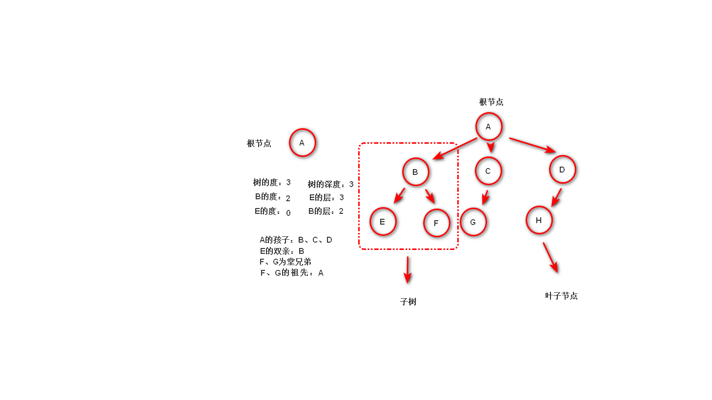

# PYTHON 数据结构初步学习

## 概念

* 数据：计算机能处理的信息载体
* 数据元素：构成数据的基本单位（record），范畴依据定义变化
* 数据结构：研究数据元素之间的关系

## 逻辑结构

### 特点

* 只是描述数据结构中数据元素的联系规律
* 只是从具体问题抽象出来的数学模型，与机器无关

### 分类

* 线性结构
  * 定义：即为n个数据元素的有序集合
  * 特点
  * 集合有且只有一个起始元素
  * 集合有且只有一个终点元素
  * 除终点元素外，其他数据元素都有唯一一个后继
  * 除起始元素外，其他数据元素都有唯一一个前驱
* 树形结构
  * 一对多，树根没有前驱节点，每个叶子节点没有后继节点，每个节点的后继节点可以是一个或多个
* 图形结构（网状结构）
  * 多对多的复杂关系，表示其中任意两个节点之间都有可能有关系
* 其他结构
  * 除以上结构外，还有更多样的数据结构，如：集合。有时根据实际情况抽象的模型还有可能是多种模型的结合

## 存储结构

### 特点

* 顺序存储：将数据中各元素依据逻辑顺序储存于内存中的整块位置
* 链式存储：将数据元素中各元素分布至存储器中的不同位置，用在前一个节点记录下一个节点位置的方式，建立联系
* 索引存储：在存储数据的同时，建立一个附加的索引表，即包含数据文件与索引表

## 实际逻辑模型

### 线性表

#### 定义

通过一一对应的方式，形成映射

#### 顺序映像

##### 定义

即线性表$L= (a_1， a_2, ......, a_n)$中各元素依次存储于内存中一整片连续的存储空间中（如列表）

##### 特点

* 逻辑上相邻的元素，即$a_{n-1}, a_n, a_{n+1}$，其存储的位置也是相邻的
* 存储密度高，方便对数据的遍历查找
* 对数据的插入和删除的效率较差

#### 链式映像

##### 定义

即线性表$L= (a_1， a_2, ......, a_n)$中各元素分布存储于内存的不连续空间中，每个元素称为节点，每个节点都有指向下一个节点的引用

##### 特点

* 逻辑上相邻的元素，即$a_{n-1}, a_n, a_{n+1}$，其存储的位置不一定相邻
* 存储稀疏，对内存空间利用率高
* 对数据的插入与删除效率较高
* 结构复杂，不利于遍历

##### 代码实现

* 节点实现方式：

```python
class Node01:
    def __init__(self, value, next_node=None):
        self.value = value
        self.next_node = next_node
# 此为正向，也可逆向，此处略
```

* 单链表实现方式：

```python
class NodeList01:
    def __init__(self):
        self.head = Node01(None)
        # 只存储起始节点，之后一切操作基于起始节点

    def list_init(self, list_):
        tail = self.head
        for item in list_:
            tail.next_node = Node01(item)
            tail = tail.next_node

    def show(self):
        tail = self.head.next_node
        while tail is not None:
            print(tail.value)
            tail = tail.next_node

    def insert(self, index, value):
        new_node = Node01(value)
        tail = self.head
        for item in range(index):
            if tail.next_node:
                tail = tail.next_node
            else:
                break
        new_node.next_node = tail.next_node
        tail.next_node = new_node

    def delete(self, value):
        tail = self.head.next_node
        while tail.next_node and (f'{tail.next_node.value}' != f'{value}'):
            tail = tail.next_node
        if not tail.next_node:
            raise ValueError
        else:
            tail.next_node = tail.next_node.next_node

    def get_index(self, index):
        tail = self.head.next_node
        for item in range(index):
            if tail.next_node:
                tail = tail.next_node
            else:
                raise IndexError
        if index >= 0:
            return tail.value
        raise IndexError
```

#### 链式映像与顺序映像

* 前者插入删除靠前元素快，利用效率高
* 后者遍历快，删除插入靠后元素快

### 栈模型

#### 定义

栈是只能在一端（栈顶）进行插入，删除等操作的线性表（堆栈），另一端固定的称为栈底，当栈中元素为空时，称为空栈

#### 特点

* 栈只能在栈顶一段进行操作
* 有Last In First Out的特性

#### 图示


#### 语法

##### 功能

包含入栈（压栈），出栈（弹栈），判断栈的空满等操作

##### 实现

* 顺序栈

```python
class SStack:
    def __init__(self):
        self.stack_ = []

    def is_empty(self):
        return len(self.stack_) == 0

    def push(self, item):
        self.stack_.append(item)

    def pop(self):
        if self.is_empty():
            raise IndexError
        return self.stack_.pop()

    def top(self):
        if self.is_empty():
            raise IndexError
        return self.stack_[-1]
```

* 链式栈

```python
class Node01:
    def __init__(self, value, next_node=None):
        self.value = value
        self.next_node = next_node


class ChainStack:
    def __init__(self):
        self.top = None

    def is_empty(self):
        return self.top

    def push(self, item):
        self.top = Node01(item, self.top)

    def pop(self):
        if not self.is_empty():
            raise IndexError
        temp = self.top
        self.top = self.top.next_node
        return temp

    def top_show(self):
        if self.is_empty():
            raise IndexError
        return self.top
```

### 队列模型

#### 定义

限制在两端进行插入、删除等操作的线性表，允许插入的称为队尾，允许删除的称为队首（队头）

#### 特点

* 只能在队列与队尾进行特定操作
* 有First In First Out特性

#### 图示


#### 语法

##### 功能

包含入队，出队，判断队列空满等操作

##### 实现

* 顺序队列

```python
class SQueue:
    def __init__(self, length=10):
        self.items = []
        self.length = length

    def enqueue(self, item):
        if self.is_full():
            raise IndexError
        self.items.append(item)

    def dequeue(self):
        if self.is_empty():
            raise IndexError
        return self.items.pop(0)

    def is_empty(self):
        return len(self.items) == 0

    def is_full(self):
        return len(self.items) >= self.length
```

* 链式队列

```python
class Node01:
    def __init__(self, value, next_node=None):
        self.value = value
        self.next_node = next_node


# 有首位两个指针，首指针指向的是出列的，尾指针指向的是入列的，二者重合代表队列为空（其实留了一个元素）
class CQueue:
    def __init__(self, len_max=10):
        self.head = self.tail = Node01(None)
        # 先指向一个空的节点，方便后续移动
        self.len_max = len_max + 1

    def is_empty(self):
        return self.head == self.tail

    def is_full(self):
        return self.tell_len() >= self.len_max

    def tell_len(self):
        len_ = 0
        temp = self.head
        while True:
            try:
                temp = temp.next_node
            except AttributeError:
                return len_
            len_ += 1

    def enqueue(self, value):
        if self.is_full():
            raise IndexError
        self.tail.next_node = Node01(value)
        self.tail = self.tail.next_node

    def dequeue(self):
        if self.is_empty():
            raise IndexError
        self.head = self.head.next_node
        return self.head.value
```

### 树形结构模型

#### 定义

树是有n个节点的有限集合T，有且只有一个根节点，其余节点可以分为m个互不相交的有限集合，其中每一个集合都是一个数，并称为其根的子树

#### 特点

* 有唯一的根
* 一个节点的子树的个数为该节点的度数
* 一棵树的度数是指该树节点中的最大度数
* 度数为0的节点称为树叶或终端节点
* 度数不为0的节点称为分支节点
* 分支节点中非根节点的称为内部节点
* 一个节点的子树称为子节点，反之为父节点
* 同一节点的各个节点称为兄弟节点
* 根节点无父节点，叶子节点无子节点
* 由一个起始节点到终止节点（不能向上返），称为一个路径
* 路径中，前面节点是后面节点的祖先，反之为子孙
* 节点具有层数，根节点层数为1
* 多棵不相交的树称为森林

#### 图示



#### 特例（二叉树）

##### 定义

每个节点最多有左右两个孩子的树

##### 特点

* i层上最多有$2^{i - 1}$个节点
* 深度为k的节点最多有$2^k - 1$个
* 任意一棵二叉树，叶子树比度数为2的节点多一个
* 满二叉树：有k层，且节点数为$2^k - 1$的二叉树
* 完全二叉树：即二叉树除最后一层，每层都排满的二叉树

###### 遍历

* 分类
  * 先序（根左右）
  * 中序（左根右）
  * 后续（左右根）
  * 层序
* 实例
  * 实例1
    
    先序：ABDEGCFH
    中序：DBGEACFH
    后续：DGEBHFCA
    层序：ABCDEFGH
  * 实例2
    先序： A 1 B 3 F G D+ C 2 D E 4 5
    中序： F 3 D+ G B 1 C A D 2 4 E 5
    

###### 语法实现

如下

```python
class BinaryTreeNode:
        def __init__(self, val, left_node=None, right_node=None):
            self.value = val
            self.left_node = left_node
            self.right_node = right_node


class BinaryTree:
    def __init__(self, value=None):
        self.root_ = BinaryTreeNode(value)
        self.layer_list = [self.root_]
        # 用来记录还有空余的节点
        self.dir = -1
        # 用来记录第一个空余节点的左右孩子的赋值情况

    def add_node(self, *args):
        for item01 in range(len(args)):
            if self.dir == -1:
                temp = self.layer_list[0].left_node = BinaryTreeNode(args[item01])
                # 左孩子赋值
            else:
                temp = self.layer_list[0].right_node = BinaryTreeNode(args[item01])
                # 右孩子赋值
                del self.layer_list[0]
                # 清空赋值满的节点
            self.dir = -self.dir
            # 表示节点的空满情况
            self.layer_list.append(temp)
            # 增加新节点

    @staticmethod
    def preorder(root_):
        if root_ is None:
            return
        print(root_.value, end=' ')
        # 打印根节点
        BinaryTree.preorder(root_.left_node)
        # 走左支
        BinaryTree.preorder(root_.right_node)
        # 走右支

    @staticmethod
    def postorder(root_):
        if root_ is None:
            return
        BinaryTree.postorder(root_.left_node)
        # 走左支
        BinaryTree.postorder(root_.right_node)
        # 走右支
        print(root_.value, end=' ')
        # 打印根节点

    @staticmethod
    def in_order(root_):
        if root_ is None:
            return
        BinaryTree.in_order(root_.left_node)
        # 走左支
        print(root_.value, end=' ')
        # 打印根节点
        BinaryTree.in_order(root_.right_node)
        # 走右支

    @staticmethod
    def level_order(*args, re_list):
        for item02 in args:
            print(item02.value, end=' ')
            # 打印该层节点值
            if item02.left_node:
                re_list.append(item02.left_node)
                # 增加该节点下一层的左孩子
            if item02.right_node:
                re_list.append(item02.right_node)
                # 增加该节点下一层的右孩子
        if not args:
            # 元组为空，结束
            return
        BinaryTree.level_order(*re_list, re_list=[])
```

# 算法初步学习

## 定义

有穷规则的有序集合，通过算法有限步运行，产生一个或多个输出

## 特征

* 有穷性
* 确定性
* 可行性
* 输入输出

## 评价标准

* 正确性
* 可读性
* 健壮性
* 时间效率高
* 存储量低

## 实例（排序算法）

### 传统排序

* 复杂度：都为$O(n^2)$
* 三种算法
  * 冒泡排序：前面一个比后面一个大就互换

  ```python
  def bubble_sort(arr):
    for i in range(len(arr) - 1):
        for j in range(0, len(arr) - i - 1):
            if arr[j] > arr[j + 1]:
                arr[j], arr[j + 1] = arr[j + 1], arr[j]

  ```

  * 选择排序：第一个未排序的作为最小值，后面比其小就替换

  ```python
  def selection_sort(arr):
    for i in range(len(arr) - 1):
        min_index = i
        for j in range(i + 1, len(arr)):
            if arr[j] < arr[min_index]:
                arr[min_index], arr[j] = arr[j], arr[min_index]
  ```

  * 插入排序：从左至右，选择第一个未排序的，左移，直到左侧的值比该值小时，插入其右侧

  ```python
  def insertion_sort(arr):
    for i in range(1, len(arr)):
        for j in range(i, 0, -1):
            if arr[j] < arr[j - 1]:
                arr[j], arr[j - 1] = arr[j - 1], arr[j]
            else:
                break
  ```

### 当前最快算法

* 复杂度为$O(n\ln{n})$  
* 快速排序:选定基准，从右至左，将最小值交换左侧空位，从左至右，将最大值交换右侧空位，直到全部排完，将基准插入空位（类似逆向的二分查找）

  ```python
  def sub_sort(head, tail, arr):
    x = arr[head]
    # 确定基准值
    while head < tail:
        # 循环结束条件：由于确定基准后从两侧根据大小移放，故当收尾相接时，全部排序完成
        while arr[tail] > x:
            # 从后向前，大的留住，小的放置左侧空位
            tail -= 1
        arr[head] = arr[tail]
        # 交换空位，空位变为右侧
        while arr[head] <= x and head < tail:
            # 从前往后，小的留住，大的放右侧空位
            head += 1
        arr[tail] = arr[head]
        # 交换空位，空位变为左侧
    arr[head] = x
    # 插入基准值
    return head
    # 返回分割点


  def quick_sort(head, tail, arr):
    if head < tail:
        # 结束条件：每次递归会传入新的头和尾，当头尾相接结束递归
        key = sub_sort(head, tail, arr)
        # 返回新的分割点
        quick_sort(head, key - 1, arr)
        # 传回分割点左侧数组
        quick_sort(key + 1, tail, arr)
        # 传回分割点右侧数组
  ```

## 实例（二分查找算法）

* 时间复杂度为$\log_2n$
* 对有序列表，每次取中间比较，大则取小的一侧，小则取大的一侧

    ```python
    # 递归


    def search(head, tail, list_target, key):
    mid = (head + tail) // 2
    if head > tail:
    return False
    elif list_target[mid] < key:
    return search(mid + 1, tail, list_target, key)
    elif list_target[mid] > key:
    return search(head, mid - 1, list_target, key)
    else:
    return mid

    # 非递归


    def search(list_, key):
        low, high = 0, len(list_) - 1
        while low <= high:
            mid = (low + high) // 2
            if list_[mid] < key:
                low = mid + 1
            elif list_[mid] > key:
                high = mid - 1
            else:
                return mid
        return False
    ```

# 结语

python数据结构与算法的初步学习自此结束，剩余进阶内容见后续笔记，下一部分为python系统编程
