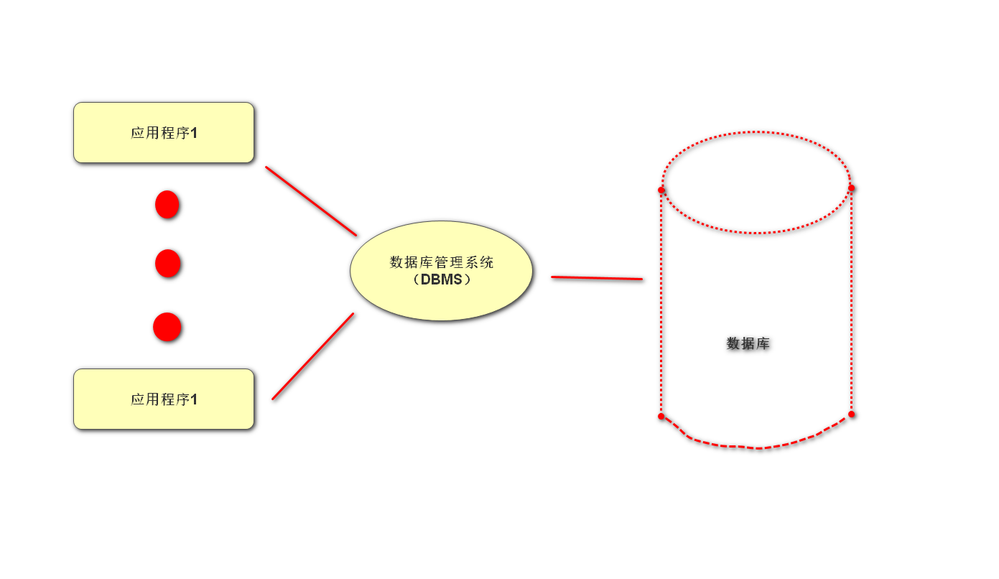
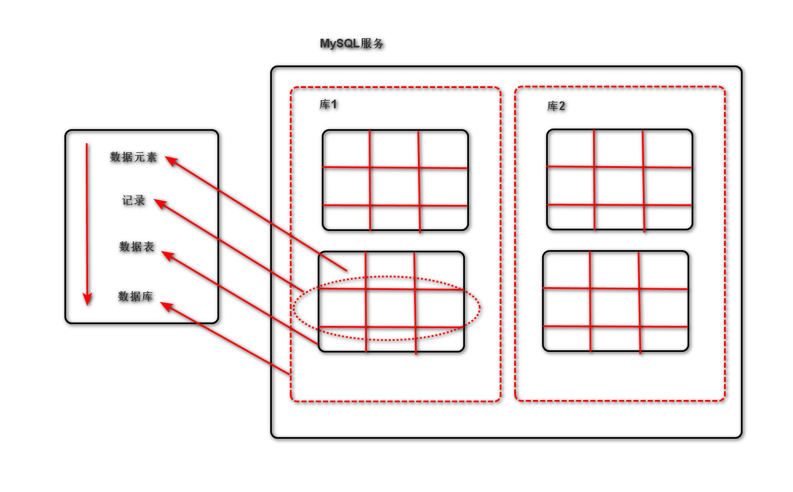
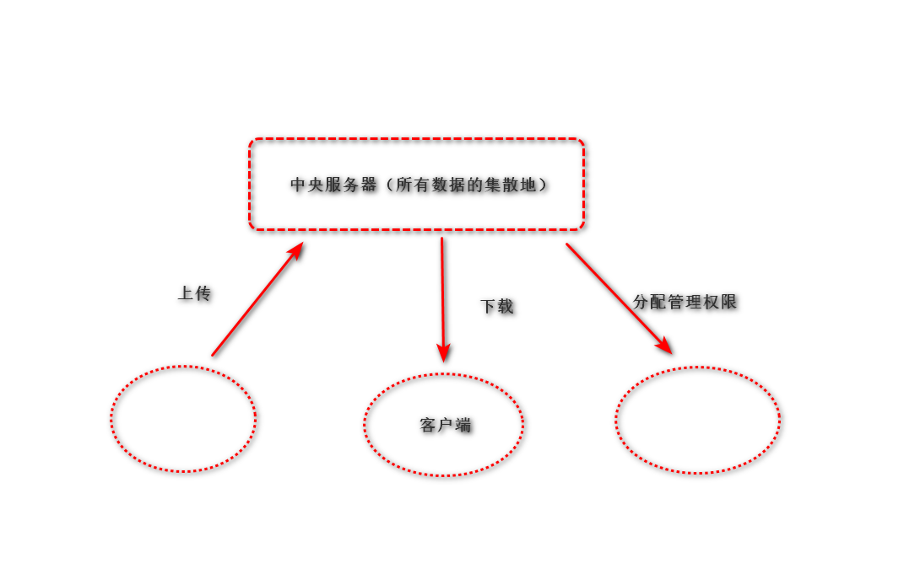
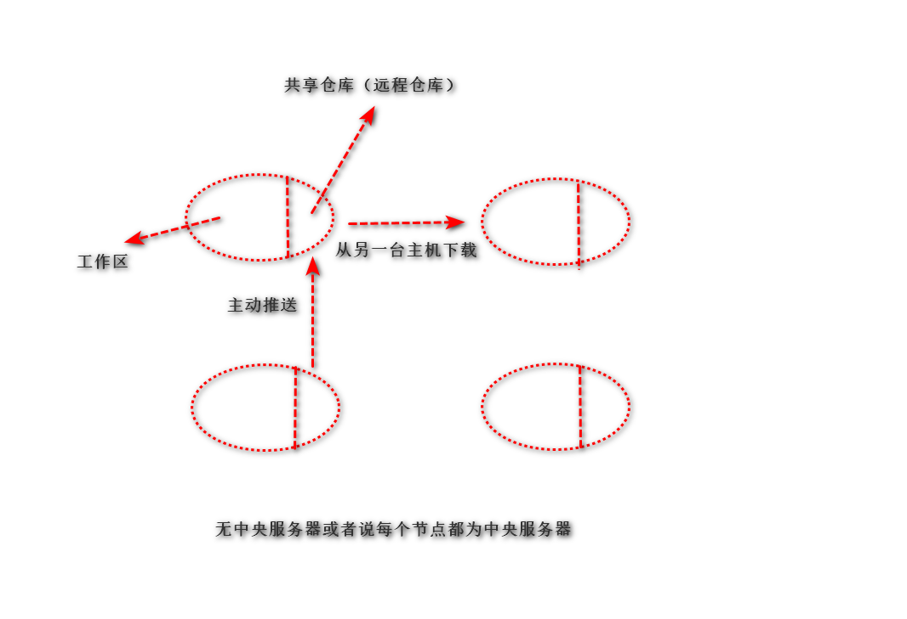
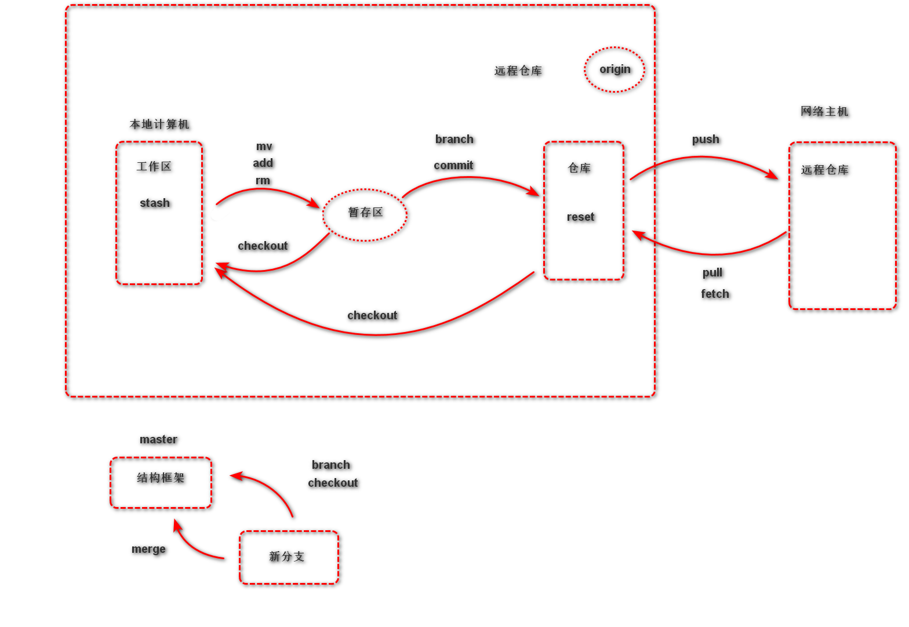

# 正则表达式

## 出现背景

由于文本处理极其常用，且对文本内容的搜索、定位、提取是逻辑比较复杂的，故正则表达式的出现很好的解决了该问题

## 定义

即文本的高级匹配模式，提供搜索、替换等功能。其本质是由一系列字符和特殊符号形成的字符串，此字符串即正则表达式

## 原理

通过普通字符和具有特定含义的字符来组成字符串，用以描述一定的字符串规则（比如：重复，位置等），来表达某类特定的字符串，进而进行匹配

## 格式

### 普通字符

#### 匹配规则

普通字符匹配其对应的字符

#### 实例

```re.findall('ab', 'abcdefabcd')```得到的结果为```['ab', 'ab']```
注：python中的正则表达式也可以匹配中文

### 或关系

#### 元字符

```|```

#### 匹配规则

匹配在```|```两侧的任意正则表达式

#### 实例

```re.findall('com|cn', 'https://www.baidu.com.cn')```得到的结果为```['com', 'cn']```

### 匹配单个字符

#### 元字符

```.```

#### 匹配规则

匹配除换行符的任意一个字符

#### 实例

```re.findall('张.丰', '张三丰,张四丰')```得到的结果为```['张三丰', '张四丰']```
注：多个```.```可以匹配多个字符，但不用，由于有表示重复的元字符

### 匹配字符集

#### 元字符

```[字符集]```

#### 匹配规则

匹配字符集中的任意一个字符

#### 表达形式

* ```[abc#!好]```：表示匹配其中任意一个字符
* ```[0-9]/[a-z]/[A-Z]```：表示匹配区间中的任意一个字符
* ```[#?0-9a-z]```：混合书写，一般区间表达写在后面

#### 实例

```re.findall('[aeiou], 'How are you!'')```得到的结果为```['o', 'e', 'i', 'o', 'u']```

### 匹配字符集反集

#### 元字符

```[^]```

#### 匹配规则

匹配除了字符集以外的任意一个字符

#### 实例

```re.findall('[^0-9]', 'use 007 port')```得到的结果为```['u', 's', 'e', ' ', ' ', 'p', 'o', 'r', 't']```

### 匹配字符串的开始位置

#### 元字符

```^```

#### 匹配规则

匹配目标字符串的开始位置

#### 实例

```re.findall('^Jame', 'Jame,hello')```得到的结果为```['Jame']```
```re.findall('^Jame', 'Hi,Jame')```得到的结果为```[]```

### 匹配字符串的结尾位置

#### 元字符

```$```

#### 匹配规则

匹配目标字符串的结尾位置

#### 实例

```re.findall('Jame$', 'Jame,hello')```得到的结果为```[]```
```re.findall('Jame$', 'Hi,Jame')```得到的结果为```['Jame']```
注：如果```^```与```$```同时出现，则可以实现完全匹配的效果

### 匹配字符串重复

#### 元字符（1）

```*```

##### 匹配规则

匹配前面的字符出现0次或多次

##### 实例

```re.findall('wo*', 'wooooo~~w!')```得到的结果为```['wooooo', 'w']```

#### 元字符（2）

```+```

##### 匹配规则

匹配前面的字符出现1次或多次

##### 实例

```re.findall('wo+', 'wooooo~~w!')```得到的结果为```['wooooo']```

#### 元字符（3）

```?```

##### 匹配规则

匹配前面的字符出现0次或1次

##### 实例

```re.findall('-?[0-9]+', 'Jame,age:18,-26')```得到的结果为```['18', '-26']```

#### 元字符（4）

```{n}```

##### 匹配规则

匹配前面的字符出现n次

##### 实例

```re.findall('1[0-9]{10}', 'Jame:13886495728')```得到的结果为```['13886495728']```

#### 元字符（5）

```{m,n}```

##### 匹配规则

匹配前面的字符出现m~n次

##### 实例

```re.findall('[1-9][0-9]{5,10}', 'Baron:1259296994')```得到的结果为```['1259296994']```

### 匹配任意（非）数字字符

#### 元字符

```\d```与```\D```

#### 匹配规则

```\d```匹配任意数字字符，```\D```匹配任意非数字字符

#### 实例

```re.findall('\d{1,5}', 'MySQL:3306,http:80')```得到的结果是```['3306', '80']```

### 匹配任意（非）普通字符

#### 元字符

```\w```与```\W```

#### 匹配规则

```\w```匹配任意普通字符，```\W```匹配任意非普通字符

#### 实例

```re.findall('\w+', 'server-port='8888'')```得到的结果是```['server-port', '8888']```
注：普通字符指的是数字，字母，下划线，汉字等

### 匹配开头结尾位置

#### 元字符

```\A```与```\Z```

#### 匹配规则

```\A```匹配开头位置，```\Z```匹配结尾位置

### 匹配匹配（非）单词的边界位置

#### 元字符

```\b```与```\B```

#### 匹配规则

```\b```匹配单词边界，```\B```匹配非单词边界

#### 实例

```re.findall('\b\w+', ' Hello 123.4')```得到的结果是```['Hello', '123']```
注：单词边界指的是数字、字母（汉字）、下划线与其他字符的交界处

### 贪婪与非贪婪模式

#### 定义

* 贪婪模式（default）：匹配重复的元字符总是尽可能多的向后匹配内容
* 非贪婪模式（懒惰模式）：匹配重复的元字符总是尽可能少的向后匹配内容

#### 贪婪模式转化为非贪婪模式的表达

在匹配重复元字符后加```?```即可，如：```*?```或```+?```或```{m,n}?```

### 正则表达式分组

#### 定义

在正则表达式中，以```()```建立正则表达式的内部分组，子组是正则表达式的一部分，可以作为内部整体成为操作对象

#### 作用

可以作为整体操作，改变元字符的操作对象
如：```re.search('(ab)+', 'ababababab').group()```得到的结果是```abababab```

#### 捕获组

##### 定义

给正则表达式的子组起一个名字，表达子组的意义，这种有名字的子组即为捕获组

##### 格式

```(?P<name>pattern)```

##### 实例

```re.search(r'(?P<pig>ab)+', 'ababababab').group('pig')```得到的结果为```'ab'```

#### 注意事项

* 一个正则表达式中可以包含多个子组
* 子组可以嵌套，但是不要重叠或嵌套结构过于复杂
* 子组序列一般从外到内，从左到右计数

## 正则表达式匹配原则

* 正确性：能正确匹配出字符串
* 排他性：除目标字符串，尽可能减少其他字符串
* 全面性：尽可能考虑到字符串的所有情况，不遗漏

## Python Re 模块

### 模块内常用函数或对象

#### re中可直接调用的正则匹配函数

* ```re.findall(pattern, string, flags=0)```
  * 功能：根据正则表达式匹配目标字符串中的内容
  * 参数
    * pattern：正则表达式
    * string：目标字符串
    * flags：功能标志位，扩展正则表达式的匹配
  * 返回值：匹配到的内容列表，但如果正则表达式中包含子组，则只能获取子组对应的内容
* ```re.split(pattern, string, flags=0)```
  * 功能：使用正则表达式匹配到的内容来切割目标字符串
  * 参数
    * pattern：正则表达式
    * string：目标字符串
    * flags：功能标志位，扩展正则表达式的匹配
  * 返回值：切割后的内容列表
* ```re.sub(pattern, replace, string, max, flags=0)```
  * 功能：使用一个字符串替换正则表达式匹配到的内容
  * 参数
    * pattern：正则表达式
    * replace：替换的字符串
    * string：目标字符串
    * max：最多替换几处，默认全部
    * flags：功能标志位，扩展正则表达式的匹配
  * 返回值：替换后的字符串
* ```re.finditer(pattern, string, flags=0)```
  * 功能：根据正则表达式匹配目标字符串中的内容
  * 参数
    * pattern：正则表达式
    * string：目标字符串
    * flags：功能标志位，扩展正则表达式的匹配
  * 返回值：匹配结果的迭代器（match对象）
* ```re.fullmatch(pattern, string, flags=0)```
  * 功能：完全匹配某个目标字符串
  * 参数
    * pattern：正则表达式
    * string：目标字符串
    * flags：功能标志位，扩展正则表达式的匹配
  * 返回值：match对象
* ```re.match(pattern, string, flags=0)```
  * 功能：匹配目标字符串的开始位置
  * 参数
    * pattern：正则表达式
    * string：目标字符串
    * flags：功能标志位，扩展正则表达式的匹配
  * 返回值：match对象
* ```re.search(pattern, string, flags=0)```
  * 功能：匹配每个字符串中的第一个符合的内容
  * 参数
    * pattern：正则表达式
    * string：目标字符串
    * flags：功能标志位，扩展正则表达式的匹配
  * 返回值：match对象

#### re中通过生成正则表达式（compile）对象调用相关实例方法及属性

##### 实例方法

* ```regex = compile(pattern, flags=0)```
  * 功能：生成正则表达式对象
  * 参数
    * pattern：正则表达式
    * flags：功能标志位，扩展正则表达式的匹配
  * 返回值：正则表达式对象
* ```regex.findall(string, pos, endpos)```
  * 功能：根据正则表达式匹配目标字符串中的内容
  * 参数
    * string：目标字符串
    * pos：开始匹配的位置
    * endpos：结束匹配的位置
  * 返回值：匹配到的内容列表，但如果正则表达式中包含子组，则只能获取子组对应的内容

注：由于compile对象拥有的实例方法与re中直接调用是一致的，区别在于函数多一些参数，故只以findall为例展示

##### 属性

* ```regex.flags```
  * 功能：返回flags值
  * 返回值：int，默认32
* ```regex.pattern```
  * 功能：返回正则表达式
  * 返回值：str类型
* ```regex.groupindex```
  * 功能：返回捕获组的名称与组号
  * 返回值：dict类型
* ```regex.groups```
  * 功能：返回子组数量
  * 返回值：int类型

#### match对象

##### 属性

* ```obj.pos```
  * 功能：返回目标字符串开始位置
  * 返回值：int类型
* ```obj.endpos```
  * 功能：返回目标字符串结束位置
  * 返回值：int类型
* ```obj.re```
  * 功能：返回正则表达式
  * 返回值：str类型
* ```obj.string```
  * 功能：返回目标字符串
  * 返回值：str类型
* ```obj.lastgroup```
  * 功能：返回最后一组子组组号
  * 返回值：str类型
* ```obj.lastindex```
  * 功能：返回最后一组子组序列号
  * 返回值：int类型

##### 实例方法

* ```obj.span()```
  * 功能：返回被匹配内容在目标字符串中的位置
  * 返回值：int类型
* ```obj.start()```
  * 功能：返回匹配内容在目标字符串中的开始位置
  * 返回值：int类型
* ```obj.end()```
  * 功能：返回匹配内容在目标字符串中的结束位置
  * 返回值：int类型
* ```obj.groupdict()```
  * 功能：获取捕获组字典
  * 返回值：dict类型
* ```obj.groups()```
  * 功能：获取子组对应内容元组
  * 返回值：tuple类型
* ```obj.group(target)```
  * 功能：获取obj的内容（re匹配到的字符串）或返回子组对应的内容
  * 参数
    * target：数字则对应对应的子组，字符串则对应对应的捕获组，不写则返回全部内容
* 返回值：str类型

### flags参数

#### 作用

扩展并丰富正则表达式的匹配功能

#### 常用flag

* ```A```/```ASCII```：只匹配ASCII码
* ```I```/```IGNORANCE```：无视字母大小写
* ```S```/```DOTALL```：使```.```可以匹配换行
* ```M```/```MULTILINE```：使```^```和```$```可以匹配每一行的开头与结尾
* ```X```/```VERBOSE```：为正则表达式添加注释
  * 格式为

    ```python
    r'''a+ # 匹配多个a，至少一个
        \w # 匹配一个字符'''
    ```

注：当使用多个flag时，用```|```隔开

# 数据库

## 数据存储阶段

1. 人工管理工具
   * 缺点：数据无法共享，不能单独保持，数据存储量有限
2. 文件管理阶段（.txt/.doc/.xls）
   * 优点：数据可以长期保存，可以存储大量数据，使用简单
   * 缺点：数据一致性差，数据查找修改不方便，数据冗余度可能比较大
3. 数据库管理阶段
   * 优点：数据组织结构化降低了冗余度，提高了增删改查的效率，容易扩展，方便程序调用，做自动化处理
   * 缺点：需要使用sql或者其他特定的语句，相对比较复杂

## 数据库应用

* 金融机构，游戏网站，购物网站，论坛网站
* 图示
  

## 数据库基础概念

* 数据：能够输入到计算机并被识别处理的信息集合
* 数据结构：研究一个数据集合中数据之间的关系
* 数据库：按照数据结构存储管理数据的仓库。数据库是在数据库管理系统和控制下，在一定介质上的数据集合
* 数据库管理系统：管理数据库的软件，用于建立和维护数据库
* 数据库系统：由数据库和数据库管理系统和开发工具等组成的集合
* 数据元素：一个实实在在的数据
* 记录：一行数据元素的集合
* 数据表：由多行记录组成的集合体
* 数据库：由多个数据表组成的集合体
* 字段：数据表中每列的表头，用来表示该列的含义

## 数据库分类和常见数据库

### 关系型数据库和非关系型数据库

#### 概念解析

* 关系型：采用关系模型（二维表）来组织数据结构的数据库
* 非关系型：采用关系模型来组织数据结构的数据库，如：三维表

#### 常见数据库

* 关系型：MySQL
* 非关系型：MongoDB

### 开源数据库和非开源数据库

#### 概念解析

* 开源：免费使用，向外展示源代码
* 非开源：付费

#### 常见数据库

* 开源：MySQL，SQLite，MongoDB
* 非开源：Oracle，DB2，SQL_Server

## 数据库结构（图库结构） --  MySQL



## 数据表结构初步设计

1. 分析存储内容
2. 确定字段构成
3. 设计字段类型

## SQL语句

### 定义

结构化查询语言（Structured Query Language），一种特殊目的的编程语言，是一种数据库查询和程序设计语言，用于存取数据以及查询，更新和管理数据库系统

### 使用特点

* SQL语句基本上独立于数据库本身
* 各种不同数据库对SQL语言的支持与标准存在着细微的不同
* 每条命令必须以```;```结尾
* SQL语句关键字不区分字母大小写

### 具体使用

#### 库名命名规则

* 数字、字母、下划线，但不能纯数字
* 库名区分字母大小写
* 不能使用特殊字符或者MySQL关键字

#### 数据类型支持

##### 数字类型

###### 整数类型（精确值）

* INTEGER/INT
* SMALLINT
* TINYINT
* MEDIUMINT
* BIGINT
注：后面可以加上括号，写上在各自范围内的数字来限定存储的最大数字

###### 定点类型

* DECIMAL
注：后面要加上括号，写上两位数字并用逗号隔开；第一位数字表示数字总长度，取值范围为1-65，默认为10；第二位数字表示小数点后的数字长度（标度），其范围是0-30，但不可超过前者

###### 浮点类型（近似值）

* FLOAT
* DOUBLE
注：后面可以加上括号，写上在各自范围内的数字来限定存储的最大数字；类似decimal括号内也可写入两个数字，功能与decimal后括号一致

###### 比特值类型（0，1 -- True，False）

* BIT

另：数字类型表

|类型|占用大小（byte）|有符号取值范围|无符号取值范围|
|:----:|:----:|:----:|:----:|
|TINYINT|1|(-128, 127)|(0, 255)|
|SMALLINT|2|(-32768, 32767)|(0, 65535)|
|MEDIUMINT|3|(-8388608, 8388607)|(0, 1677215)|
|INT/INTEGER|4|(-2147483648, 214783647)|(0, 4294967295)|
|BIGINT|8|(-9223372036854775808, 922372036854775807)|(0, 1844674407370955165)|
|FLOAT|4|(-3.40282346E+38, -1.175494351E-38), 0, (1.175494351E-38, -3.40282346E+38)|0, (1.175494351E-38, 3.40282346E+38)|
|DOUBLE|8|(-1.7976931348623157E+308, -2.2250736585072014E-308), 0, (2.2250736585072014E-308, 1.7976931348623157E+308)|0, (2.2250736585072014E-308, 1.7976931348623157E+308)|
|DECIMAL(M, D)|依赖于M，D的值|依赖于M，D的值|依赖于M，D的值|

##### 字符串类型

###### char和varchar

* char
  * 特点：定长，如果位数不足会用空格补足
  * 优点：在update语法中，由于存储空间不会发生改变效率更高
  * 缺点：不能存储带有空格的内容，同时由于定长故相同的读取长度获得的内容更少，对磁盘io消耗更大，效率更低
* varchar
  * 特点：不定长，除了申请的存储空间外，会额外开辟空间来记录存储内容长度，如在256以内，则会额外申请一个字节空间
  * 优点：由于按需分配存储空间，故相同的读取长度获得的内容一般更多，磁盘io更少，效率更高，同时可以存储带空格的内容
  * 缺点：在update语法中，由于需要重新申请内存空间，会使得效率偏低，同时由于重新申请的空间与以前的空间不连续从而出现错误，临界值为500w数据
注：后面要括号加上数字，表明最多写入多少个字符

###### text和blob

* text：用来存储非二进制文本
* blob：用来存储二进制字节串

###### enum和set

* enum：用来存储给出的若干值中的一个
* set：用来存储给出的若干值中的一个或多个值
注：不建议使用，由于一旦数据非集合中的内容，则会存储为null

另：字符串类型表

|类型|占用空间大小（byte）|
|:----:|:----:|
|CHAR|0-255|
|VARCHAR|0-66535|
|TINYBLOB|0-255|
|TINYTEXT|0-255|
|BLOB|0-66535|
|TEXT|0-66535|
|MEDIUMBLOB|0-16777215|
|MEDIUMTEXT|0-16777215|
|LONGBLOB|0-4294967295|
|LONGTEXT|0-4294967295|

##### 时间类型

###### 基础关键字

* 年月日：DATE
* 年月日时分秒：DATETIME
* 时间戳：TIMESTAMP

另：时间类型表

|时间类型|占用空间（byte）|时间范围|时间格式|
|:----:|:----:|:----:|:----:|
|DATE|3|1000-01-01~9999-12-31|YYYY-MM-DD|
|TIME|3|-838:59:59~838:59:59|HH:MM:SS|
|YEAR|1|1901~2155|YYYY|
|DATETIME|8|1000-01-01 00:00:00~9999-12-31 23:59:29|YYYY-MM-DD HH:MM:SS|
|TIMESTAMP|4|时间戳|YYYY-MM-DD HH:MM:SS|

###### 日期时间函数

* 返回服务器当前时间：```now()```
* 返回当前日期：```curdate()```
* 返回当前时间：```curtime()```
* 返回指定时间的年份：```year(字段)```
* 返回指定时间的日期：```date(字段)```
* 返回指定时间的时间：```time(字段)```

###### 日期时间运算

* ```时间 + interval 时间间隔单位```
* ```时间 - interval 时间间隔单位```

注：时间间隔单位为Second/Month/Hour/Day/Month/Year

#### 数据运算逻辑符

##### 运算符

* $+$
* $-$
* $*$
* / 或 DIV
* % 或 MOD

##### 比较运算符

* =
* != 或 /<>
* $>$
* $<$
* <=
* $>=$
* BETWEEN：在两值之间
* NOT BETWEEN：不在两值之间
* IN：在集合中
* NOT IN：不在集合中
* <=>：严格比较两个NULL值是否相等
* LIKE：模糊匹配
* REGEXP 或 RLIKE：正则匹配
* IS NULL
* IS NOT NULL

##### 逻辑运算符

* NOT 或 !
* AND
* OR
* XOR：异或

##### 位运算符

* &：按位与
* |：按位或
* ^：按位异或
* !：取反
* <<：左移
* $>>$：右移

#### 数据库操作

* 查看已有库
  * ```show databases;```
* 创建库（指定字符集）
  * ```create database 库名 [character set utf8];```
  * ```create database 库名 [charset = utf8];```
* 查看创建库的语句
  * ```show create database 库名;```
* 切换库
  * ```use 库名```
* 查看当前所在库
  * ```select database();```
* 删除库
  * ```drop database 库名;```

#### 数据表操作

##### 表的基本操作

* 创建表
  * ```create table 表名 (字段名 数据类型 附加内容, ...)charset=utf8,auto_increment=0 ## 设置自增起点;```
    * unsigned：设置数字只能为正
    * not null：设置字段传值不能为空
    * default：设置一个字段的默认值，后面直接写即可
    * primary key：定义列为主键，主键不能为空且值不能重复；可以直接书写至最后并括号，括号内写上前面要成为主键的字段名；也可直接写在要成为主键的字段名之后
    * auto_increment：定义列自增，一般用于主键，每放入一个数据，数值自动加1
* 查看数据表
  * ```show tables;```
* 查看已有表的创建语句（字符集，搜索引擎）
  * ```show create table 表名;```
* 查看表结构
  * ```desc 表名;```
* 删除表
  * ```drop table 表名1, 表名2, ...;```
* 已有表添加主键（一般新字段起名为id）
  * ```alter table 表名 add primary key(新字段);```
* 删除主键
  * ```alter table 表名 drop primary key;```
* 已有表添加自增属性：使用modify更改数据类型即可
* 重置自增的起始值
  * ```alter table 表名 auto_increment=20000;```
* 删除自增属性：使用modify更改数据类型即可  

##### 表的数据操作

* 插入数据
  * ```insert into 表名 values (记录1), (记录2), ...;```
  * ```insert into 表名 (字段1, 字段2, ...) values (记录1), (记录2), ...;```

  注：若没有特殊指明字段，记录要包含所有字段（包括有默认值，自增）；如果特殊指明字段，记录只需包含指明的字段即可
* 查找数据
  * ```select * from 表名 [where 条件;]```
  * ```select 字段1, 字段2, ... from 表名 [where 条件;]```

  注：在查找数据时可以直接在字段后使用数学运算，显示出经过数学运算后的结果
* 更新记录
  * ```update 表名 set 字段1 = 值1, 字段2 = 值2, ... where 条件;```

  注：在更新记录时可以直接在值后使用数学运算，赋予经过数学运算后的值，在值处写字段名，可以拿出该记录当前所存储的数据元素的值
* 删除表记录
  * ```delete from 表名 where 条件;```

##### 表的字段操作

* 添加字段
  * ```alter table 表名 add 字段名 数据类型;```
    * 加在表的最前面：```alter table 表名 add 字段名 数据类型 first;```
    * 加在某个字段后面：```alter table 表名 add 字段名 数据类型 after 字段名;```
* 删除字段
  * ```alter table 表名 drop 字段名```
* 修改数据类型
  * ```alter table 表名 modify 字段名 新数据类型;```
* 修改字段
  * ```alter table 表名 change 旧字段名 新字段名 新数据类型;```
* 表重命名
  * ```alter table 表名 rename 新表名```

#### 高级查询语句

##### 模糊查询

###### 格式

* ```where 字段名 like '模糊匹配格式'```

注：模糊匹配格式中使用```%```表示0个或多个字符，当```%字符```表示结尾有该字符，当```字符%```表示开头有该字符，当```%字符%```表示包含该字符即可；用```_```表示任意一个字符

###### 例子

* 代码示例：```select * from class_1 where hobby like '%下棋%'```
* 结果示例

  |id|name|hobby|
  |:----:|:----:|:----:|
  |10|张三|睡觉，下棋，学习|

注：表格仅表示这几个是不同字段，并不是真实表现形式

##### 正则匹配

###### 格式

* ```where 字段名 REGEXP '正则表达式'```

注：在MySQL中只支持部分元字符

###### 实例

* 代码示例：```select * from class_1 where hobby rlike '.+下棋.+'```
* 结果示例

  |id|name|hobby|
  |:----:|:----:|:----:|
  |10|张三|睡觉，下棋，学习|

##### 排序

###### 格式

* ```where 字段名1 ORDER BY 字段名2```
  * 降序：```where 字段名1 ORDER BY 字段名2 DESC```
  * 升序（default）：```where 字段名1 ORDER BY 字段名2 ASC```

###### 实例

* 代码示例：```select * from class_1 where sex = 'm' order by age;```
* 结果示例

  |id|sex|age|
  |:----:|:----:|:----:|
  |1|m|25|
  |7|m|18|
  |15|m|15|

##### 分页

###### 作用

限制select，update，delete语句的操作数量

###### 格式

* ```select ... from ... where ... limit 数量/select ... from ... where ... limit 开始位置-1,数量```
* ```delete from ... where ... limit 数量/delete from ... where ... limit 开始位置-1,数量```
* ```update ... set ... where ... limit 数量/update ... set ... where ... limit 开始位置-1,数量```

##### 联合查询

###### 作用

以union将多个select连接在一起，使得可以在多表多条件下筛选

###### 格式

* ```select ... union select ... union ...```
  * 显示全部内容（default）：```select ... union select ... union all ...```
  * 将重复出现的记录删除后显示：```select ... union select ... union distinct...```

## MySQL数据库

### 特点

* 是开源数据库
* 能够工作在不同的平台上
* 提供了用于C，C++，Python，Java，Perl，PHP，Ruby众多语言的API
* 存储结构优良，运行速度快
* 功能全面丰富

### Mysql语句

* 查看Mysql数据库运行状态
  * ```sudo /etc/init.d/mysql status```
* 客户端连接
  * ```mysql -h主机地址 -u用户名 -p密码```
  
  注：本地连接可省略```-h```；主机地址包含IP与端口
* 启动连接
  * ```sudo /etc/init.d/mysql start```
  * ```sudo /etc/init.d/mysql restart```
* 关闭连接
  * ```sudo /etc/init.d/mysql stop```
* 退出Mysql命令台  
  * ```exit```
  * crtl键+d键
* 备份命令
  * ```mysqldump -u用户名 -p 源库名 > 路径/文件名.sql```
    * 备份所有库：```mysqldump -u用户名 -p --all-databases > 路径/文件名.sql```
    * 备份多个库：```mysqldump -u用户名 -p -B 库1 库2 ... > 路径/文件名.sql```
    * 备份库中指定个表：```mysqldump -u用户名 -p 源库名 表1 表2 ...> 路径/文件名.sql```
* 恢复命令
  * ```mysql -u用户名 -p 目标库名 < 路径/文件名.sql```
    * 从所有库中恢复某一个库：```mysql -u用户名 -p --one-database 目标库名 < 路径/文件名.sql```

  注：目标库要先创建

### pymysql库

#### 使用流程

1. 建立数据库连接（```db = pymysql.connect(...)```）
2. 创建游标对象（```c = db.cursor()```）
3. 游标方法（```c.execute("sql语句")```）
4. 提交数据库[写操作]（```db.commit()```）
5. 关闭游标对象（```c.close()```）
6. 断开数据库连接（```db.close()```）

#### 具体函数解析

##### db对象

* ```db = pymysql.connect(host, port, user, password, charset, database)```
  * 功能：生成db对象，连接数据库
  * 参数
    * host：主机地址，本机为localhost
    * port：端口号，默认3306
    * user：用户名
    * password：密码
    * charset：库编码方式
    * database：库名
  * 返回值：db对象
* ```db.commit()```
  * 功能：提交数据库执行（写操作）
* ```db.rollback()```
  * 功能：回滚数据库
* ```db.close()```
  * 功能：断开数据库连接

##### 游标对象

* ```cur = db.cursor()```
  * 功能：生成游标对象
  * 返回值：游标对象
* ```cur.execute(query， args)```
  * 功能：执行sql语句
  * 参数
    * query：sql语句
    * args：给sql语句中的values传值
  * 注：args中如果传入的为文本对象，在query中不需要在占位外套引号
* ```cur.executemany(query， args_list)```
  * 功能：执行多个sql语句
  * 原理：达到一定上限，即字节，进行一次通信
  * 优势：减少通信次数，增加网络io效率
  * 参数
    * query：sql语句
    * args_list：每个元素都负责给一句sql语句中的values传值
  * 注：args中如果传入的为文本对象，在query中不需要在占位外套引号
* ```cur.fetchone()```
  * 功能：返回查询到的第一条信息
  * 返回值：tuple类型
* ```cur.fetchmany(n)```
  * 功能：返回查询到的n条信息
  * 返回值：tuple类型
* ```cur.fetchall()```
  * 功能：返回查询到的所有信息
  * 返回值：tuple类型
* ```cur.close()```
  * 功能：关闭游标对象

## getpass与hashlib模块

### getpass

* ```item = getpass.getpass(prompt)```
  * 作用：使得输入的内容不可见，增加安全性
  * 参数
    * prompt：输入的提示语（与input类似）
  * 返回值
    * item：输入的内容

### hashlib

* ```item = hashlib.md5()```
  * 作用：返回md5对象
  * 返回值
    * item：md5对象
* ```item.update(__data)```
  * 作用：将字节串进行md5算法加密
  * 参数
    * __data：byte类型，需要加密的内容
* ```obj = item.hexdigest()```
  * 作用：返回加密后的内容
  * 返回值
    * obj：加密后的字符串

# 代码管理工具

## 功能

* 防止代码丢失，做备份
* 项目的版本管理和控制，可以通过设置节点进行跳转
* 建立各自的开发环境分支，互不影响，方便合并
* 在多终端开发时，方便代码的互相传输

## 集中式与分布式代码管理工具图解（以SVN与GIT为例）

* SVN集中式
  
* GIT集中式
  

## GIT与GITHUB

### GITHUB简介

开源社区，有最多的开源项目

### GIT概念

一个开源的分布式版本控制系统，用于高效的管理各种大小项目和文件

### GIT特点

* git是开源的，多在*nix下使用，可以管理各种文件
* git是分布式的项目管理工具
* git数据管理更多样化，分享速度快，数据安全
* git拥有更好的分支支持，方便多人协调

### GIT基本概念

* 工作区：项目所在操作目录
* 分支：在原有代码基础上建立独立的工作环境，类似父子进程关系（完成各分支工作后会合并回主分支）
* 暂存区：用于记录工作区的工作（修改）内容
* 仓库区：用于备份工作区的内容
* 远程仓库：远程主机上的git仓库（即其为相对概念）

注：在本地仓库中，git希望工作区的内容与仓库保持一致，而且只有仓库中的内容才能和其他远程仓库交互

### GIT使用

#### 初始配置命令（配置文件位置是Linux的）

* 配置所有用户：```git config --system [选项]```
  * config位置：/etc/gitconfig
  * 配置用户名：```git config --system user.name 用户名```
* 配置当前用户：```git config --global [选项]```
  * config位置：~/.gitconfig
  * 配置用户邮箱：```git config --global use.email 邮箱```
* 配置当前项目：```git config [选项]```
  * config位置：project/.git/config
  * 配置编译器：```git config core.editor pycharm```
  * 查看配置信息：```git config --list```

#### 基本命令

* 初始化仓库
  * 代码格式：```git init```
  * 意义：将某个项目转变为git操作目录，生成git本地仓库。即该项目目录可以使用git管理
* 查看本地仓库状态
  * 代码格式：```git status```
  
  注：初始化仓库时默认工作在master（主）分支上，当工作区与仓库不一致时会有提示
* 将工作提交到暂存区
  * 提交多个文件的格式：```git add files ...```
  * 提交所有文件的格式：```git add *```
* 忽略提交内容
  * 方法：创建.gitignore文件，忽略提交直接写入
  * 规则说明表

    |关键字|效果|
    |:----:|:----:|
    |file|忽略名字为file的文件|
    |*.a|忽略.a结尾的文件|
    |*.a !lib.a|忽略.a结尾的文件但是lib.a除外|
    |build/|忽略build/目录下的所有文件，过滤整个build文件|

* 取消文件暂存记录
  * 代码格式：```git rm --cached [file]```
* 将文件同步到本地仓库
  * 代码格式：```git commit [file] -m "附加信息"```

  注：-m表示提交附加信息（必须写），同时附加信息必须双引号；file不写则提交所有
* 查看commit记录
  * 详细记录的格式：```git log```
  * 简单记录的格式：```git log --pretty=oneline```
* 比较工作区文件和仓库文件差异
  * 代码格式：```git diff [file]```
* 将暂存区域或查某个commit点文件恢复到工作区
  * 代码格式：```git checkout [commitid] -- [file]```
* 移动或删除文件
  * 移动文件的格式：```git mv [file] [path]```
  * 删除文件的格式：```git rm [file]```
  
  注：执行完后会放入暂存区，需要commit提交

#### 版本控制命令

* 版本跳转
  * 退到上一个commit节点的格式：```git reset -- hard HEAD^```

    注：一个```^```就是退回一个版本，n个```^```就是退回n个版本；版本回退后，工作区会恢复到当前commit版本
  * 退回到指定的commit节点的格式：```git reset --hard [commitid]```

    注：commitid则为提交时的前七位编号
  * 退回到指定的tag版本的格式：```git reset --hard [tag]```
* 查看所有操作记录
  * 代码格式：```git reflog```

  注：最上面为最新操作，显示所有操作节点（commitid）
* 创建标签
  * 作用：在项目重要commit位置添加快照，保存当时的工作状态，一般用于版本的迭代
  * 代码格式：```git tag [tag_name] [commit_id] -m "message"```

  注：commit_id可以不写，则默认最新的commit_id位置，message可以不写，但最好添加

#### 保存工作区命令

* 保存工作区内容
  * 代码格式：```git stash save "message"```
  
  注：将工作区未提交的修改封存，让工作区回到修改前的状态
* 查看保存工作区列表
  * 代码格式：```git stash list```

  注：最新保存的在最上面
* 应用某个保存工作区
  * 代码格式：```git stash apply [stash@{n}]```
* 删除保存工作区
  * 删除某一个保存工作区的格式：```git stash drop [stash@{n}]```
  * 删除所有保存工作区的格式：```git stash clear```

#### 分支管理命令

* 查看分支情况
  * 代码格式：```git branch [-a]```

  注：前面带*的分支表示当前工作分支；加上-a，则显示所有分支
* 创建分支
  * 代码格式：```git branch [branch_name]```

  注：由于要基于原分支创建新分支，此时新分支会拥有原分支当前节点所有内容，故在创建时最好保证原分支处于干净的状态  
* 切换分支
  * 代码格式：```git chechout [branch_name]```
* 合并分支
  * 代码格式：```git merge [branch_name]```

  注：如果分支间提交发生冲突可能需要手动合并或再次commit确定
* 删除分支
  * 已合并删除分支的格式：```git branch -d [删除分支]```
  * 未合并删除分支的格式：```git branch -D [删除分支]```

#### 远程仓库命令

* 下载远程仓库内容
  * 代码格式：```git clone 远程仓库地址```
* 创建远程仓库
  * 添加远程仓库的格式：```git remote add 远程仓库名 远程仓库地址```
  * 关联本地分支的格式：```git push -u 远程仓库名 上传分支名```

  注：第一次上传分支要加-u来关联本地分支与远程仓库分支；远程仓库名是本地自己取的
* 删除远程主机
  * 代码格式：```git remote rm [远程主机名]```
* 查看远程主机
  * 代码格式：```git remote```
* 上传工作内容
  * 正常推送的格式：```git push [远程主机名]```
  * 强制推送旧版本的格式：```git push --force [远程主机名]```
  * 推送所有标签的格式：```git push [远程主机名] --tags```
  * 推送单个标签的格式：```git push [远程主机名] [tag]```
* 下载工作内容
  * 直接下载合并的格式：```git pull [远程主机名]```
  * 下载不合并而在本地创建新分支的格式：```git fetch [远程主机名] [远程分支名]:[本地新分支名]```
* 取消本地分支与远程仓库的关联
  * 代码格式：```git push [远程主机名]:[branch]```
* 删除远程仓库标签
  * 代码格式：```git push [远程主机名] --delete tag [tag_name]```

### 图解GIT工作模式



# 结语

re正则，MySQL数据库初步与git初步学习至此结束，下一部分为HTML与CSS
