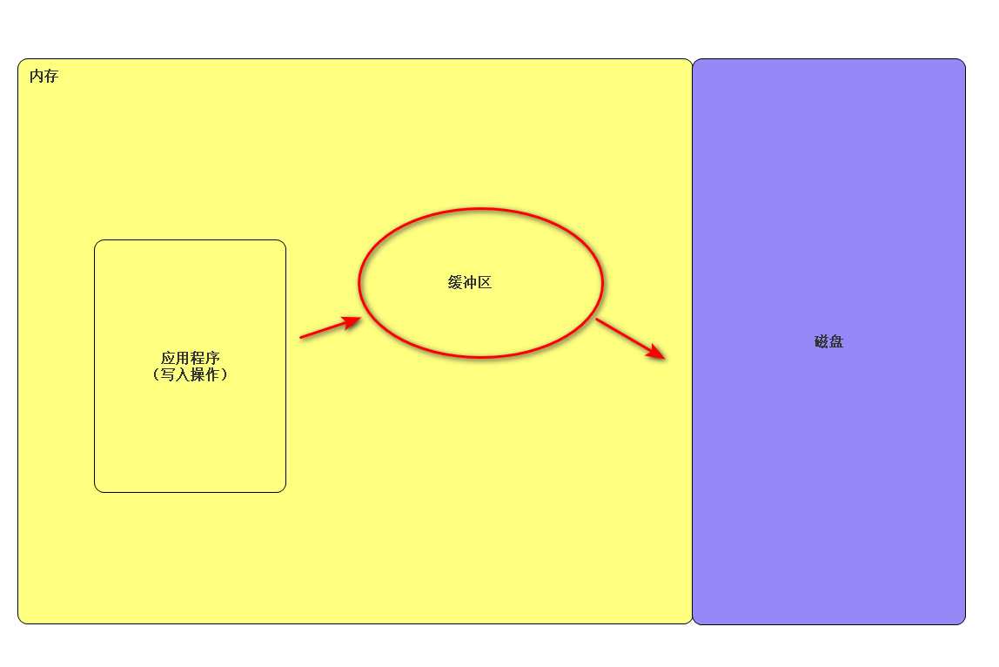

# 编程语言
## 机器语言，高级语言与自然语言
### 自然语言
#### 定义
生活中常用的语言，是以口语化的方式描述完成一个事件的诸多过程
#### 实例
例子如下：  
将大象装进冰箱的步骤
1. 打开冰箱门
2. 将大象塞进冰箱
3. 关闭冰箱门
#### 特点
所以不难看出，自然语言没有定式，较为灵活，也使得理解具有歧义，理解较为容易
### 机器语言
#### 定义
机器即像电脑等电子设备可以直接读懂的语言，以0与1构成
#### 特点
对于机器来说阅读速度快，处理速度快，缺点也明显，人难以理解
### 高级语言
#### 定义
即间于机器语言与自然语言中的一种语言，即具有一定规则，格式，可以指向机器语言的一种语言
#### 实例
如： python， java， c++， c# 等
#### 特点
可以使人更好的与机器沟通，在使人能够较为容易的明白机器语言的同时也能以较为严谨的方式完成对完成事件过程的描述
### 汇编语言
#### 定义
可以认为是早期的高级语言，仅仅是对机器语言中的部分以一个整体替换
#### 特点  
依旧更加接近于机器语言，晦涩难懂，离去自然语言甚远
### 机器语言，高级语言与自然语言之间的关系
高级语言（high level lanauage）
* 转化为字节码（类似对句子进行注释，即解释器可快速识别的语言）
  * 解释器 or 虚拟机 识别并翻译
    * 转化为机器语言（machine lanauage/ low level lanauage）
      * cpu运行 
* 编译器翻译后再执行
  * cpu运行

总而言之，高级语言建立起自然语言到机器语言之间的桥梁，完成人机互通 
## 编译型与解释型语言
### 编译型语言
#### 定义
直接将高级语言以编译器转化为机器语言的语言
#### 实例
c， c++， go

如lz4解压器，将lz4文件直接转为exe，故翻译，起编辑器作用
#### 特点
可以以翻译书籍打比方，编译语言就是整书翻译完再发表，故执行速度快，同时可以脱离环境独立运行（与编程文件无关，直接转化为新文件），但各个操作系统间不通用
### 解释型语言
#### 定义
将高级语言先转化为解释器能读懂的语言，再由解释器一边读取一边转译为机器语言的高级语言
#### 实例
python， php， ruby， javascript

如龙神模拟器，只是创建了ns文件运行环境，使文件可以打开，如果没有，程序无法运行
#### 特点
依旧以翻译书籍打比方，相当于有个同声传译，一边读书一边翻译，故执行速度慢，同时需要依赖解释器，不能脱离环境独立运行，但是只要有解释器，在各个操作系统都能使用（跨平台能力好）
#### 关于python的各种类型（主要为三种）（即在哪个语言基础上开发的）
cpython（c语言开发，一般都是）， ironpython（.net语言开发）， jpython（java语言开发）， ......
## 代码编辑器（IDE —— Intergrated Developed Environment）
### 作用高效率完成代码，起辅助作用
### 实例（常用）
pycharm（大项目）， visual studio code（小的程序）， sublime text（临时写写可以）
### 快捷键
不多说了，注意多收集，多使用，自定义，注意是否与其他软件的快捷键冲突即可
# 电脑组成（初步）
## 电脑三大件
* cpu： 只计算，不存储
* 内存： 只负责数据临时储存（以电记录，断电失去）
* 硬盘： 只负责数据存储（物理方法存储）
### 内存
#### 作用
速度较快，先将需要cpu操作内容放入其中，增加运算效率，如果全部从硬盘读取，由于硬盘读取内容速度过慢，浪费cpu性能。
#### 实现方法
一次性将相关数据从硬盘调至内存，交给cpu运算，运算完保存回归硬盘
# python正式面向过程的初步学习
## 变量
### 定义
python中一种代表其他值的对象
### 内存存储方式
变量名（占一个内存地址），其关联一个空的内存地址，该空的内存地址，会在赋值之后  
关联到值所在的内存地址
### 变量使用方式
先定义后使用
### 变量定义规则
* 变量名只能由数字，字母，下划线组成
* 首项不是数字 （极其重要，文件名命名同样，导包时由于是将文件名作为变量名，若数字开头会无法导包）
* 不能以python已定义的作为变量名（不会报错，可能倒置部分内置函数无法使用）
* 驼峰体命名（如：AgeOfGirl）
* 下划线（如：age_of_girl）
* 是英语单词，尽量短，并表达含义（如：体现父子类关系）
* 常量，不要改（全大写）（硬要改也不是不行）
### 变量修改与删除
* 修改：直接定义一个新的
* 删除：直接取消变量名与变量值之间的关联
* 底层逻辑：由内存图可知，变量的修改，其实是变量名其关联空的内存地址指向一个新的值对象所在的地址，原本值的对象会被python回收[^1]但有特例；变量的删除，就是取消变量名其关联空的内存地址与值对象所在的地址的指向性，二者都被python回收[^1]，在无特殊情况下，除非变量值的对象与其他变量名还有关联那么值的对象不会被python回收[^1]
### 变量id的查询
```python
id(变量)
```
返回变量所在的内存地址
### 小整数对象池与字符串对象池
* 小整数对象池：在cpython中-5至256，永远占有一个内存空间，故变量若赋值这些，则指向同一个内存地址，同时当删除变量时不会删除这些值
* 字符串对象池：类似，不好用，不多做赘述
## 物理行与逻辑行
### 物理行
即代码文件中的一行
### 逻辑行
一句完整的代码语句
### 多个物理行，一个逻辑行
一般是由于语句过长，所以进行转行，使用折行符或者有各种括号（小中大括号）

实例如下：
```python
# 折行符实现
a = 1 + 2 + 3 
# 正常语句
a = 1 + 2 \
    3
# 折行后，逻辑不变，只是占多个物理行

# 括号实现（此处举小括号为例）
a = (1 + 2
    +3)
```
#### 多个逻辑行一个物理行
通过```;```在一个物理行连接多个逻辑行

实例如下：
```python
# 正常，即一个物理行对应一个逻辑行（建议）
a = 4
b = 1
# 一个物理行，多个逻辑行(不建议)
a = 4;b = 1 
```
## pass语句
用来填充语句空白，例如父类中用来统一概念的方法有时没有语句（由于要用子类重写），可使用pass

实例如下：
```python
class MySuperClass:
  def fun01(self):
    pass


class MySubClass(MySuperClasss):
  def fun01(self):
    print('hello world')
```
## 空值对象None
* 定义：顾名思义，什么值都没有的对象就是None
* 特点：其本身的bool值为False，是函数默认的返回值
* 作用：可以用来占位或者解除与对象的关联（变量指向None），即还没有赋值的变量需要使用的话可以选择先赋值None
## 科学计数法
* 语法：```数字类型对象e数字类型对象```左侧是科学计数法的值，右侧是数量级，如:5e-2 等价于 $5\times10^{-2}$， 5e2 等价于 $5\times10^2$
## 复数
虚数原本用i表示，现在换成j
## 数据类型（容器）
### 通用操作
#### 增删改查
* 每个容器的语法略有不同，功能为所有或其中的几个，如果有所不同会在后面具体容器的笔记中提及
* 通用删除语法：```del 删除对象```，此处对象指的是容器或容器中的元素（其实一切对象都可以用）
#### 类型查询
语法：```type(对象)```，返回对象类型，此处对象指的是容器（其实一切对象都可以用）
#### 切片（集合类型，字符串类型，列表类型）
通过```[起始位置， 终止位置， 步长]```来截取内容（可以做到增删改取），具体内容见后面具体容器笔记

注：python中具有反向索引
#### 运算符与加强运算符
注：每个容器都可以用，但用的方式不同，如列表的乘法只能与数字相乘，结果为生成含有相乘倍数个已有元素的列表
##### 运算符
算数运算符
  * 加法：+
  * 减法：=
  * 乘法：*
  * 幂：**
  * 除法：/
  * 整除：//
  * 取模：%  
  
注：上方运算符默认返回的是新的对象，不是在原本对象上操作，另其运算顺序与数学一致，想改变顺序加括号

比较运算符
* 等于（值的判断，区分is）：==
* 大于：>
* 大于等于：>=
* 小于：<
* 小于等于：<=
* 不等于：!=

注：上方运算符返回bool值

逻辑运算符
* 交：and
* 并：or
* 补：not

注：上方运算符返回bool值，判断顺序为not优先级最高，or其次，and最后

成员运算
* 元素在容器对象中：in
* 元素不在容器对象中：not in

注：数字类型，bool类型不能用，其返回bool值
##### 加强运算符
* 赋值：=
* 加法赋值：+=
* 减法赋值：-=
* 乘法赋值：*=
* 幂赋值：**=
* 除法赋值：/=
* 整除赋值：//=
* 取模赋值：%=

注：上方运算符默认在原本对象上操作，返回的是原对象
##### 数据类型转换
* 字符串：```str()```
* 整型：```int()```
* 浮点型：```float()```
* 列表：```list()```
* 字典：```dict()```
* bool：```bool()```
* 集合：```set()```
* 字节：```byte()```

注：其中字典与列表都是通过迭代来获取的，且迭代的是最外层
### bool类型
#### 特征
只有两个值True,False
#### 作用
程序中的逻辑判断
### 数字类型
#### int（整型）
* 定义：整数，在64位系统中，整数位数为64位，取值范围位$[-2^{63}, 2^{63}-1]$
#### long(长整型)[^2]
* 定义：位数超过64的整数，与c语言不同，python长度没有指定位宽，但内存有限
#### float（浮点型）
* 定义:带小数
* 语法知识点：```'%（浮点数需要保留的位数）.f' % (放入其中的浮点数)```
### str类型
#### 特性
不可修改，所以本质上来说修改其实是直接替换，通过内存图可更深入了解
#### 切片
* 有索引可切片，从零开始，每个元素加一
* 切片可进行增删改取，语法如下：
```python
str[索引值]   
# 取值，单个
str[索引值起始:索引值结束：步长（default：1）]   
# 取值，多个，步长可为负
```

注：注意str取单个值时，索引越界会报错，而切片越界不报错，同向越界取起始索引后全部，异向越界返回空；另，由负值取到正值或0则返回空；另由于右侧不包含，要取到底右边不写即可

实例如下：
```python
str01 = '123456'
str01[7] 
# raise IndexError
str[-2:1]
# 返回None 
str[1:7]
# 返回23456
```
* 多行字符串
  可以写入多行的字符内容，用三引号包裹
* 字符串拼接（str的__add__）
```python
a = '1'
b = '2'
c = a + b # c:'12' 
```
* 字符串引用外部变量
  * 两种实现方式
    ```python
    a = 1
    b = 'x'
    c = 1.5
    # 第一种
    d = '%d,%s,%1.f'%(a, b, c) # d:'1,x,1.5'
    # d（digit），整型；s（str），字符串；f（float），浮点型
    # n.f表示保留几位小数

    # 第二种
    d = f'{a}{b}{c}' # d:'1x1.5'
    # 用f格式化字符串，使用{变量}，即可将变量放入字符串
    ``` 
#### 字符串常用语法
  内容较多，了解即可，大部分不常用，不做案例展示，基本用法都写在其中了

  ```python
   a=''
  n=0
  a.capitalize() # 首字母大写
  a.casefold() # 全小写
  a.lower() # 全小写
  a.upper() # 全大写
  a.swapcase() # 大小写互换，其中swap的中文意思为交换
  a.center(__width=,__fillchar=) # width指的是将字符长度改为...，fillchar就是长度不足时的填充物，作用是居中字符，两边用指定字符填充
  a.ljust(__width=,__fillchar=) # width指的是将字符长度改为...，fillchar就是长度不足时的填充物，作用是字符居左并右边用指定字符填充
  a.rjust(__width=,__fillchar=) # width指的是将字符长度改为...，fillchar就是长度不足时的填充物，作用是字符居右并左边用指定字符填充
  a.zfill(__width=) # width指的是将字符长度改为...，作用是字符居右并左边用0填充
  a.expandtabs(tabsize=) # tabsize指的是tab键的延升长度，作用是延长tab键的距离，注：其中tabsize可写可不写
  a.title() # 每个单词首字母大写
  a.strip() # 两边去死皮
  a.lstrip() # 左边去死皮
  a.rstrip() # 右边去死皮
  a.format(变量1=，变量2=，........，变量n=) # 用来给字符串中的待定数值，引用外部变量,字符内部变量用大括号括起来
  #第二部分：判断
  a.startswith('') # 判断是否为该字符开头，返回True或者False
  a.endswith('') # 判断是否为该字符结尾，返回True或者False
  a.isalpha() # 判断是否为字符，注：都是字符串类型，故是判断引号内内容本身的特征，返回True或者False
  a.isnumeric() # 判断是否为数字，注：都是字符串类型，故是判断引号内内容本身的特征，返回True或者False
  a.isalnum() # 判断是否为字符或者数字，注：都是字符串类型，故是判断引号内内容本身的特征，返回True或者False
  a.isdigit() # 判断是否为数字
  a.isdecimal() # 判断是否为小数，据说不好用，注：都是字符串类型，故是判断引号内内容本身的特征，返回True或者False，其中decimal的中文意思为小数
  a.isascii() # 判断是否为ascii码，注：都是字符串类型，故是判断引号内内容本身的特征，返回True或者False
  a.isidentifier() # 判断是否为py语法关键词
  a.islower() # 判断是否为小写
  a.isupper() # 判断是否为大写
  a.isprintable() # 判断是否为可打印内容
  a.isspace() # 判断是否为空格
  a.istitle() # 判断是否为标题
  #第三部分：查找
  a.index('',__start=,__end=) # 查找左数第一个索引值,sub表示要寻找的对象，start表示从第几个索引开始找，end表示在第几个索引结束查找，只可为正，找不到时报错,当要找到字符末尾时可省略后一项，反之不可
  a.rindex('',__start=,__end=) # 查找右数第一个索引值，sub表示要寻找的对象，start表示从第几个索引开始找，end表示在第几个索引结束查找，只可为正，找不到时报错,当要找到字符末尾时可省略后一项，反之不可
  a.find('',__start=,__end=) # 查找左数第一个索引值，sub表示要寻找的对象，start表示从第几个索引开始找，end表示在第几个索引结束查找，只可为正，当要找到字符末尾时可省略后一项，反之不可,找不到时输出-1
  a.rfind('',__start=,__end=) # 查找右数第一个索引值，sub表示要寻找的对象，start表示从第几个索引开始找，end表示在第几个索引结束查找，只可为正，当要找到字符末尾时可省略后一项，反之不可,找不到时输出-1
  a.count('',__start=,__end=) # 记录总共有多少个查找对象，start表示从第几个索引开始找，end表示在第几个索引结束查找，只可为正，当要找到字符末尾时可省略后一项，反之不可
  #第四部分：特殊用法
  a.split('',maxsplit=) # 按照引号内内容作为标志分割从左依次分割变为list类型，分割物会消失，maxsplit为最大分割数，maxsplit=可写可不写，split的中文意思为分割
  a.rsplit('',maxsplit=) # 按照引号内内容作为标志分割从右依次分割变为list类型，分割物会消失，maxsplit为最大分割数，maxsplit=可写可不写
  a.splitlines() # 按照转行分割引号内内容变为list类型
  a.removeprefix(__prefix=) # 按要求移除前缀，__prefix表示前缀内容
  a.removesuffix(__prefix=) # 按要求移除后缀，__suffix表示前缀内容
  a.replace(__old=,__new=,__count=) # 替换指定字符指定次数，old表示要换的，new表示换成的，count表示换的次数
  a.encode('编码方式') # 将字符转变为指定编码类型的二进制形式，即python的字节类型
  a.decode('编码方式') # 将已转为指定编码类型的字符二进制转回字符
  ''.join([]) # 将列表中的每个元素之间以引号内的内容连接在一起，并返回字符串
  n.maketrans([],[]) # 将第一个列表与第二个列表形成映照关系，即一中的一一对应二中的，返回字典类型的，n为随意变量，括号内分别为两个列表，第一个为原文，第二个为对应密文
  a.translate(a.maketrans([],[])) # 将a字符串通过前一个生成的字典将字符进行转换，括号内为生成的字典
  ```
* 加密（encrypt）文字
  即两组密码形成映照关系，反别对应解密与加密
* string库中部分语法
  * ```string.ascii_letters```所有字母ascii码排序
  * ```string.printable``` 所有字符ascii码排序
* 引号使用规则
  * 首先由于单双三引号都可以表示字符串（三引号比较特殊）
  * 简单来说最外层引号要与内层引号不同即可
* 转义符
  * \ : 即转义符，取消原本字符的含义
  * \\\ : 取消转义符的转义功能（此处markdown源码也有所体现
  * \n : 转行符
  * \t : 水平表格tab键
  * r'' : r表示字符串中没有转义符（原始字符串
* 字符串中的比较逻辑符
  依据ascii码比较字符串的第一个字符
* 字符串拼接不考虑直接加和，一般先转列表再转str(三个或以上尽量)
  以下为示例
  ```python
  a = '123'
  b = '456'
  c = '789'
  d = [a, b, c]
  ''.join(d)
  ``` 
### list类型
#### 增删改查
* 增 ：```变量名.append（元素）```或者```变量名.insert(位置（索引），元素)```,此处变量是指列表对象
* 删 ：对于列表删除```del 变量名```；对于元素删除```del 变量名[索引]```或者```变量名.remove(元素)```此处变量是指列表对象
* 改 ：```变量名[要改的元素位置] = 新的对象```，此处变量是指列表对象
* 查 ：```变量名.index(元素)```，此处变量是指列表对象
#### 列表的嵌套
* 定义：即列表中的元素是列表
* 特点：内部列表元素发生变化，外层列表中该列表所在位置元素也发生变化
* 原理：将列表的内存（表头）地址放入其中，详见内存图

注：内部列表具有列表所有性质，但需通过索引先取出该列表才能进行操作
#### 切片
列表具有索引可切片，正向索引从0开始，逆向索引从-1开始
* 切片使用方法：```变量[起始:终止:步长]```，此处变量是指列表对象,由于右侧不包含，要取到底右边不写即可
* 增删改取
  见以下代码示例
  ```python
  list01 = [1, 2, 3]
  list01[0:2] # 取值[1, 2]，右边取不到，且返回的是新列表（浅copy）
  list01[0:2] = 3, 4 # 更改值（即与索引取的值数量对应），list01:[3, 4, 3],在原列表对象上操作
  list01[0:2] = [] # 删除（即小与索引取的值数量），list01：[3]，在原列表对象上操作
  list01[0:2] = 3， 4， 5 # 增加（即大于索引取的值数量），list01：[3, 4, 5, 3]，在原列表对象上操作
  ```
* 特殊用法
  [::] ：浅copy列表
  [::-1] : 倒着浅copy列表
  list01[::] = 新列表: 正着接受列表，在原列表对象上操作
  list01[::-1] = 新列表：倒着接受列表，在原列表对象上操作
#### 列表常用语法
内容较多，了解即可，大部分不常用，不做案例展示，基本用法都写在其中了
```python
a=[]
import copy
#第一部分：删
a.clear() # 清空列表
a.remove() # 移除列表指定内容，括号内为指定内容
#第二部分：增
a.append() # 增加一个内容至列表的最后，括号内为指定内容
a.insert(self=,__index=) # 在列表索引值处插入一个内容，其他内容向后一格，self为插入内容，index为插入地的索引值
#第三部分：查
a.index(self=,__start=,__end=) # 查找列表中指定内容左数第一个的索引值，self为查找的内容，start为起始位置，end为结束位置
#第四部分：取
a[__start=:__end=:__len=] # 取出从起始位置到终止位置，按照一定步长的列表中的内容，start为起始位置，end为结束位置，len为步长
len（a） # 返回列表的长度
#第五部分：改
a.reverse() # 将列表反转
a.extend([]) # 将两列表相加a在前，[]在后，括号内填相加列表
a.sort(reverse=True/False) # 只能将数字排序，否则报错，顺序倒序都可，reverse表示是否要倒序，注意reverse=必须写
a.copy() # 浅层复制一个列表，若有嵌套列表，如果一个列表中的嵌套列表修改，另一个也会跟着改
copy.copy(a) # 浅层复制一个列表，若有嵌套列表，如果一个列表中的嵌套列表修改，另一个也会跟着改,需要引入copy库
copy.deepcopy(a) # 深层复制一个列表，若有嵌套列表，如果一个列表中的嵌套列表修改，另一个不会跟着改,需要引入copy库
#第六部分：列表生成式
n=[放入列表元素及要求 for 循环语句 if 条件] # 生成一个列表，详情可看for与while循环语句文件夹中的抽奖.py作为例子，每一项空格隔开
n=[放入列表元素极其要求 for 循环语句 for 循环语句 if 条件] # 生成一个列表，每一项空格隔开，双for循环
n=list('') # 将字符以每一个索引为单位分割并变为表格
```
#### list删除原理
当删除一个元素时，后一位替换前一位，当删除时要注意正向索引倒序删除，逆向索引正向删除，否则会出问题，看如下案例
```python
list01 = [1, 2, 3]
for i in list01:
  del i
# 当删除1时，由于2、3向前移一格，会跳过2，故结果为[2]，并没有删除完
```
#### 列表扩容原理
1. 列表会预留空间（即看起来只存几个元素，实际还空了好几个位置，等待传入对象地址）
2. 当预留空间不足，创建新列表
3. 将原有数据拷贝
4. 替换引用

注：列表地址不发生改变的原因是，列表地址存的是表头内存地址
### 元组
#### 元组赋值注意事项
当只有一个元素的时候要如此写```a = (元素，)```
#### 特点
* 元素不可删改，但可循环切片
* 当嵌套列表时，嵌套的列表发生变化，元组中该列表元素也会发生变化，可以见上方列表所写内容，即浅copy
* 元组即按需分配，相比列表省内存空间（无预留空间）
#### 元组的几个用法
* 元组给多个变量赋值（需一一对应），```元组 = 多个变量```（列表也行）
* ```a, b = b, a```，右边其实是元组
* 前面字符串中%d，%s，%f与%（变量），也是元组给多个变量赋值的一种用法
#### 元组的语法
与列表一致，支持没有增删改
### dict类型
#### 特性
* 一key对应一value
* key必须为不可更改的数据类型
* key值必须唯一，不可重复
* value为任意值
* 可嵌套
* 有序[^3]
* 查询速度快（直接将key转化为hash值，一次性找到，复杂度为o（1））
* 极其占内存（以空间换时间）
#### 增删改查
* 增：第一种：```a[key] = value```没有增加，有则修改；第二种：```a.setdefault(key, value)```，无则增，有则返回对应值
* 改：第一种：```a[key] = value```没有增加，有则修改；第二种```a.update(b)```，将两个列表合并，如果有key值相同的取b的value
* 查：第一种：```a.get(key)```有则返回值，无则返回None；第二种```a[key]```，有返回值，无报错，raise keyError
* 删：第一种：```a.pop(key)```取出key对应的值并删除；第二种：```del a[key]```直接删除；第三种：```a.popitem()```遵循LIFO（last in first out）删除一对键和值；第四种：```a.clear()```清空
#### 字典常用语法
内容较多，了解即可，大部分不常用，不做案例展示，基本用法都写在其中了
```python
#第一部分：创建字典;注：可再嵌套列表或者字典
a={key_1:value_1,key_2:value_2,.......}
a=dict(key_1=value_1,key_2=value_2,.......)
a = {key:value for key in 范围 for value in 范围 if 条件}
#第二部分：增加
a[key_n]=value_n # 没有重复key的时候新增，有重复key的时候修改value
a.setdefault(key_n,value_n) # 新增单个key与value,没有重复key的时候新增，有重复key的时候输出原先key对应的值
#第三部分：修改
a[key_n]=value_new
a.update(b) # 将ab两字典合并，若用同key则value值取b中的
#第四部分：查
a.get(key_n) # 查找此key值的value值，若无返回None
a[key_n] # 查找此key值的value值，若无报错
#第五部分：判断
key_n in a # 判断key值是否在a中
#第六部分：删除
a.pop(key_n) # 拿出key所对应的value，并删除该key
del a[key_n] # 删除该key
a.popitem() # LIFO(last in first out)删除最后放入字典的一对值
a.clear() # 清空
#第七部分：打印
a.keys() # 返回所有key值，看起来像列表，其实不是
a.values() # 返回所有value值，看起来像列表，其实不是
a.items() # 返回所有key与value值，以元组形式
#第八部分：循环
for k in a.keys() # 循环key
for k in a.values() # 循环value
for k in a.items() # 循环key与value一起
for k,v in dic # 循环key,更快推荐
#第九部分：特殊
a.fromkeys([],value) # 以列表中的每个元素为key，共同赋予相同的value
#第十部分：
a.copy() # 浅copy
#第十一部分：
len(a) # 返回字典a长度
```
### bytes类型
#### 特征
python独有的，解释器能够读懂的语言（处理二进制码），可以描述所有对象，包含图片，代码等
#### 实例
对于分为多个模块的项目，除了主模块（第一个运行的模块）不会提前编译外，其余模块都会预先编译为pym文件，即字节码形式的代码文件，可以加快程序执行速度
### set类型
#### 特性
* 元素不可变，只可存字符串，数字，元组
* 天然去重，重复的内容无法加入
* 无序
* 基于hashtable
#### 增删查
* 增：```a.add()```
* 查：```b in a```返回False或True
* 删：第一种：```a.pop()```随机删除并返回该值；第二种：```a.remove(元素)```删指定值，无则报错；第三种```a.discard(元素)```删指定值，无便什么都不做；第四种```a.clear()```清空
#### 关系运算
* 交集```A&B```或```A.intersection(B)```
* 并集```A/B```或```A.union(B)```
* 差集```A-B```或```A.difference(B)```
* 对称差集```A^B```或```A.symmetric_difference(B)```
* 子集```A.issubset(B)```
* 父集```A.issuperset(B)```
* 修改```A.update(B)```合并后将结果赋予A，类似加强运算符
  可以结合前面交并差对称差，在第二种实现方式基础上后面加上_update（另一个集合）即可
## 流程控制（if）
### 基础语法
* 单分支
  if后加判断语句其下方写入执行语句，符合条件执行其下方的代码语句
  实例见下：
  ```python
  if 判断逻辑：
    执行语句
  ```
* 双分支
  * if后加判断语句其下方写入执行语句，else后面不加判断语句直接写执行语句，符合条件走if，否则走else
    实例见下：
    ```python
    if 判断逻辑：
      执行语句1
    else:
      执行语句2
    ```

  * if后加判断语句其下方写入执行语句，elif后面加判断语句其下方写执行语句，符合if条件走if，符合elif条件走elif，否则什么都不做
    实例如下：
    ```python
    if 判断逻辑1：
      执行语句1
    elif 判断逻辑2:
      执行语句2
    ```
* 多分支
  即以if开头，后有多个elif，最后一个else可写可不写
  实例如下：
  ```python
  if 判断逻辑1：
    执行语句1
  elif 判断逻辑2:
    执行语句2
  elif 判断逻辑3:
    执行语句3
  elif 判断逻辑4:
    执行语句4
  .......
  else: # 可不写
    执行语句n
  ```
* 嵌套分支
  即一个if执行语句中还有if（建议不超过四层）
  实例如下：
  ```python
  if 判断逻辑1：
    if 判断逻辑2：
      执行语句1
    执行语句2
  ```
* 特点
  * if内部本身使用bool函数，故可直接跟东西进行判断该对象bool值，如：```if 1: # True;if 0: # False```  
  * 多分支中符合前面条件，后续不会再判断，故可将复杂判断留在最后，甚至使用else，增加程序运行效率
## 循环语句
### for循环语句（初步）
#### 原理
其本质是使用了for相关的一个协议，底层是通过生成迭代器，并使用next函数对可迭代对象进行迭代
#### 作用
* 拿出聚合类对象中的多个元素（给出了一个访问聚合类对象内部元素的方法，且不暴露该对象本身的数据结构）
* 可以完成知道循环次数的任务，类似乘法，将多个相同代码合并为一个
#### 基础语法
* 单层for循环
  如下：
  ```python
  for 变量 in 可迭代对象:
    对变量的操作语句
  ```
* 嵌套for循环
  如下：
  ```python
  for 变量 in 可迭代对象:
    执行语句1
    for 变量 in 可迭代对象:
      执行语句2
    执行语句3
  # 其中1、3语句都属于第一个循环，而第2个语句属于第二个循环
  ```

  注：嵌套循环不要超过四层
### while循环语句
#### 特点
满足条件一直循环
#### 原理
与for类似，其实是for的底层代码（详情见核心中的迭代器）
#### 作用
* 与for类似，都可迭代可迭代对象，主要用于不知道循环次数，但知道循环结束条件
* 死循环（常用于重复获取输入，直到符合要求退出）
#### 语法
* 普通while循环，即满足条件停止循环
  如下：
  ```python
  while 条件:
    执行语句
  ```
* 死循环，即条件恒成立
  如下：
  ```python
  while True:
    执行语句
  ```
* 嵌套while循环，即while循环内还有while循环
  如下：
  ```python
  while 条件1:
    执行语句1
    while 条件2:
      执行语句
    执行语句3

  # 1、3在第一个循环下，2在第二个循环下
  ```

  注：嵌套不要超过四层
### break语句
#### 作用
执行会立即退出循环，常用于在循环次数结束前完成循环任务，直接退出，或在死循环中完成任务退出死循环
#### 语句
  如下：
  ```python
  while True:
    if 条件：
      执行语句
      break

  for 变量 in 可迭代对象:
    if 条件:
      执行语句
      break
  ```
### continue语句
#### 作用
执行会跳过此次循环，常用于在循环次数中有些循环不执行时跳过该循环，如：while循环中使用记录并逐次增加循环次数来退出循环中，中间循环出现问题，且保证循环次数不会减少会使用continue
#### 语句
  如下：
  ```python
  while True:
    if 条件：
      执行语句
      continue

  for 变量 in 可迭代对象:
    if 条件:
      执行语句
      continue
  ```
### for else 与 while else语句
#### 作用
当循环非正常退出时（break），不执行else语句，可以完成循环中只要有一个不符合条件就不执行语句的任务
#### 语句
  如下：
  ```python
  while True:
    if 条件：
      执行语句
      break # break，下方else中语句不执行
    else:
      执行语句

  for 变量 in 可迭代对象:
    if 条件:
      执行语句
      break # break，下方else中语句不执行
    else:
      执行语句 
  ```
## 三元运算
### 作用
* 简化代码流程，使得代码更加简洁
* 依据不同条件给变量赋值
### 语法
* 普通三元运算
  如下：
  ```python
  变量 = 对象一 if 判断逻辑 else 对象二
  ```
* 嵌套三元运算
  如下：
  ```python
  变量 = 对象一 if 判断逻辑一 else (对象二 if 判断逻辑二 else 对象三)
  ```

  注：嵌套勿超过四层
## 进制
### 二进制运算（初步）
#### 进制转换
* 十进制转二进制
  找到$2^n$使得其正好小于需要转换的数，然后n依次减1，如果加上后小于等于这个数记为1否则为0，直到正好等于该数，剩余位数填0
  实例如下：
  ```
  2**4 > 10 > 2**3， 故二进制最高位为第四位1
  10 - 2**3 = 2
  2**2 > 2 故第三位为0
  2**1 = 2 故第二位为1
  2-2**1 = 0
  2**0 > 0 故第一位为0
  所以结果为1010
  ```
* 二进制转十进制
  每一位位权为$2^{n-1}$乘上改为的数字（1或0）加和得结果
  实例如下：
  ```
  1010
  则结果为1*2**3+0*2**2+1*2**1+0*2**0=10
  ```
* 二进制转十六进制
  每四位二进制转成十进制并对应为十六进制
  示例如下：
  ```
  101011101001
  1010:10
  1110:14
  1001:9
  故十六进制为：AE9
  ```
* 十六进制转二进制
  每一位十六进制转为十进制再转为四位二进制，最后拼起来即可
  示例如下：
  ```
  AE9
  A:10-->1010
  E:14-->1110
  9:9-->1001
  故二进制为：101011101001
  ```
#### 二进制位运算
* 加 逢二进一
* 减 不够借位，借来在该位2
* 乘 （只考虑乘2）右移一格
* 除 （只考虑除2）左移一格
#### 逻辑门运算
##### 各逻辑门概述
* 与（&）：都为1输出1
* 或（|）：有一个1输出1
* 非：反转
* 异或（^）：一个1一个0输出1
* 同或：两个都为1或都为0输出1

拓展：半加器与全加器等一系列数字电路课程，想看b站上自己看
##### 实践
将类中几个属性用不同位二进制的十进制表示（如：1，2，4，8），当需要检测其是否是某个属性是只需与（&）即可，当增加某个属性时只需或（|）即可
#### 左移或右移运算符
* <<: $\times2$
* \>>: $\div 2$
### 十六进制
#### 位数的数字表示
0123456789ABCDEF ------> 分别对应0-15
#### 十六进制的声明写法
/x 或 0x
#### 作用
方便阅读，比二进制短，且区别明显
### python中的进制转换
* 十转二：```bin(数字)```
* 十转十六：```hex(数字)```
* 十转八：```oct(数字)```
## 编码
### ascii码
#### 定义
由美国人定义的一个字符表，便于计算机表示文字，本质就是一个映射表
#### 部分语法
* 查询字符ascii码：```Ord(字符)```
* 返回对应ascii码的字符：```Chr(数字)```
#### 编码分割
根据当时英语字母数字，常用的字符，不常用的字符，并且为其他语言预留了部分扩展表，共计8位二进制，成为了目前存储单位，由于计算机识别ascii字符时八位一读
#### 存储单位
如下：
```
8bit = 1Byte(b)
1KB = 1024B
1MB = 1024GB
1TB = 1024GB
1PB = 1024TB
1EB = 1024PB
1ZB = 1024EB
1YB = 1024ZB
1BB = 1024YB
```
### 中文编码历史
* 1980 gb2312：2字节对应1汉字，通过使用ascii的扩展表兼容ascii，当出现2个高位即2个16位或者2个8位，判定使用中文字符表
* 1995 gbk
* 2005 gb18030
* 统一世界编码 unicode
  * UTF-8(最常用) 优先1，至多4，不够加，英1，欧2，东亚3，其他4
  * UTF-16 优先2否则4
  * UTF-32 全四
### python编码
* py2：默认ascii码，需主动申明才可使用，文件开头写```# -*- encoding:填入编码 -*-```
* py3：默认为UTF-8，支持一切语言编码

注：windows默认gbk，mac默认utf-8
## 文件处理与编码转换
### 文件定义及分类
保存在磁盘上的一段数据，依据功能可将文件分为文本文件与二进制文件
### 文件缓冲区
* 定义：开辟在内存中的一块区域，用来临时存放要放入磁盘的数据（故断电不保存）
* 作用：当缓冲区满或达到要求时，将缓冲区的内容一次性放入磁盘，增长磁盘使用寿命
* 图示：
  
* 生效条件
  * 缓冲区域满了
  * 行缓冲时，换行
  * 程序运行结束或文件关闭
  * 使用flush函数
### 文件偏移量
* 定义：打开文件时系统自动生成一个记录，用来记录文件被操作与操作到的位置，后续的任意对文件的操作都是从这个位置即文件偏移量开始进行的
### 空洞文件
* 定义：无实际意义内容却占有存储空间的文件
* 实例：下载电影，只要开始下载，空间便已占用
* 原理：先用无意义字符（如：空格）占用空间，并用标识标记起始与结尾，下载时逐渐替换内容，完成后，消去头尾
* 代码实现
  ```python
  fd = open('file', 'wb')
  fd.write(b'start')
  fd.seek(1024, 2)
  fd.write(b'end')
  fd.close()
  ``` 
### 文件描述符
* 定义：系统中每一个IO操作都会自动分配一个整数，该整数即这个IO操作的文件描述符
* 作用：便于系统管理IO操作
* 获取文件描述符语法：```fileno()```
### python文件操作（txt）
#### 通用语法
##### 文件管理函数
* 获取文件大小：```os.path.getsize(file)```
* 查看文件列表（传入目录，将目录中所有文件以列表形式返回）：````os.listdir(dir)``
* 查看文件是否存在：```os.path.exists(file)```
* 判断文件类型：```os.path.isfile(file)```
* 删除文件：```os.remove(file)```

注：需```import os```
##### with语法
* 作用：临时打开资源进行访问与操作，脱离语句块后自动销毁
* 语法：
  ```python
  with context_expression [as target(s)]:
    with-body
  ```
  * 前一个是一个对象，后者是赋予对象的变量名
* 实例：
  ```python
  with open('file', 'r+') as f:
    f.read()
  ```
  注：用with语句无需```f.close()```，由于with语句有脱离语句块自动销毁文件的特性
##### open语法
* 作用：打开一个文件，供后续逻辑操作
* 语法：```open('file', mode='',encoding=， buffering=-1)```
  * 第一个填文件，第二个填打开模式，第三个为编码方式，第四个表示是否使用系统默认缓冲，当为1时使用行缓冲，即换行缓冲
  * 使用语法时，类似于只打开了文件简介，文件并未进入内存
##### close语法
* 作用：关闭文件，停止对其操作
* 语法：```f.close()```
##### seek语法
* 作用：重置文件偏移量，使得可再次读取文件内容
* 语法：```f.seek(offset，whence=0)```,offset这一参数要写入数字，正数时表示将文件偏移量从相对位置右移数字个字符，为负数时，表示从相对位置左移数字个字符；whence默认值为0，表示从头这一相对位置，1表示从当前这一相对位置，2表示从尾这一相对位置。
  注：1、2这两个选项只能在二进制模式，即'b'模式使用
##### tell语法
* 作用：返回文件偏移量
* 语法：```f.tell()```
##### flush语法
* 作用：将缓存内容强行放入硬盘，以防文件内容丢失
* 语法：```f.flush()```
* 注意事项：缓存约为8192KB，约2000个汉字
##### 删除文件
* 删除文件（需导入os库）
* 语法：```import os ; os.remove('文件名')```
###### 编码与解码方法
* ```a.encode(编码方式)```将字符以输入编码方式编码
* ```a.decode(编码方式)```将字符以输入编码方式解码
#### mode类型
##### 'r'（default）：只读模式
###### 特点
只可读取，不可写入
###### 语法
* ```f.read(数字)```，不加数字读所有，填数字则读数字个字节（二进制模式），汉字则为三字节一读（即读数字个字符），当文件读完时返回None
  * 注意事项：只读一次，由于是根据光标位置的移动读取内容，当读过一次后，光标向后移动，前面的内容就不会再读了，可通过重置光标位置的方式重读。
* ```f.readline(数字)```，不加数字读一行，填数字则读数字个字节（二进制模式），汉字则为三字节一读（即读数字个字符）。注意与read函数不同，其遇到转行符时便停止读取，如：一行有10个字节，当数字填11，只会读这一行，不会读下一行；如果先填5读一次，再填6读一次，那么依旧只会读到该行结束，当文件读完时返回None
  * 注意事项：只读一次，由于是根据光标位置的移动读取内容，当读过一次后，光标向后移动，前面的内容就不会再读了，可通过重置光标位置的方式重读。 
* ```f.readlines(数字)```，不加则按行读取，并将读取内容放入列表中，加数字则读取数字个字符所在行并放入列表中
  * 注意事项：只读一次，由于是根据光标位置的移动读取内容，当读过一次后，光标向后移动，前面的内容就不会再读了，可通过重置光标位置的方式重读。  
* ```for 变量 in 文件:```，当文件为txt模式时，依据行迭代文件内容
  * 使用：当加上判断时，可以查找行内是否出现指定字符，实现查找功能   
##### 'w'：只写模式
###### 特点
无文件时，创建新文件，有文件时删除文件再创同名新文件，支持写入

注：由于会删除已有文件的特性，所以使用时要注意原文件备份和误删问题
###### 语法
```f.write('字符对象')```，在文件光标位置写入对应内容
```f.writelines(列表)```，将列表内的内容依次写入文件，转行符需要手动写入
```f.truncate(数字)```不填数字时，删除光标位置以后的内容；填入数字时，无论光标处于什么位置，从文件起始处保留数字个字节，中文保留数字个字符，其余删除

注：写入内容要自己写转行符
##### 'x'：只写模式
###### 特点
每次创建新文件，并支持写入，如果文件存在报错
###### 语法
* ```f.write('字符对象')```，在文件光标位置写入对应内容
* ```f.writelines(列表)```，将列表内的内容依次写入文件，转行符需要手动写入
* ```f.truncate(数字)```不填数字时，删除光标位置以后的内容；填入数字时，无论光标处于什么位置，从文件起始处保留数字个字节，中文保留数字个字符，其余删除

注：写入内容要自己写转行符
##### 'a'：更新模式
###### 特点
如果文件存在时，每次写入内容直接在文件最后追加内容，如果文件不存在，创建新文件

注：如果人工移动光标位置是可以的，但是当写入内容时光标会自动移至最后
###### 语法
* ```f.write('字符对象')```，在文件最后写入对应内容
* ```f.writelines(列表)```，将列表内的内容依次写入文件，转行符需要手动写入
* ```f.truncate(数字)```不填数字时，删除光标位置以后的内容；填入数字时，无论光标处于什么位置，从文件起始处保留数字个字节，中文保留数字个字符，其余删除

注：写入内容要自己写转行符
##### 'b'：二进制模式（字节码）
###### 特点
一切只要是字节码都可以放入，如：视频，图片，文字等
###### 语法（常用）
* ```a.encode(编码方式)```将字符以输入编码方式编码
* ```a.decode(编码方式)```将字符以输入编码方式解码

注：上方两种方法一般用于在往b模式的文件写入内容前转好编码方式，或是将已编码的内容转化为可见的字符串

注：b模式要与其他模式搭配使用，其只表明打开文件的写入或读取的内容形式
##### 't'：文本模式（default）
###### 特点
只可写入文字

注：t模式要与其他模式搭配使用，其只表明打开文件的写入或读取的内容形式
##### '+' ：读写模式
###### 作用
在常规几种模式下，在其后方加上+号，则即可读又可写
##### 'r+'
###### 特点
* 写入内容时，直接从头覆盖内容，或者从文件偏移量处覆盖内容
* 文件修改应先将文件转字符串，使用replace语法改为再写回去
* 不可使用tell语法
* 在文本模式下，当先使用read函数读取部分内容后，再使用write函数写入内容，文件偏移量自动移至文件末尾；在二进制模式下，文件偏移量不会移动至末尾
###### 语法
* ```f.read(数字)```，不加数字读所有，填数字则读数字个字节（二进制模式），汉字则为三字节一读（即读数字个字符），当文件读完时返回None
  * 注意事项：只读一次，由于是根据光标位置的移动读取内容，当读过一次后，光标向后移动，前面的内容就不会再读了，可通过重置光标位置的方式重读。
* ```f.readline(数字)```，不加数字读一行，填数字则读数字个字节（二进制模式），汉字则为三字节一读（即读数字个字符）注意与read函数不同，其遇到转行符时便停止读取，如：一行有10个字节，当数字填11，只会读这一行，不会读下一行；如果先填5读一次，再填6读一次，那么依旧只会读到该行结束，当文件读完时返回None
  * 注意事项：只读一次，由于是根据光标位置的移动读取内容，当读过一次后，光标向后移动，前面的内容就不会再读了，可通过重置光标位置的方式重读。 
* ```f.readlines(数字)```，不加则按行读取，并将读取内容放入列表中，加数字则读取数字个字符所在行并放入列表中
  * 注意事项：只读一次，由于是根据光标位置的移动读取内容，当读过一次后，光标向后移动，前面的内容就不会再读了，可通过重置光标位置的方式重读。
* ```f.write('字符对象')```，在文件最后写入对应内容
* ```f.writelines(列表)```，将列表内的内容依次写入文件，转行符需要手动写入
* ```f.truncate(数字)```不填数字时，删除光标位置以后的内容；填入数字时，无论光标处于什么位置，从文件起始处保留数字个字节，中文保留数字个字符，其余删除

注：覆盖内容时可能由于占用原本三字节字符的部分字节而导致乱码，同时写入内容要自己写转行符

注：各个模式可以和'b'或't'或'+'模式叠加，写的时候两个合在一起写即可如：'rb'
#### 处理编码不同的文件
不可使用声明（在调用open方法的文件中），而是在open中的encoding写入编码类型
## 函数
### 定义
将一组能实现一个功能的语句通过一个名字即函数名封装起来
### 作用
* 想要使用方法时，直接写函数名小括号即可调用，无需重复写代码
* 使程序可扩展
* 使程序便于维护
### 参数
#### 定义
函数完成功能时需要外界提供的内容
#### 形参
##### 定义
写函数方法时，括号内的变量
##### 类型
* 位置形参（必备形参）：即直接写在括号内的参数
* 默认形参：即写在括号内的参数且已经赋有默认值（位置参数，命名关键字形参都可为默认形参）
  * 注意事项：默认值尽量为不可变类型，如果为可变类型，由于所有调用此函数的都共用默认参数，可能倒置随着使用默认值发生变化 
* 命名关键字形参：即在调用函数传入实参时必须写出形参名字并用等号为其赋值的形参，出现在*号后，或者不定参数（星号元组形参）后 
* 不定长参数
  * 星号元组形参：*args，收录所有未定义的位置形参，将其以元组封装起来，传入函数
  * 双星号字典形参：**kwargs，收录所有未定义的关键字形参，将其以字典的键和值封装起来，传入函数

注：形参书写顺序：先位置，再星号元组形参，再命名关键字形参，最后双星号字典形参
#### 实参
##### 定义
即调用函数时真实传入的参数
##### 类型
* 普通类型与形参一一对应不多做赘述
* 特殊用法：*可将列表或元组拆开作为位置实参传入，**可将字典拆开作为命名关键字实参传入
##### 可变实参与不可变实参
由于函数原理，内部局部变量会销毁，故不可变实参传入时，其实是赋在函数内部的一个局部变量上，修改好，断开与变量的联系，且函数返回时，销毁内部局部变量，故外部不会发生更改，需要函数将值返回出去；而可变类型由于传入的是其内部地址，更改的是内部地址中的元素，故外部也会发生变化，无需返回值
#### 作用域（ELGB）
##### 类型
* Enclosed：外部嵌套作用域（详见嵌套函数）
* Local：局部作用域（函数内）
* Global：全局作用域
* Builtin：内置模块作用域（导入的python内置模块内部）
##### 寻找顺序
L --> E --> G --> B
##### 变量作用域声明
* 作用：有函数原理可知，在函数内部定义变量是生成局部变量，与外部嵌套域和全局作用域的变量（即使同名）也无关，为了可以在函数内部定义更改外部嵌套域和全局作用域的变量，可以通过语法声明，从而达到改变变量的目的
* 语法：如下
  ```python
  变量1 = None
  def fun01():
    global 变量1
    变量1 = 1
    变量2 = None
    def fun02():
      nonlocal 变量2
      变量2 = 1
    fun02()
    print(变量2)
  fun01() # --> 控制台上变量2变为1而非None
  print(变量1) # --> 控制台上变量1变为1而非None
  ```
### 返回值
* 即函数执行完给外界的值，默认为None
* 可以为任意类型，也可返回多个（返回多个建议封装）
* 建议一个函数返回的数据类型一致
* 当返回的值是bool值时，可以考虑直接return判断语句，由于return后会强制退出函数，不需要if来走分支
### 语法
如下：
```python
def 函数名(形参....):
  '''
            函数功能
      :param 形参名字: 描述（类型，要求......）
      :return: 返回值类型
  '''
  方法体
```

注：函数注释一定要写，且牢记一个函数实现一个单一功能（单一职责原则），并且函数不要超过十行（单一功能的判断标准）
### 原理
当写完一个函数时，其会存入方法区，不会执行，当调用时开辟栈帧，内部生成的变量在没有特殊声明下，为局部变量，当函数执行完毕一并销毁，释放内存


注：栈帧有上限，默认999
### 函数类型
#### 嵌套函数
##### 定义
函数内定义函数，外部函数的变量内部函数可使用（Enclosed）
##### 语法
见下：
```python
def fun01(parameter......):
  方法体
  def fun02(parameter......):
    方法体
  方法体
```
##### 作用
详见闭包
#### 匿名函数
##### 定义
没有名字的函数
##### 语法
```lambda 参数: 方法体```，可传入多个参数，方法体只能有一句语句，方法体若是运行后有结果，自动retur出去，可以没有返回值，但不能赋值
##### 作用
临时函数，用完就丢，不用单独写一个函数，较为方便，常与高阶函数连用
##### 实例
如下：
```python
age_list = [11, 12, 13]
map(lambda item: item + 1, age_list)
# 返回一个对象，若使用list迭代，就可以得到每个元素加一的结果，其中lambda起到临时函数作用，需要传入逻辑，却不需要单独写一份
```
#### 高阶函数
##### 定义
将函数作为参数传入或者将函数作为返回值返回的函数
##### 作用
* 扩展函数功能（闭包）
* 该参数可以起到隔离变化点的作用，高阶函数本身承担责任类似客户端代码（组合复用）；该参数其实是封装的逻辑，类似于父子类（继承，多态）
##### 实例
详见python核心中的函数式编程
#### 递归函数
##### 定义
函数自己调用自己
##### 特点
* 要有明确结束条件
* 递归至下一层，问题规模应该有所缩小
* 递归效率低，会溢出（由于反复开启栈帧，且未销毁）

注：通过stack数据结构实现，调用一次+1，返回时-1
#### 内置函数
内容较多，了解即可，大部分不常用，不做案例展示，基本用法都写在其中了
```python
#第一部分：函数的定义
def 函数名(参数一,参数二,....,参数n):
    打包的代码
return 需要从函数中返回的值 #函数运行后只会运行内部程序并无法将运行结果返回至函数外部，故可用return返回函数运行的结果，（default）返回None，可返回多个值
#注：可变类型数据传入后可更改，如list，由于传入的是内存地址，而不可变类型数据传入后无法影响外部变量，由于是复制了一份，于新的内存地址生成相同的内容，且仅在函数内生效，即局部变量
#第二部分：参数类型
必备参数（位置参数）：即按顺序填入参数（实参）需与形参一一对应（如果与后面参数类型混用，必须放在最前面）
关键字参数：即将形参写入用等号连接实参，可直接指定，无需按顺序（如果与必备参数（位置参数）混用，放在它后面）
默认参数：即提前在def中赋予形参一个值格式为形参等于一个值，效果为若不修改则默认参数为该值，当与普通参数混用时，需全部放在最后。
不定长参数：（1）args/*args，放于已经写完参数的最后，用来以元组/字符串收集未定义的参数，前者打印时为元组，后者打印为字符串
          （2）**kwargs，放于已经写完参数的最后，用来以字典收集未定义的参数
注：特殊用法为当要将list/dict的值一一对应形参时，可通过函数名称（*list/**dict）来直接放入参数
   当同时要存入list/dict时*args与**kwargs都要写，否则报错
#第四部分：嵌套函数
def 函数名(.......): #主函数
    打包的代码
    def 函数名(........): #子函数，只能在函数内部生效，主函数外无法调用
        打包的代码
        .......  #函数嵌套尽量不超过三层
#第五部分：全局与局部变量
全局变量：在整个程序生效
局部变量：只在一定范围内生效
查找顺序：先局部后全局
global 变量 #表明后面所使用的为全局变量，不建议使用
#第六部分：匿名函数
lambda 参数:参数进行的代码 #只能写一行
#第七部分：高阶函数
将一个函数作为参数放入另一个函数或者一个函数输出另一个函数
#第八部分：函数递归
函数内部调用自己 #有最大值，（default）999
#内置函数
abs()#求绝对值
all(可迭代对象)#都为True且都不为0则输出True，否则False
any(可迭代对象)#存在True或存在不为0则输出True，否则False
bin()#十转二
bool()#判断输入值的bool值
bytearray()#将字节形式的数据转化为可更改的数组，再输出字节形式
bytes()#生成空字节
callable()#判断输入内容是否可调用
chr()#返回输入数字再ascii表中所对应的字符
dict()#生成空字典
dir()#返回输入对象的可调用属性，类似help
divmod(被除数,除数)#返回商与余数
enumerate(可迭代对象,开始的索引值)#返回列表的索引和元素
eval()#将字符串形式的list，dict，set，tuple转化为原有类型,并可执行单行代码
exec()#将字符串类型的代码解译并执行
exit()#退出程序
filter(函数,可迭代对象)#将可迭代对象中的每一个值取出，将满足函数关系的滤出
float()#转化为浮点数
frozenset(set)#将set变为不可变类型，即除了无法更改，也无法增加和删除
globals()#以dict形式，显示所有全局变量
locals()#以dict形式，显示所有局部变量
hash()#返回对象的hash值
help()#查看对象用法
hex()#十转十六
id()#查看对象的内存地址
input('提示语')#作为外界的指令接受，以字符形式输出，括号内可写提示语
int()#转化为整型数
isinstance(数据,数据类型)#判断对象是否为某种数据类型
len()#返回对象长度
list()#生成空列表
map(函数,可迭代对象)#将可迭代对象的每一个值放入函数处理并返回map的对象
max()#求最大值
min()#求最小值
oct()#十转八
open()#打开文件，详见文件常用语句注释
ord()#返回字符对应的ascii码
print()#打印对象，可以直接打印进文件对应语法为：print（对象，文件名，sep='|',end='',file=文件名指向的变量）
quit()#退出程序，与exit相同
range()#生成一个范围
repr()#返回一个值的字符串形式
reversed()#反转字符或列表，返回列表的对象
round(小数,保留小数位)#四舍五入
set()#生成空集合
sorted(可迭代对象,取值方式（函数）,升降序（True or False）)#对可迭代对象进行排序，以选取的对象中的对象为标准
str()#sc空字符串
sum(可迭代对象)#将列表中的所有值求和
tuple()#生成空元组
type()#查询对象数据类型
zip()#将多个list合一如：[1,2,3]与[1,2,3]结果为[(1,1),(2,2),(3,3)],如果不一一对应，多出来的舍去
compile(f.read(),'','exec')#将文件中读取的内容转化为代码模块，配合exec（）来解译执行
```
# 结语
python面向过程的初步学习至此结束，剩余进阶内容见python核心和后续笔记，下一个笔记为python面向对象的初步学习

[^1]: 释放内存
[^2]: 现在不用了，于python2.2后长整型自动转化，都为int类型
[^3]: 在python早期版本中字典是无序的
