# python系统编程
## Linux操作系统及其组成
1. Linux操作系统：os
   * 作用：管理计算机硬件与软件资源的程序，可简单理解为将计算机硬件的功能封装起来，向外提供必要的接口让软件调用，以此实现软件功能，是联系软件与硬件的桥梁
2. Linux操作系统组成
   * Linux内核：即Linux操作系统核心代码
   * 文件系统：磁盘管理系统，将数据以目录或文件的形式存储。每个文件都具有自己特殊的格式与功能
   * 命令行shell：接收用户指令，然后调用相关应用程序，并根据用户输入指令来反馈给用户指定的信息，可以简单理解为系统自带的编程语言，向外提供必要的功能接口，保护操作系统内核
   * 图形界面（不一定有）
   * 桌面环境
   * 工具与应用
   * 图示：
     
3. Linux文件存储结构
   * 特点
     * 典型的树形结构
     * 一般终端进入的是主目录即```~```
     * root（根目录）为```/```
     * 主目录在root中的home文件夹中
   * 常见的命名规范
     * bin：二进制文件
     * dev：驱动文件
     * etc：配置文件
     * lib：库文件  
   * 图示
    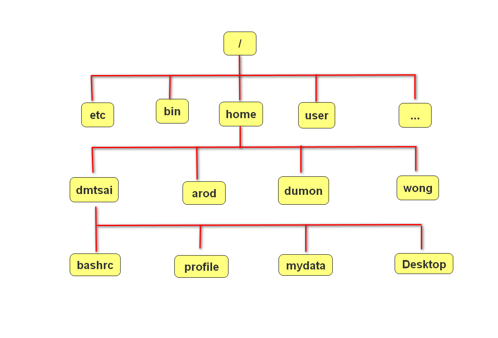
4. Linux常用命令
   * ```sudo``：启用超级管理员权限
     * ```sudo su```：进入超级管理员指令环境 
   * ```cd```：切换工作目录（空格加上目录名称即可） 
     * ```cd ..```：返回上级目录 
   * ```ls```：展示目录内容（直接写即可）
     * ```ls -a```：查看隐藏文件（文件名前有```.```的）
     * ```ls -l```: 查看文件目录下各个文件属性
        * 第一列为文件类型，```-```后面表示文件权限
        * 第二列表示链接数（被其他程序使用的数量）
        * 第三列表示其属于的用户
        * 第四列表示用户所在的用户组
        * 第五个表示文件大小（单位：byte）
        * 第六七八列表示文件创建时间
        * 最后一列为文件名称
   * ```ll```：查看当前文件夹的权限
   * ```cp -r```：复制文件（cp与-r之间加入需复制的文件或目录，-r后加入在当前目录中要放入的子目录或者绝对地址）
   * ```mv```：移动文件（空格加上移动文件或目录名称再空格加上要移动至的目录即可）
   * ```rm```：删除文件（空格加文件名即可）
     * ```rm -r```：删除目录（rm与-r间加目录名即可）
     * ```rm -rf```：强制删除，无论文件存不存在（rm与-r间加目录名即可）
     * ```mkdir```：创建目录
       * ```mkdir -p```：创建多层目录（mkdir与-p间加目录名称即可，不同目录间用```/```隔开）
       * ```cat```：查看文件（空格加文件名）
       * ```touch```：创建文件（空格加文件名）
    * ```crtl + alt + T```：打开终端（在```~```目录下）
    * ```crtl + alt + N```：打开终端（在当前目录下）
    * ```|```：为管道符，将前一个命令的结果传给下一个命令
    * ```grep```：筛选符号，在后面使用空格加字符串筛选含有该字符串的对应内容
    * ```wc -l```：查看获取结果的数量
    * ```vim```：后加文件名，进行查看文件或修改
      * ```HJKL```：方向键
      * ```:set number```：显示行数
      * ``ndd````：删除n行，其中n为行数，需在非命令模式使用
      * ```o```：从当前光标行的下方新开一行并进入插入模式
      * ```i```：进入插入模式
      * ```u```：撤销
      * ```:w```：保存不退出
      * ```:q```：退出不保存
      * ```:q!```:强制退出不保存
      * ```:wq```：退出并保存
      * ```:wq!```：强制退出并保存
      * ```/查询字符串```：检索文件中包含查询字符串的位置，n下一个，N上一个
  注：tab键可以补全文件名或目录名（已输入的内容一定要可以确定唯一一个）
## IO操作
### 定义
内存中存在数据交换的操作，包括终端交互，磁盘交互与网络交互
### IO分类
#### 阻塞IO
##### 定义
执行IO操作时如果执行条件不满足则阻塞
##### 特点
是IO的默认值，逻辑简单
##### 效率
阻塞IO是效率很低的IO
##### 阻塞情景
* 因为某种执行条件没有满足造成的函数阻塞（accept，input，recv）
* 处理IO事件较长产生的阻塞状态（网络传输，大文件读写）
#### 非阻塞IO
##### 转变原理
通过修改IO属性行为，使原本阻塞的IO变为非阻塞的状态
##### 设置方法
* 套接字中如下设置非阻塞IO
  * ```sockfd.setblocking(bool)```
    * 作用：设置套接字为非阻塞IO
    * 参数
      * bool：True（defalut），False时为非阻塞
  * ```sockfd.settimeout(sec)```
    * 作用：设置套接字的超时检测，超时将其转变为非阻塞IO
    * 参数
      * sec：设置的时间

注：对套接字的设定对其所有的实例方法都生效，但accept时产生的新套接字不受影响；同时socket中的部分IO会由于修改阻塞而报错
### 程序分类
* IO密集型操作
  * 特点：IO操作多，cpu运算少。故cpu消耗少，耗时长
* 计算密集型操作
  * 特点：程序中运算多，IO操作少。故cpu消耗多，执行快，几乎无阻塞
## 网络编程基础
### 作用
实现资源共享，实现数据信息的快速传递
### OSI七层模型
#### 制定组织
ISO（International Standard Organization），即国际标准化组织
#### 作用
使网络信息通信工作流程标准化
#### 各层概览
应用层：提供用户服务，具体功能由应用程序实现
表示层：数据的压缩优化加密
会话层：建立用户级的连接，选择适当的传输服务
传输层：提供传输服务
网络层：路由选择，网络互联（即选择物理层的信息传输路径）
链路层：进行数据交换，控制具体数据的发送
物理层：实际的网络内容传输
#### 优点
* 建立统一工作流程
* 分步清晰，各司其职，每个步骤分工明确
* 降低各个部分即模块之间的耦合度，便于开发
#### 四层模型（TCP/IP模型）
* 定义：OSI的前三层合并为第一层，即应用层；第二层为传输层；第三层为网际层；OSI的倒数两层合并为第四层，即网络接口层
* 图示：
    | OSI七层网络模型 | TCP/IP模型 | 对应网络协议 |
    |:---:|:----:|:----:|
    |应用层（Application）||TFTP，FTP，NFS，WAIS|
    |表示层（Presentation）|应用层|Talnet，Rlogin，SNMP,Gopher|
    |会话层（Session）||SMTP，DNS|
    |传输层|传输层|TCP，UDP|
    |网络层（Network）|网际层|IP，ICMP，ARP，RARP，AKP，UUCP|
    |数据链路层（Data Link）|网络接口层|FDDI，Ethernet，Arpanet，PDU，SLIP，PPP|
    |物理层（Physical）||IEEE 802.1A， IEEE802.2~IEEE802.11|
#### 数据传输过程
* 步骤简述
  1. 发送端由应用程序发送信息，逐层增加首部信息，最终在物理层发送信息包
  2. 发送的信息经过多个节点（交换机，路由器等）传输，最终到达国际主机
  3. 国际主机由物理层逐层解析首部信息包，最终到应用呈现信息
* 图示
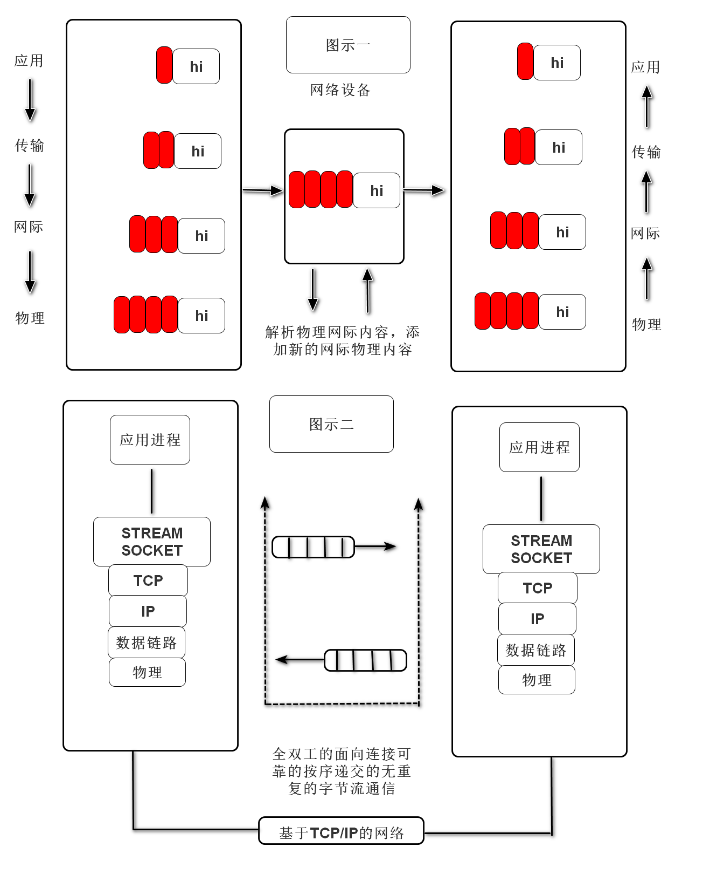
#### 网络协议（TCP/IP协议簇）
在网络数据传输中都遵循的规定，包括建立什么样的数据结构，什么样的特殊标志等
### 网络基础概念
* IP地址
  * 功能：确定一台主机的路由位置
  * 查看本机的IP地址指令
    * ```ifconfig```：Linux适用
    * ```ipconfig```：Windows适用
  * 结构
    * IPV4：点分十进制表示，如：```172.40.91.185```，每部分取值范围为0-255，即32位二进制
    * IPV6：冒号十六进制表示，如：```fe80::7f8a:3e2a:3d2d:e71d%7```,128位二进制
* 域名
  * 定义：给网络服务器地址起的名字（本质就是IP地址，由于服务器就是一个主机）
  * 作用：方便记忆，表达一定含义
  * 测试主机连接指令：```ping IP地址```
* 端口号（port）
  * 作用：是网络地址的一部分，用于区分主机上不同的应用程序
  * 特点：一个系统中的应用监听端口不能重复
  * 取值范围：1~65635
    * 1~1023：系统应用或者大众程序监听端口
    * 1024~65535：自用端口
* 网络应用实例（微信等程序应用信息发送特征）
  * 需要客户端向服务端发起申请（服务器IP与对应监听端口）
  * 发送自身信息，IP与端口以及收件IP与端口
  * 经服务器转发给收件主机（通过IP与端口锁定）
  * 图示      
   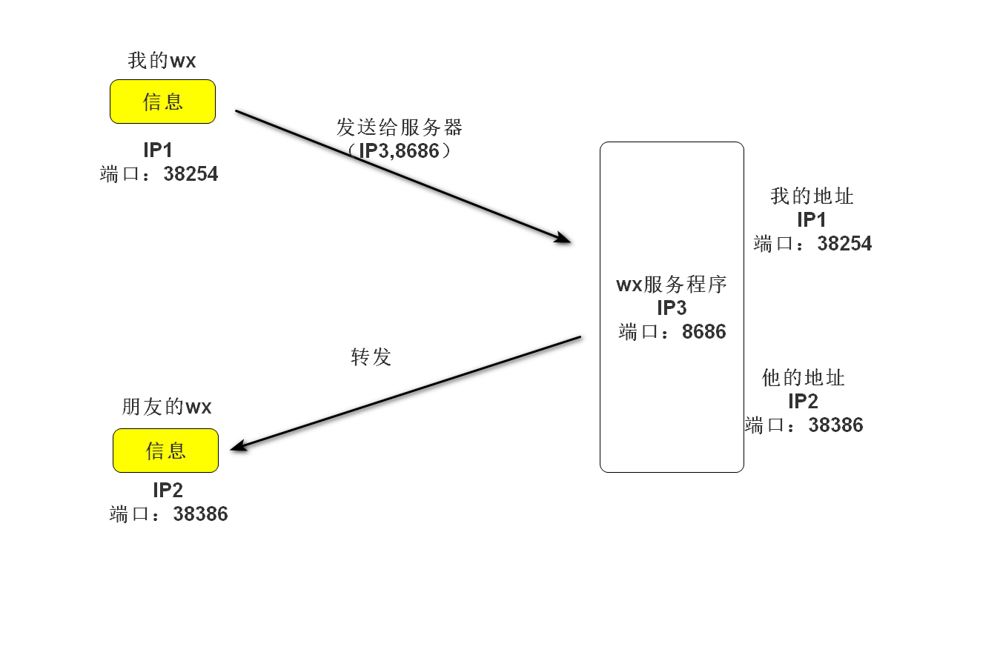
### 传输层服务
#### 面向连接的传输服务（基于TCP协议的数据传输）
* 传输特征：提供了可靠的数据传输
  注：可靠性数据传输指的是传输过程中数据无丢失，无失序，无差错，无重复
* 实现手段
  * 原理：在通信前需建立数据连接，通信结束要正常断开连接 
  * 具体方式
    * 三次握手（建立连接）
      1. 客户端向服务器发送信息报文请求连接
      2. 服务器收到请求后报文回复确定可以连接
      3. 客户端收到回复，发送最终报文建立连接
      * 图示
      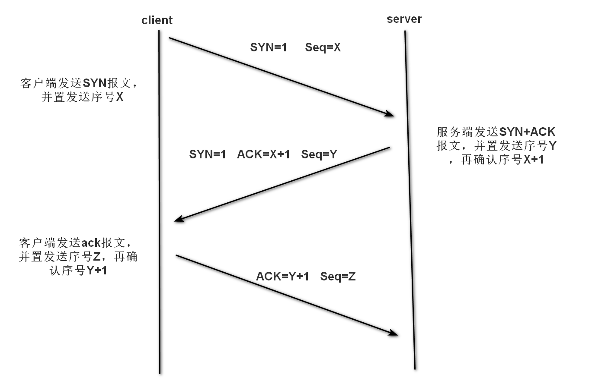 
    * 四次挥手（断开连接）
      1. 主动方向被动发申请断开连接
      2. 被动方向主动发发送准备断开连接信息
      3. 被动方向主动方发送可以断开连接信息
      4. 主动发送断开连接信息
      * 图示
      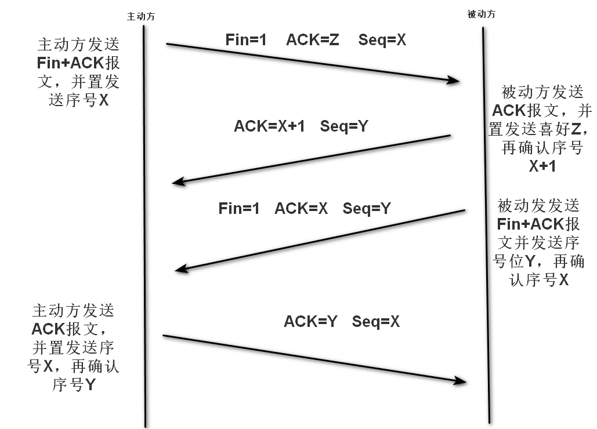
* 适用情况：对数据传输准确性有明确要求，传输文件较大，需要确保可靠性的情况（如：文件下载，网页获取，邮件发送）
#### 面向无连接的传输服务（基于UDP协议的数据传输）
* 传输特点：不保证传输的可靠性，传输过程没有连接与断开，数据收发自由随意
* 使用情况
  * 网络差
  * 对传输要求不高（如：网络视频，群聊，广播）
### socket套接字
#### 作用
实现网络编程进行数据传输的一种手段
#### 分类
* 流式套接字（SOCK_STREAM）：以字节流方式传输数据（基于TCP协议）
* 数据报套接字（SOCK_DGRAM）：以数据报形式传输数据（基于UDP协议）
#### 套接字属性
* ```sockfd-type```：套接字类类型
* ```sockfd-family```：套接字地址类型
* ```sockfd.getsockname()```：获取套接字的绑定地址
* ```sockfd.fileno()```：获取套接字的文件描述符
* ```sockfd.getpeername```：获取连接套接字的客户端地址
* ```sockfd.setsockopt(level, option, value)```
  * 作用：设置套接字选项
  * 参数
    * level：选项类别（常用SOL_SOCKET，等等）
    * option：具体选项内容
    * value：选项值
  
  另：SOL_SOCKET的具体选项内容表
    |option|功能|value|
    |:---:|:---:|:---:|
    |SO_BINDTODEVICE|可以使socket旨在某个特殊的网络接口（网卡）有效。也许不能是移动便携设备|一个字符串给出设备的名称或者一个空字符串返回默认值|
    |SO_BROADCAST|允许广播地址发送和接收信息包。只对UDP有效。|布尔型整数|
    |SO_DONTROUTE|禁止通过路由器和网关往外发送信息包。这主要是为了安全而用在以太网上UDP通信的一种方法。不管目的地使用什么IP地址，都可以防止数据离开本地网络|布尔型整数|
    |SO_KEEPALIVE|可以使TCP通信的数据包保持在连续性。这些信息包可以在没有信息传输的时候，使通信双方确定连接是保持的|布尔型整数|
    |SO_OOBINLINE|可以把收到的不正常数据看成是正常数据，也就是说会通过一个标准的对recv的调用来接收这些数据|布尔型整数|
    |SO_REUSEADDR|当socket关闭后，本地端用于socket的端口号立即可以被重用。通常来说，只用经过系统定义的一段时间后，才能被重用|布尔型整数|
#### socket套接字流程
##### TCP协议
###### 服务端流程
* 流程概览
  1. socket（创建）
  2. bind（绑定IP与端口）
  3. listen（监听及监听长度）
  4. accept（等待访问）
  5. send/recv（收发）
  6. close（关闭）
* 代码实现
  * ```socketfd = socket.socket(socket_family=AF_INET, socket_type = SOCKSTREAM, proto=0)```
    * 作用：创建套接字对象 
    * 参数
      1. ```socket_family```：网络地址类型
        注：常用网络地址类型 AF_INET（IPV4），AF_INET6（IPV6）
      2. ```socket_type```：套接字类型
        注：常用套接字类型 SOCK_STREAM，SOCK_DGRAM，还有底层套接字等
      3. ```proto```：通常为0，选择子协议（常用的两个套接字协议无子协议）
    * 返回值
      1. sockfd：返回套接字对象
  * ```socketfd.bind(addr)```
    * 作用：绑定套接字对象的IP与端口 
    * 参数     
      1. addr：tuple类型，格式为('IP', port)
        注：IP中'127.0.0.1','localhost'为本地回环地址（即部署主机本身），'0.0.0.0'为自动获取地址 
  * ```socketfd.listen(n)```
    * 作用：设置监听
    * 参数
      1. n：int类型，监听长度，即最多同时能处于监听队列的数量
  * ```connfd, addr = socketfd.accept()```
    * 作用：阻塞等待接受客户端连接请求
    * 返回值
      1. connfd：服务端与客户端的专属套接字
      2. addr：客户端的地址（IP与端口）
  * ```data = connfd.recv(buffersize)```
    * 作用：阻塞接受客户端发送的内容
    * 参数
      1. buffersize：每次接受信息的最大长度（byte）
    * 返回值
      1. data：byte类型，客户端发送信息
  * ```n = connfd.send(data)```
    * 作用：消息发送
    * 参数
      1. data：byte类型，要发送的内容           
    * 返回值
      1. n：int类型，发送的字节数
  * ```socketfd.close()```
    * 作用：关闭套接字
###### 客户端
* 流程概览
  1. socket
  2. bind（一般不选）
  3. connect（连接服务端）
  4. send/recv
  5. close
* 代码实现
  * ```sockfd.connect(server_addr)```
    * 作用：请求与服务端连接
    * 参数
      1. server_data:tuple类型，服务器地址（IP与端口）

注：客户端与服server_data:tuple类型，服务器地址（IP与端口）
注：客户端与服务端的套接字类型要匹配，同时recv与send要与双方相互配合，防止阻塞，服务端要注意异常处理，防止异常退出（服务端一般是不关闭的，以提供稳定的服务）；服务端的套接字类型要匹配，同时recv与send要与双方相互配合，防止阻塞，服务端要注意异常处理，防止异常退出（服务端一般是不关闭的，以提供稳定的服务）
###### TCP套接字数据传输的特点
* TCP连接中，当一段退出，另一端如果阻塞在recv，此时recv会立即返回一个空字符串
* TCP连接中，无法发送空字符串
* TCP连接中，如果一端已断开连接，另一端仍然试图通过send发送信息则会产生BrokenPipeError
* TCP连接中，一个监听套接字可以同时连接多个客户端，也能够重复被连接
###### 网络收发缓冲区
* 作用：有效的协调了信息的收发速度
* 原理：send和recv的信息发送事项缓冲区发送接受信息，当缓冲区不为空，recv就不会阻塞
* 粘包问题
  * 原因：TCP以字节流形式传输，没有消息边界，多次发送的消息被一次接受，此时就会产生粘包
  * 实例：1. 消息发送过快   2. 一次发送内容超过接收信息上限与下次信息一起被接收
  * 影响：如果每一次发送的内容含义相互独立，可能使得信息无法正确解析
  * 处理方法
    * 人为添加消息边界
    * 控制发送速率
###### TCP套接字之HTTP协议（超文本传输协议）
* 作用：网页获取，数据传输
* 特点
  * 应用层协议，传输层使用TCP协议
  * 简单灵活，很多语言都有HTTP专门接口
  * 无状态，协议不记录传输内容
  * HTTP/1.1支持持久连接，丰富了请求类型
* 图示
  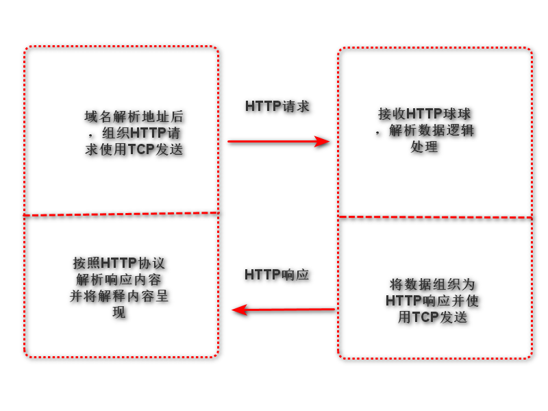
* HTTP请求（request）
  * 格式
    * 请求行
      * 格式：```请求类别 请求内容 协议版本```
      * 请求类别
        1. （常用）GET：获取网络资源
        2. （常用）POST：提交一定的消息来得到反馈
        3. （会用）HEAD：只获取网络资源的响应头
        4. （会用）PUT：更新服务器资源
        5. （会用）DELETE：删除服务器资源
        6. CONNECT：预留，无作用
        7. （几乎不用）TRACE：测试
        8. （几乎不用）OPTIONS：获取服务器性能信息（一般被封死，无法使用）  
      * 请求内容：具体内容，如在服务器的存储位置等
        注：```/```一般表示网页根目录 
      * 协议版本：一般为```HTTP/1.1```
    * 请求头
      * 作用：对请求的进一步解释和描述
      * 格式：键值对形式呈现，每个占一行
    * 请求体
      * 作用：请求参数或提交内容
      * 格式：请求头写完后空一行，写请求体
      * 注意事项：空行中不要出现空格
* HTTP响应（response）
  * 格式
    * 响应行
      * 格式：```版本信息 响应码 附加信息```
        * 版本信息：```HTTP/1.1```
        * 响应码
          * 1xx：提示信息，表示请求已接受
          * 2xx：响应成功
          * 3xx：响应需进一步操作，重定向（转发给其他服务器，不保证响应成功）
          * 4xx：客户端错误
          * 5xx：服务器错误
    * 响应头
      * 作用：对响应内容的描述
      * 格式：键值对形式呈现，每个占一行
      * 实例：```Content-Type:text/html```：以html格式来解析文本
    * 响应体
      * 作用：响应的主题信息
      * 格式：响应头后空一行写响应体
      * 注意事项：空行时不要有空格

注：Pycharm中有专门的html格式的文本          
##### UDP协议
###### 服务端
* 流程概览
  1. socket
  2. bind
  3. recvfrom（接收）
  4. send to（发送）
  5. close
* 代码实现
  * ```data, addr = sockfd.recvfrom(buffersize)```
    * 作用：消息接收
    * 参数
      * buffersize：每次最多接收的字节数
    * 返回值
      * data：byte类型，接收到的内容
      * addr：tuple类型，消息发送方发的地址   
  * ```n = sockfd.sendto(data, addr)```
    * 作用：发送信息
    * 参数
      * data：byte类型，发送的内容  
      * addr：tuple类型，目标地址
    * 返回值
      * n：int类型，发送的字节数
###### 客户端
* 流程概览
  1. socket
  2. bind（一般不选）
  3. sendto
  4. recvfrom
  5. close
###### UDP套接字数据传输特点
* 不会产生粘包，数据传输是有边界的
* 在Linux中服务端不存在，客户端也可发送内容，但消息会丢失
* 多个客户端可同时连接服务端同一个套接字
* 客户端断开连接不影响服务端
* 如果发送内容大小查过最大字节接收数会全部丢失
###### UDP套接字广播
* 定义：一端发送多点接收
* 广播地址：每个网络的最大地址为发送广播的地址（一般最后一个为255），向该地址发送，则网段内所有主机都能被接收
* 注意事项
  * 有权限广播
  * 是指套接字SOL_SOCKET中的SO_BROADCAST为Ture即可
  * 客户端绑定地址与端口（相当于调电台频道）
  * 服务端不需要绑定地址（由于在整个网段的指定端口广播，无需与主机IP互联）
* 代码示例
  ```python
  # 发送端
  import socket
  import time
  destination = ('192.168.16.255', 9999)
  s = socket.socket(socket.AF_INET, socket.SOCK_DGRAM)
  s.setsockopt(socket.SOL_SOCKET, socket.SO_BROADCAST, 1)
  data = b'hello world'
  while True:
      time.sleep(2)
      s.sendto(data, destination)
  # 接收端
  import socket
  s = socket.socket(socket.AF_INET, socket.SOCK_DGRAM)
  s.setsockopt(socket.SOL_SOCKET, socket.SO_BROADCAST, 1)
  s.bind(('0.0.0.0', 9999))
  while True:
      msg, addr = s.recvfrom(1024)
      print(msg.decode())
  ```  
### struct模块
#### 作用
跨语言的传输数据
#### 原理
将一组简单的数据（字符串转化为字节串，整型，浮点型）转化为bytes（网络字节序）发送，或将一组bytes格式数据进行解析，本质是将python语言转变为c语言
#### 接口使用
* ```st = struct(fmt)```
  * 作用：生成结构化对象
  * 参数
    * fmt：定制的数据结构
      * 整型：i
      * 浮点型：f
      * 字符串（长度为n）：ns
  * 返回值
    * st：结构化对象
* ```item = st.pack(v1, v2, v3, ..., vn)```
  * 作用：将一组数据按照指定格式打包转化为bytes，网络字节序
  * 参数
    * vn：要打包的数据
  * 返回值
    * item：bytes，网络字节串
* ```item = st.unpack(bytes_data)```
  * 作用：将网络字节串按照指定格式解析
  * 参数
    * bytes_data：要解析的网络字节串
  * 返回值
    * item：解析后的内容
* ```struct.pack(fmt, v1, v2, v3, ..., vn)```
  * 作用：将两个动作（格式+打包）合并
* ```struct.unpack(fmt, v1, v2, v3, ..., vn)```
  * 作用：将两个动作（格式+解包）合并

注：解包与打包的格式要统一；字符串长度不够会以十六进制的0来补齐           
## 多任务编程
### 意义
充分利用计算机多核资源，提高程序地利用效率
### 实现方法
多进程与多线程
### 多任务编程中的相关概念
#### 并行与并发
* 并行：多个任务利用多核资源，同时执行，此时多个任务间为并行关系
* 并发：同时处理多个任务，内核在任务间不断切换，达成好像多个任务被同时执行的效果，实际每个时刻只有一个任务占有内核
#### 共享资源
多个进程或线程可共同操作的资源
注：在线程中就是全局变量
#### 临界区
对共享资源操作的代码
#### 同步互斥机制
##### 意义
无序的对共享资源的操作可能会带来逻辑混乱通过该机制可以解决问题
##### 同步与互斥
* 同步：协作，依照步骤有序执行，如管道通信的接收阻塞
* 互斥：互相制约，当一个线程或进程操作资源，资源上锁，直至操作完成，再次分配给其他线程或进程争夺
##### 死锁
###### 定义
两个或以上线程/进程由于竞争资源或彼此通信而造成阻塞，无外力作用下，其不会继续运行，这时称产生了死锁或系统处于死锁状态
###### 产生条件
* 互斥条件：使用的资源是排他的
* 请求和保持条件：拥有一个资源，并要求其他资源
* 不剥夺条件：使用的资源只会运行完自主释放
* 环路条件：多个进程/线程间资源的拥有与请求形成环形
###### 解决方法
* 完善设计逻辑使得上方条件无法同时成立
### 进程（Process）
#### 定义
程序在计算机内的一次运行
#### 程序与进程的区别
* 程序时储存在磁盘中的可执行文件
* 进程是一个动态的描述，占有计算机资源，具有一定的生命周期
#### 进程运行特征
* 进程可使用计算机多核资源
* 进程是计算机分配资源的最小单位
* 进程之间的运行互不影响，各自独立
* 每个进程都拥有独立的空间，各自使用自己空间资源
#### 系统进程创建流程
1. 用户空间通过调用程序接口或者命令发出请求
2. 操作系统接收用户请求，开始创建进程
3. 操作系统调配计算机资源，确定进程状态等
4. 操作系统将创建的进程提供给客户使用
#### 进程的相关基本概念
##### CPU时间片
如果一个进程占有CPU内核，则称这个进程在CPU时间片上
##### PCB（Process Control Block）
在内存中开辟的一个空间，用于存放进程的基本信息，也用于系统查找识别进程（双向链表循环实现）
##### 进程ID（PID）
系统为每个进程分配的一个大于0的整数，作为进程ID，每个进程ID不重复
注：Linux查看进程ID命令：```ps-aux```
##### 父子进程
系统中每一个进程（除了系统初始化进程）都有唯一一个父进程，可以有0个或多个子进程，更便于远程管理
注：Linux进程树查看命令：pstree
#### 进程状态
##### 进程的五态
* 三态（简略版）
  * 就绪态：进程具备执行的条件，等待分配CPU资源
  * 运行态：进程占有CPU时间片，正在运行
  * 等待态：进程暂时停止运行，让出CPU
  * 图示
    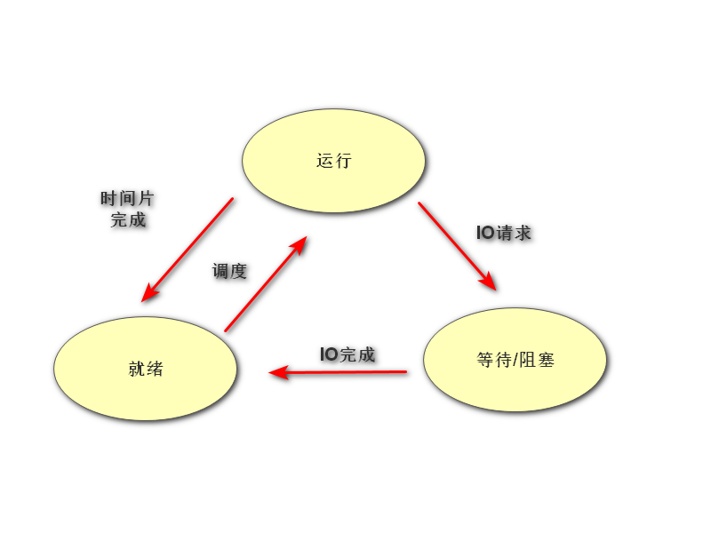 
* 五态（完整版）
  * 新建：创建一个进程，获取资源的过程
  * 终止：进程结束，释放资源的过程
  * 图示
    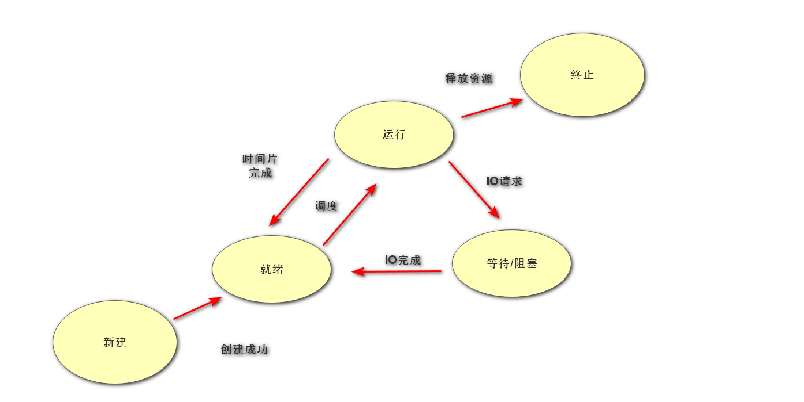

注：状态查看命令：```pa-aux```的STAT列
##### 状态标识（Linux）
* S:等待态
* R：执行态
* D：等待态
* T：等待态
* Z：僵尸
* <：有较高优先级
* N：优先级较低
* S：会话组组长
* I：有多线程的
* +：前台进程
##### 孤儿进程
###### 产生条件
父进程先于子进程退出，此时子进程成为孤儿进程
###### 特点
孤儿进程会被系统收养，此时系统进程就会成为孤儿进程新的父进程，孤儿进程退出，该进程会自动处理
##### 僵尸进程
###### 产生条件
子进程先于父进程退出，父进程没有处理子进程的退出状态，此时子进程为僵尸进程
###### 特点
僵尸进程虽然结束，但是会留存部分PCB在内存中，大量的僵尸进程会浪费系统的内存资源
###### 解决方法
* 使用wait函数处理
  * ```pid, status = os.wait()```
    * 作用：在父进程中阻塞等待处理子进程退出   
    * 返回值
      pid：退出子进程的PID
      status：子进程退出的状态（父进程退出状态*256）
    
  注：处理了，但由于阻塞父进程相当于丢失了多任务的优势
* 创建二级子进程处理
  * 流程概览 
    * 父进程创建子进程等待回收子进程
    * 子进程创建二级子进程后退出
    * 二级子进程成为孤儿进程，和原来父进程一同执行事件
  * 代码示例
    ```python
    import time
    import os


    def a():
        time.sleep(5)
        print('写代码')


    def b():
        time.sleep(3)
        print('测代码')


    pid = os.fork()
    if pid == 0:
        pid = os.fork()
        if pid > 0:
            os._exit(0)
        elif pid == 0:
            b()
    elif pid > 0:
        pid, status = os.wait()
        a()

    ```
* 通过信号处理
  * 原理：子进程退出时会发送信号给父进程，如果父进程忽略子进程信号，子系统就会自动处理子进程退出
  * 语法
  ```python
  import time
  import os
  import signal


  def a():
      time.sleep(5)
      print('写代码')


  def b():
      time.sleep(3)
      print('测代码')


  signal.signal(signal.SIGCHLD, signal.SIG_IGN)
  pid = os.fork()
  if pid == 0:
      b()
  elif pid > 0:
      a()

  ```
  * 优势：不阻塞，不影响父进程运行，可以梳理所有子进程退出
#### 进程相关函数
* ```pid = os.getpid()```
  * 作用：获取一个进程的PID
  * 返回值
    * pid：返回当前进程的PID     
* ```os._exit(status)```
  * 作用：结束一个进程
  * 参数
    * status：进程的终止状态
  注：status填什么都没有区别，但默认0为正常推出，其他数字为异常退出
* ```sys.exit([status])```
  * 作用：退出进程
  * 参数
    * status：int类型，表示退出状态，可不填
    注：可填字符串，退出打印内容
#### python中进程的实现方法
##### 基于fork的多进程编程（Linux）
* ```pid = os.fork()```
  * 作用：创建新的进程
  * 返回值
    * pid：int类型，如果创建进程失败，则返回负数；如果成功发则在原有进程返回新进程的PID并在新进程中返回0
  * 用法：利用父子进程pid返回值不同的特性，使父子进程得以通过同时执行多个分支达到多进程的效果
  * 特性
    * 子进程会复制父进程全部内存空间，并从fork下一句开始执行
    * 父子进程各自独立运行，运行顺序不定
    * 父子进程有各自特征比如PID，PCB命令集等
    * 父进程fork之前开辟的空间子进程同样拥有，父子进程对各自空间的操作不会相互影响
##### multiprocessing模块创建进程
* 流程特点
  * 将需要子进程执行的事件封装为函数
  * 通过模块的Process类创建进程对象，关联函数
  * 可以通过进程对象设置进程信息及属性
  * 通过进程对象调用start启动进程
  * 通过进程对象调用join回收进程
* 基本语法
  * ```p = Process(target, args, kwargs)```
    * 作用：创建进程对象
    * 参数
      * target：绑定要执行的目标函数
      * args：tuple类型，位置传参给target
      * kwargs：dict类型，关键字传参给target
  * ```p.start()```
    * 作用：启动进程
  
  注：调用时，进程才真正开始
  * ```p.join([timeout])```
    * 作用：阻塞等待回收进程
    * 参数
      * timeout：超时检测

* 注意事项
  * Linux中使用multiprocessing创建进程与fork创建进程的原理一致
  * 子进程只运行函数内容，其余父进程执行
  * multiprocessing中父进程往往只用来创建进程并回收子进程，具体时间由子进程完成
  * multiprocessing创建的子进程无法使用标准输入
* 进程属性
  * ```p.name```：进程名字
  * ```p.pid```：子进程PID
  * ```p.is_alive```：子进程生命周期是否结束
  * ```p.daemon```：值为布尔值，为True时，父进程退出子进程退出
###### 进程池
* 必要性：进程的创建与销毁的过程消耗资源较多。当任务众多时，多个任务同时进行，会频繁的创建、销毁进程，计算机压力大。进程池通过复用进程解决问题。
* 原理：创建多个进程，当事件处理完，不退出进程而是接取下个事件，直到事件处理完，一并销毁。
* 语法
  * ```pool = Pool(process)```
    * 作用：创建进程池并创建进程池中进程数量
    * 参数
      * process：指定进程数量，默认根据系统自动判定
    * 返回值
      * pool：进程池对象
  * ```pool.apply_async(func, args, kwargs)```
    * 作用：使用进程池执行func事件
    * 参数
      * func：目标函数
      * args：tuple类型，位置传参
      * kwargs：dict类型，关键字传参
  * ```pool.close()```
    * 作用：关闭进程池（无法添加新的事件，并不是真正关闭）
  * ```pool.join()```
    * 作用：回收进程池中的进程（真正关闭）
###### 进程间通信（IPC）
* 作用：实现不同进程间的资源共享
* 分类
  1. 管道通信（Pipe）
     * 原理：在内存中开辟管道空间，生成管道操作对象，多个进程使用同一个管道进行读写即可实现通信
     * 代码实现
        * ```fd1, fd2 = Pipe(duplex=True)```
           1. 作用：创建管道
           2. 参数
               * duplex：默认为True，表示开启双向通道；false，则为单向通道
           3. 返回值
               * fd1, fd2：两端的读写对象，如果单向，则fd1只读，fd2只写
        * ```msg = fd.recv()```
           1. 作用：从管道获取信息
           2. 返回值
               * msg：获取到的数据
        * ```fd.send(data)```
           1. 作用：向管道写入内容
           2. 参数
               * data：要写入的数据
  2. 消息队列
    * 原理：在内存中建立队列模型，进程通过队列将信息存入，或者从队列取出完成进程间通信
    * 实现方法
      * ```q = Quene(maxsize)```
        1. 作用：创建队列对象
        2. 参数
           * maxsize：队列长度
        3. 返回值
          * q：队列对象
      * ```q.put(data, [block, timeout])```
        1. 作用：向队列中放入信息
        2. 参数
          * data：要存入的信息
          * block：是否阻塞
          * timeout：超时检测 
      * ```q.get([block, timeout])```
        1. 作用：从队列中获取信息
        2. 参数
          * block：是否阻塞
          * timeout：超时检测    
      * ```item = q.full()```
        1. 作用：判断队列是否为满
        2. 返回值
           * item：布尔值   
      * ```item = q.empty()```
        1. 作用：判断队列是否为空
        2. 返回值
           * item：布尔值  
      * ```item = q.qsize()```
        1. 作用：返回队列长度
        2. 返回值
          * item：int类型 
      * ```q.close()```
        1. 作用：关闭消息队列
  3. 共享内存
    * 原理：在内存中开辟一个空间，进程可以写入或读取内容完成通信，每次写入覆盖原内容
    * 代码实现
      * Value实现 
        1. ```obj = Value(ctype, data)```
           * 作用：开辟共享空间
           * 参数
             1. ctype：'i'，'f'，'c'
             2. data：共享空间的初始数据
           * 返回值
             1. obj：共享内存对象    
        2. ```obj.value```
           * 作用：读写共享内存的值 
      * Array实现
        1. ```obj = Array(ctype, data)```
          * 作用：开辟共享空间
           * 参数
             1. ctype：'i'，'f'，'c'
             2. data：整数则表示开辟空间大小（即列表或字节串中有几个元素），其他依据ctype往列表或字节串中写值 
        2. ```obj.value```   
           * 作用：直接打印共享内存中的字节串（列表不行）
  
        注：Array共享内存需要通过迭代obj来得到或修改值
  4. 信号量
    * 原理：给定一个数量对多个进程可见，多个进程对该数进行增减，并根据数量值来决定自己的行为
    * 代码实现
      * ```sem = Semaphore(num)```
        1. 作用：创建信号量对象
        2. 参数
           * num：int类型，信号量的初始数值
        3. 返回值
          * sem：信号量对象
      * ```sem.acquire()```
        1. 作用：将信号量减一，当信号量为0时阻塞 
      * ```sem.release()```
        1. 作用：将信号量加一（不受num限制） 
      * ```item = sem.get_value()```
        1. 作用：获取信号量数值
        2. 返回值
          * item：int类型
#### Windows与Linux中多进程的差异
##### 差异原因
Linux中多进程基于fork而Windows中多进程基于sqawn
##### 实现原理差异
###### fork
可以理解为在内存中开辟一块空间，将父进程的内容完全复制，但从创建进程的下一句开始运行
###### spawn
可以理解为创建了一个子进程相当于新建一个.py文件来import父进程内容。故会将父进程中的内容再执行一次。同时继续执行对应函数中的内容。
##### 具体差异体现
* 由于fork中创建进程会从进程创建的下一句运行故没有问题而在spawn中由于导入模块时会将父进程中的内容再执行一次，故在启动前需加上```if __name__ == '__main__':```来防止进程的无限创建
* 由上一个情况使得fork中父进程可继续创建子进程进而再由子进程创建子进程，但是spawn中无法做到
* 在进程通信中（包含管道，消息队列，共享内存，信号量，套接字等），spawn由于第一个情况，以上用于进程通信创建的对象必须传入函数才能生效。由于import后重新执行通信方法对象，使得通信方法对象不是同一个对象，而spawn中不需要
* spqwn与fork中的全局变量在各自进程中修改均不互相影响。spawn中是由于重执行不是同一个对象，而fork中虽是同一个对象但内存空间不同
* 由于第一个情况，当打开文件时，fork只有一个文件描述符，操作的为同一个文件，必要时传入函数，而spawn中有两个文件描述符互不影响
### 线程（Thread）
#### 线程的基本概念
* 轻量级的进程
* 可以使用计算机的多核资源，是多任务编程方式
* 线程是系统分配内核的最小单位
* 线程可以理解为进程的分支任务
#### 线程特征
* 一个进程可以包含多个线程
* 线程是一种运行行为，消耗计算机资源
* 一个进程中的所有线程共享这个资源（进程）
* 多个线程间互不影响相互独立
* 线程的创建和销毁远远小于进程（约为1/16）
* 各线程有自己的IO特征
* 图示
  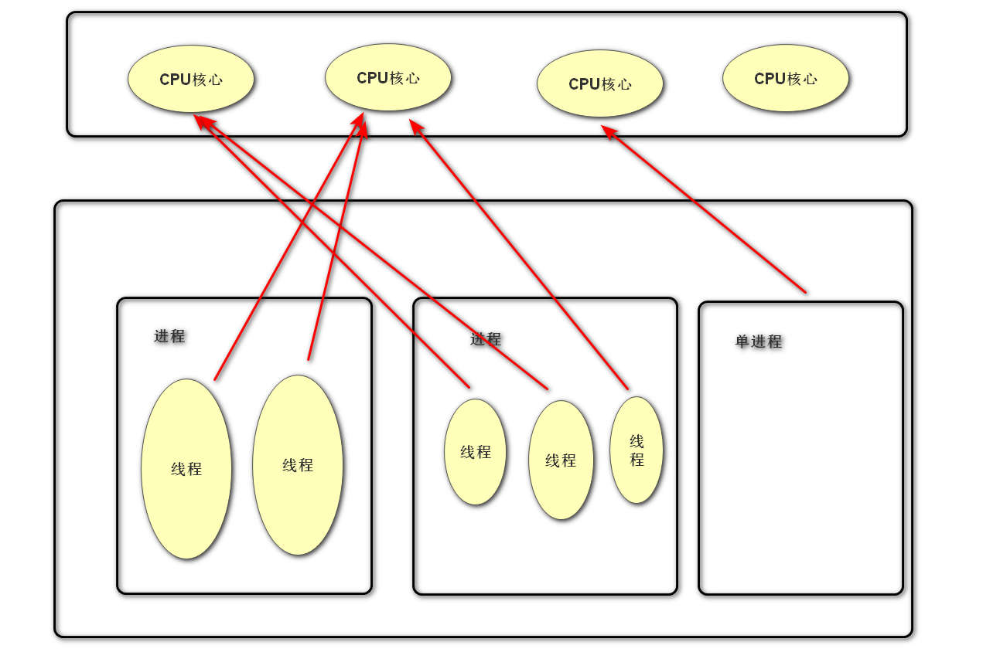
#### 代码实现
##### 线程创建与设置
* ```t = Thread(target, args, kwargs)```
  * 作用：创建线程对象
  * 参数
    * target：绑定线程函数
    * args：tuple类型，位置传参
    * kwargs：dict类型，关键字传参
  * 返回值
    * t：线程对象   
* ```t.start()```
  * 作用：启动线程 
* ```t.join([timeout])```
  * 作用：回收进程
  * 参数
    * timeout：超时检测  
* ```t.name```
  * 作用：获取或修改线程名称
  * 返回值：线程名称  
* ```t.setName()```
  ```t.getName()```
  * 作用：修改与获取线程名称（现在已经不用）
* ```item = t.is_alive()```
  * 作用：查看线程是否在生命周期
  * 返回值
    * item：布尔值  
* ```t.daemon```
  * 作用：设置或获取主线程与分支线程的退出关系
  * 返回值：bool值
* ```t.setDaemo()```
  * 作用：设置daemon值 
* ```item = t.isDaemon()```
  * 作用：读取daemon值
  * 返回值
    * item：布尔值
##### 自定义线程类
* 步骤
  1. 继承Thread类
  2. 重写```__init__```并使用super加载父类属性
  3. 重写run方法
* 使用：同Thread
* 代码示例
  ```python
  from threading import Thread
  from time import sleep


  class MyThread(Thread):
      def __init__(self, func_name, args, kwargs):
          super().__init__()
          self.func_name = func_name
          self.args = args
          self.kwargs = kwargs

      def run(self):
          self.func_name(*self.args, **self.kwargs)


  def player(sec, song):
      for i in range(3):
          print(f'{song} is playing')
          sleep(sec)


  mt = MyThread(player, (3, ), {'song': '凉凉'})
  mt.start()
  mt.join()

  ```
##### 线程间通信
###### 通信方法
使用全局变量
###### 线程中的同步互斥
1. 使用Event
  * ```e = Event()```
    * 作用：创建event对象
    * 返回值
      * e：返回event对象  
  * ```e.wait([timeout])```
    * 作用：阻塞等待e被设置
    * 参数
      * timeout：超时检测
  * ```e.set()```
    * 作用：设置e，使wait结束阻塞
  * ``` e.clear()```
    * 作用：使e解除设置 
  * ```item = e.is_set()```
    * 作用：查看e是否被设置
    * 返回值
      * item：布尔值  
2. 使用Lock   
  * ```lock = Lock()```
    * 作用：生成lock对象
    * 返回值
      * lock：返回lock对象 
  * ```lock.acquire()```
    * 作用：获取锁，使得除第一个运行该语句的线程所有线程都阻塞在该语句
  * ```lock.release()```
    * 作用：解锁（全部）
  * 使用with语法
     ```python
     with lock: 
       pass
     ```
     * 作用：语句块的内容执行时自动给其他线程上锁，语句块结束时自动解锁
#### python线程GIL
##### GIL的作用
python解释器设计了解释器锁，即GIL（全局解释器锁），使得python本体线程能够有序与系统交互，保护python解释器免受线程并发争抢资源的影响（共享资源的不一致修改）
##### GIL的特点
使得多线程难以提高实际效率，无法充分利用多核资源，在无阻塞的程序中非常明显
##### GIL的解决方案
* 不使用线程而使用进程
* 不使用c作为解释器（如：Jpython，由于GIL只有Cpython中有）
#### 线程的使用场景
受GIL的影响，多线程适用于高阻塞的并发情况，由于阻塞会让出解释器
### 并发网络模型
#### 循环服务器模型
##### 特点
循环接收客户端请求，处理请求。同一时刻只能处理一个请求，处理完成后处理下一个
##### 优缺点
* 优点：实现简单，占资源少
* 缺点：无法同时处理多个客户端请求
##### 使用情况
处理的任务可以很快完成，客户端无需长期占用服务端程序
注：UDP比TCP更适合
### IO并发模型  
#### 原理
利用IO多路复用，异步IO等技术，同时处理多个客户端IO请求
#### 优缺点
* 优点：资源消耗少，能同时高效处理多个IO行为
* 缺点：只能处理并发产生的IO事件，无法处理CPU计算
#### 适用情况
HTTP请求，网络传输等IO行为
#### 模型实现
##### IO多路复用
###### 定义
同时监控多个IO时间（系统负责），当那个IO准备就绪就执行哪个IO时间
###### 作用
使得满足条件的IO可以执行，避免由于单一IO阻塞，全体等待的情况
###### 触发方式
* EPOLLET（边缘触发）：即当满足条件未处理时，不会继续发送信息请求处理，，而是等下次有其他IO满足条件时一并发送
* EPOLLLT（水平触发）：default，即当满足条件未处理时，会持续发送信息请求处理
###### 实现方法
1. select方法（Windows，Linux，Unix）
   * 底层原理（图示）
     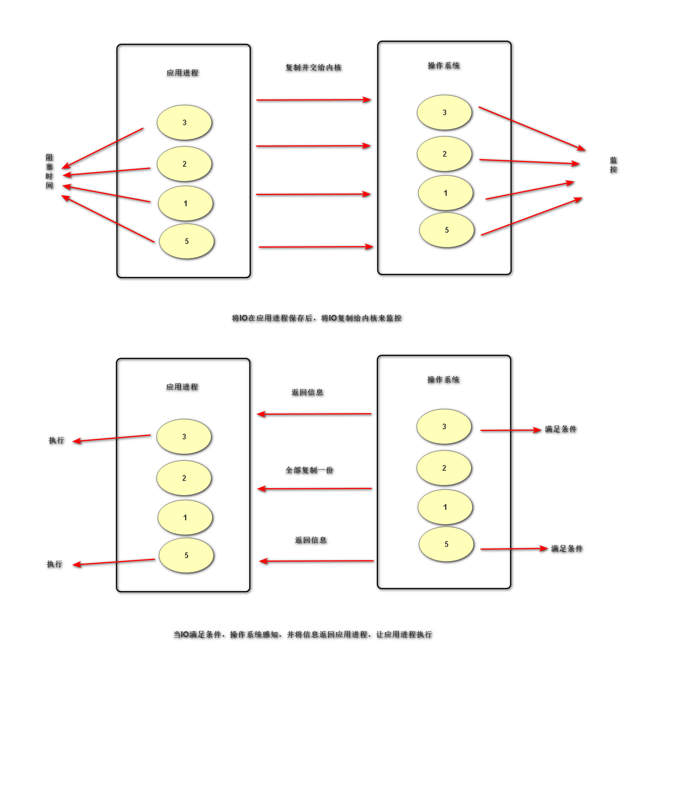 
   * 代码实现
      * ```rs, ws, xs = select(rlist, wlist, xlist, [timeout])```
        * 作用：监控IO事件，阻塞等待IO发生
        * 参数
          * rlist：读列表，即被动IO
          * wlist：写列表，即主动IO
          * xlist：异常列表，即发生异常的IO
          * timeout：超时检测
        * 返回值
          * rs：list类型，rlist中就绪的IO
          * ws：list类型，wlist中就绪的IO
          * xs：list类型，xlist中就绪的IO
    
        注：由于要在应用保存，IO最大值为1024；注意需要自行创建列表（多个）存储不同类型的IO
2. poll方法（Linux，Unix）
   * 底层原理（图示）
      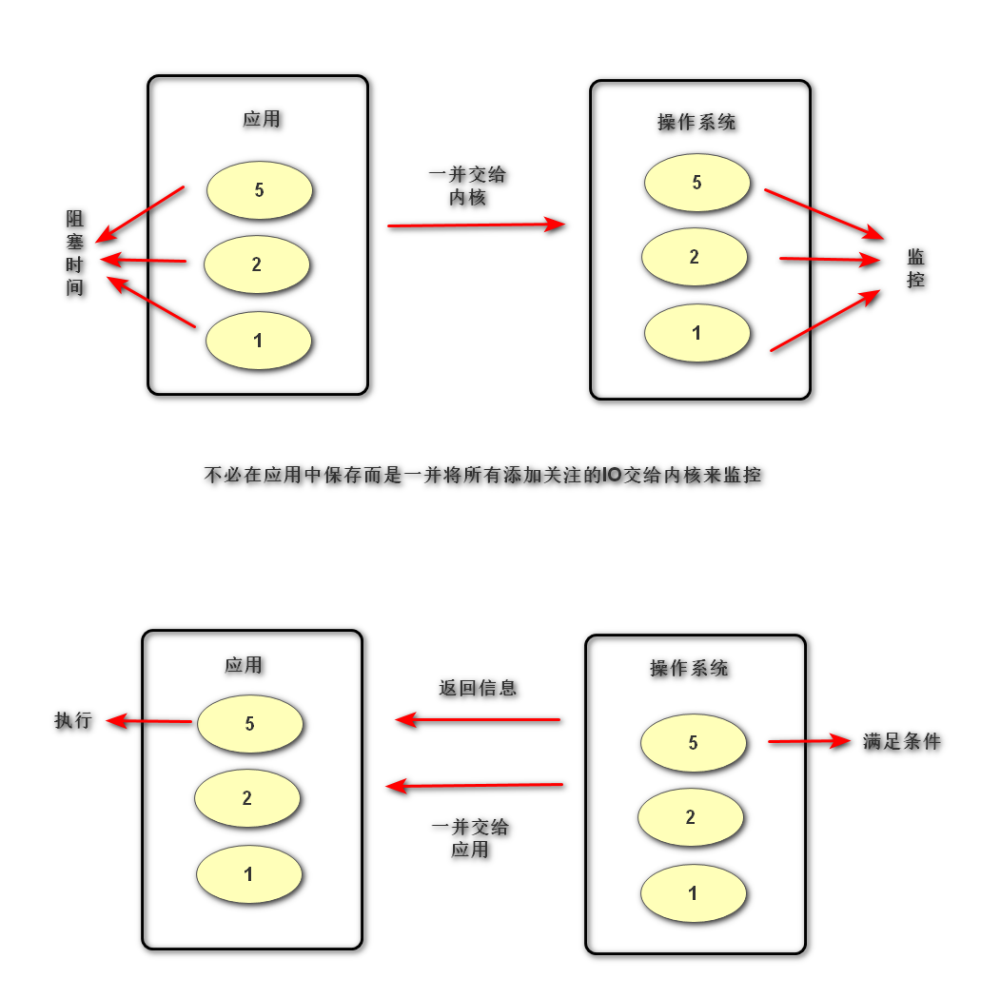 
   * 代码实现
     * ```p = select.poll()```
       * 作用：创建poll对象
       * 返回值
         * p：poll对象
     * ```p.register(fd, event)```
       * 作用：注册关注的IO
       * 参数
         * fd：需要关注的IO
         * event
           * 内容：要关注的IO的事件类型，不同事件类型用```|```连接
           * 常用类型
             1. POLLIN：读IO事件
             2. POLLOUT：写IO事件
             3. POLLERR：异常IO事件
             4. POLLHUP：断开连接
     * ```p.unregister(fd)```
       * 作用：取消对IO的灌输
       * 参数
         * fd：要取消关注的IO
     * ```events = p.poll()```
       * 作用：阻塞等待监控IO的发生
       * 返回值
         * events：返回发生的IO（格式：```[(fileno, events), ......]```）

        注：需要创建字典来映射fileno与IO对象之间的关系 
3. epoll方法（Linux）
   * 底层原理（图示）
     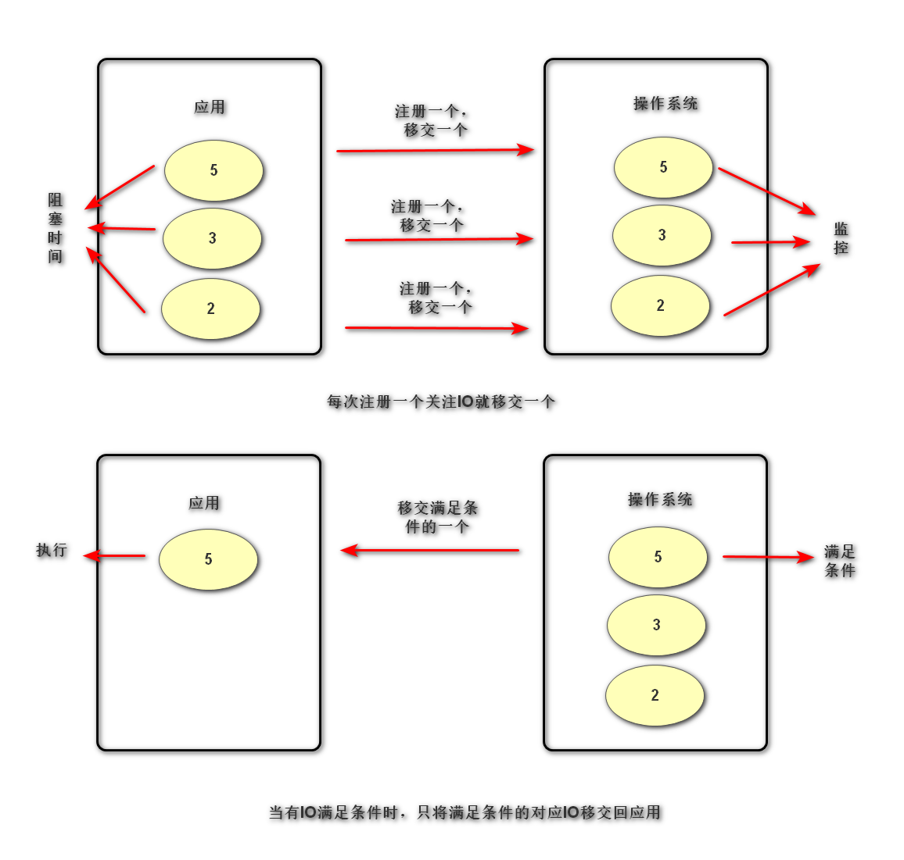
   * 代码实现：同poll（封装后使用一样，底层不同），只需将所有poll改为epoll即可 
   * 特点
     1. epoll效率最高
     2. epoll监控IO数量最多
     3. epoll的触发方式多（边缘，水平） 
##### 协程技术
###### 概念
纤程，微线程。允许在不同入口点不同位置暂停或开始的计算机程序（如：yield，生成器）
###### 原理
记录一个函数的上下文，协程调度切换时会将上下文保存，切换回来时进行调取，恢复原有执行内容，以便从上次从位置继续运行
###### 优缺点
* 优点
  * 协程完成多任务占用计算资源少
  * 由于协程的多任务切换在应用层完成，因此切换开销少
  * 协程为单线程程序，无需进行共享资源同步互斥处理
* 缺点：是单线程，无法利用多核资源
###### 实现库
1. 标准库（asyncio）
   * 优点：自带库，可直接使用，在python3.5后可用
   * 缺点：生态差，基本只支持asyncio库中拥有的IO，而且由于多数情况下不支持awaitable，需自己去封装，故只能使用已有异步库
   * 原理：通过异步IO行为完成协程
   * 代码实现
     ```python
     import asyncio
     # 生成协程函数


     async def fun()
                pass


     # 生成协程对象 
     cor = fun()
     # 加入关注异步IO
     tasks = [asyncio.ensure_future(cor)]
     # 获取监控池子
     loop = asynico.get_event_loop()
     # 启动池子中函数并等待完成
     ```
2. 第三方协程模块（greenlet）
  * 代码实现
    * ```g = greenlet.greenlet(func)```
      * 作用：创建协程函数
      * 参数
        * func：要变为协程函数的函数
      * 返回值
        * 协程函数对象
    * ```g.switch()```
      * 作用：选择要执行的协程函数 
3. 第三方协程模块（gevent）
   * ```g = gevent.spawn(func, argv)```
     * 作用：生成协程对象
     * 参数
       * func：要变为协程函数的函数
       * argv：tuple类型，给协程函数传参
   * ```gevent.joinall(list, [timeout])```
     * 作用：阻塞等待协程函数执行完毕
     * 参数
       * list：list类型协程对象列表
       * timeout：超时检测
   * monkey脚本
     * 作用：将io事件转变为协程io
     * 代码实现
       ```python
       from gevent import monkey
       monkey.patch_all()
       import time
       ```

      注：monkey脚本中有众多转化io的函数，此处仅展示一键所有转化的函数     
### 多进程/多线程网络并发模型
#### 特点
每当一个客户端连接服务器，则创建一个新的进程/线程为客户端服务直至客户端退出销毁
#### 优缺点
* 优点：能同时满足多个客户端长期占用服务器的需求，可以处理各种请求
* 缺点：资源消耗较大
#### 适用情况
客户端同时连接数量较少，需要处理行为较为复杂的情况
#### 实现逻辑
##### 步骤概述
1. 主线程/进程循环接收请求
2. 创建客户端专属进程/线程并在主进程/线程中关闭客户端套接字，在分支进程中关闭服务端套接字
3. 客户端断开销毁对应进程/线程，并由主进程/线程回收
# 结语
python系统学习至此结束，剩余进阶内容见后续笔记，下一个笔记为Re模块与MySQL数据库初步